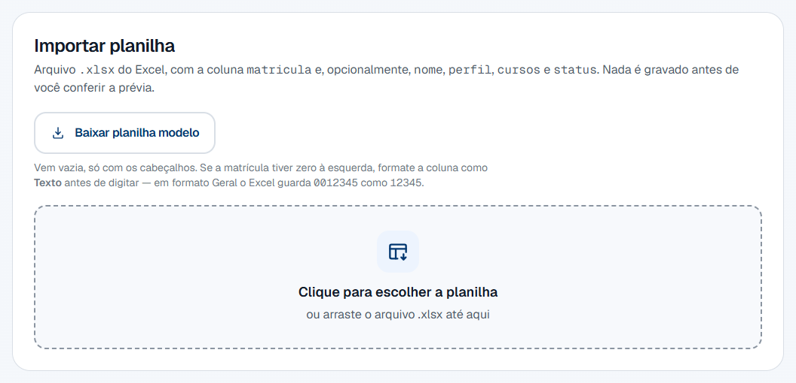
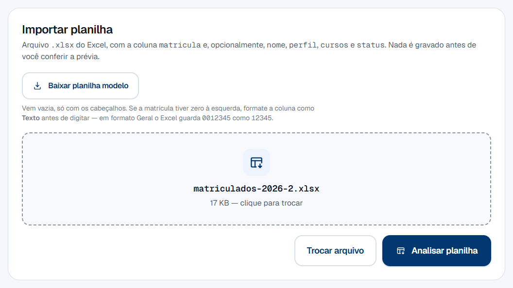
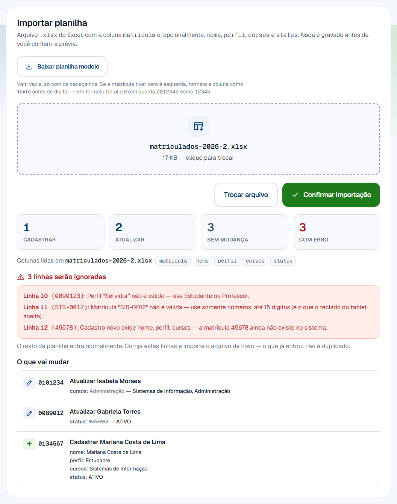
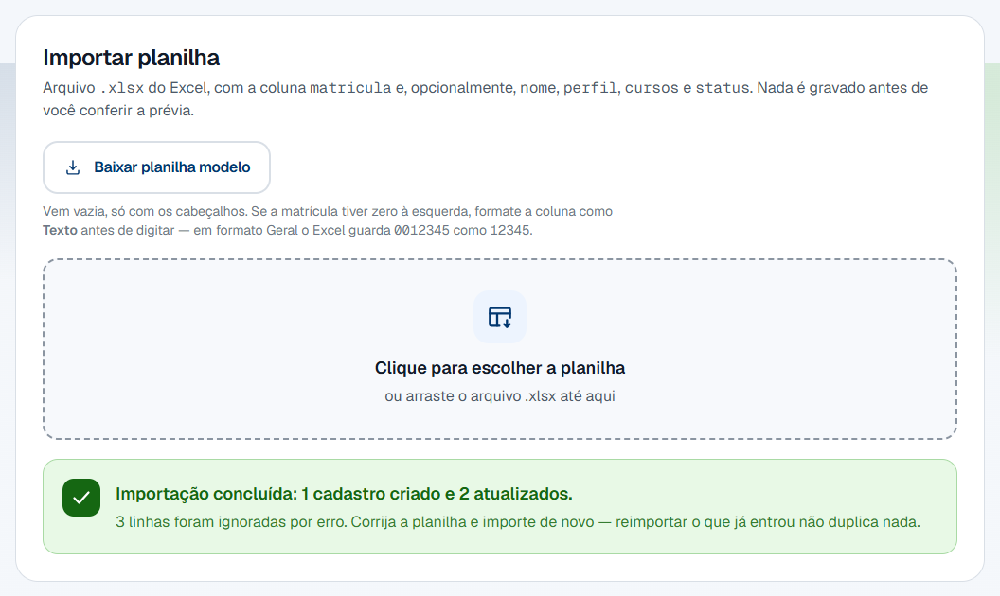
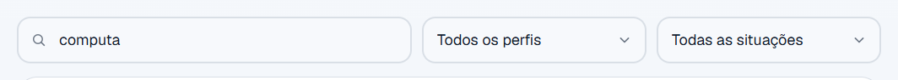
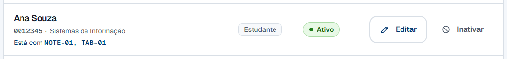
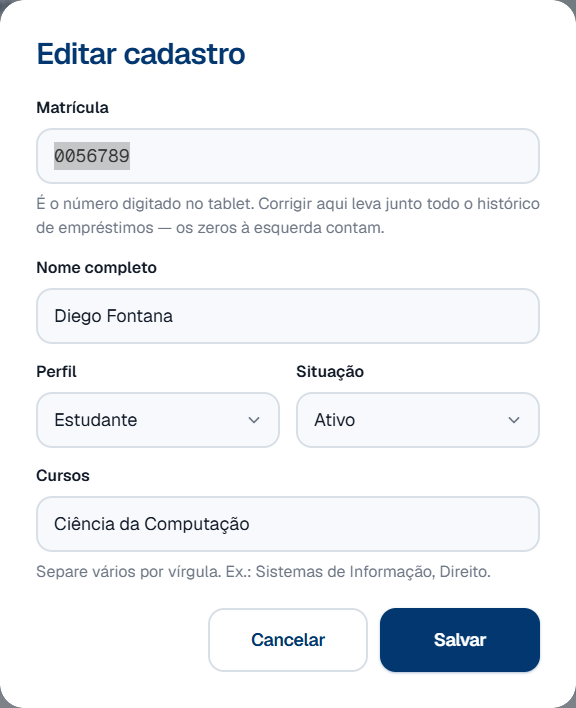
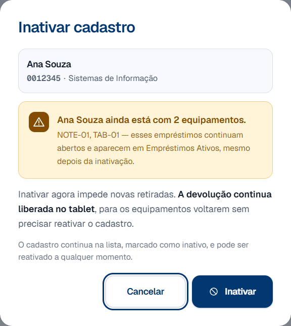
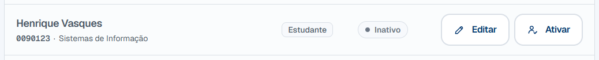

# 5. People management

## 1. What this process is for

This process keeps the list of who can pick equipment up matching the list from
the course office: whoever enrolled this semester is registered, whoever left is
taken out of circulation, and data typed wrong is corrected.

When it ends, the tablet recognizes the enrollment number of whoever arrives at
the desk — and does not recognize the one that should not be there. Nothing on
this screen erases history: a record taken out of circulation stays in the
system, because the loan history points at it.

## 2. Before you start

- You are signed in to the admin panel. If you are not, sign in with your login
  and password — see
  [Administrator account](../referencia/conta-do-administrador.md).
- **To import:** the spreadsheet is an `.xlsx` (Excel Workbook) and has an
  enrollment number column. The other four columns are optional.
- **The spreadsheet was checked before it left the course office.** The import
  writes over what is already in the system, and it has no undo — see the
  [rule about the preview](#why-does-the-import-show-a-preview-before-writing).
- To correct a record by hand, all you need is the list. The person does not
  have to be there, and the record does not have to be active.

## 3. Terms used on this page

Terms that cross several processes live in the
[general glossary](../referencia/glossario.md):
[enrollment number](../referencia/glossario.md#enrollment-number),
[profile](../referencia/glossario.md#profile),
[inactive record](../referencia/glossario.md#inactive-record-person),
[loan](../referencia/glossario.md#loan) and
[asset tag](../referencia/glossario.md#asset-tag).

These belong to this page only — they are the parts of the screen that the steps
name:

| Term                                  | What it is                                                                                                                     |
| ------------------------------------- | ---------------------------------------------------------------------------------------------------------------------------------- |
| Records                               | The table on the **Pessoas** (People) tab, one row per student or teacher, with the active ones on top.                         |
| Template spreadsheet                  | The empty file the panel generates, with the headers the import knows how to read. It is the starting point for the course office's spreadsheet. |
| Preview                               | The list of what the import **will** do, shown before anything is written: register, update, no change and error.               |
| **Situação** (Status)                 | The column that says whether the record is **Ativo** (Active) or **Inativo** (Inactive). It decides who can pick equipment up on the tablet. |
| Skipped row                           | A spreadsheet row the preview rejected. The rest of the file goes in as usual; that row does not.                               |

## 4. Who does what

| Role                       | Does                                                                                                                       | Does not                                                                                                                    |
| -------------------------- | ------------------------------------------------------------------------------------------------------------------------------ | --------------------------------------------------------------------------------------------------------------------------------- |
| Course office              | Hands over the spreadsheet with whoever is enrolled this semester. The list comes from them.                                | Does not open the admin panel. Their contact with the system is the file.                                                        |
| Front desk                 | Downloads the template, checks the preview, confirms the import, corrects records by hand and decides who leaves circulation. | Does not delete records — there is no such action, and the [rule below](#why-is-there-no-delete-record-button) explains why.     |
| Admin panel (the computer) | Reads the spreadsheet, fixes the spelling on its own, shows what will change before changing it, and rejects rows it cannot use. | Does not guess. A profile that is neither Estudante nor Professor rejects the row instead of picking one.                     |
| Student or teacher         | Nothing. Takes no part in this process.                                                                                     | Does not see this screen. What they notice is indirect: their enrollment number working — or not — on the tablet.               |

## 5. BPMN diagram

Click the diagram to open it at full size — at the width of this page it fits at
about half its size, and the labels get cramped.

Notice that the **preview is a step of the process**, not a detail of the
screen: between reading the file and writing there is a decision by whoever is
at the desk. Until that decision is made, nothing has been written.

**Downloading the template spreadsheet is not in the diagram**, on purpose: it
is preparation that happens before the process starts, and on the course
office's side. Procedure 1 in the step by step covers that part.

**The diagram labels are in Portuguese**, because it is the same file the
Portuguese pages use.

??? note "The diagram labels, in English"

    | Label on the diagram | In English |
    | --- | --- |
    | Secretaria | Front desk (the lane) |
    | Sistema | System (the lane) |
    | Abre a aba Pessoas | Opens the **Pessoas** (People) tab |
    | O que precisa ser feito? | What needs doing? |
    | importar a planilha | import the spreadsheet |
    | corrigir um cadastro | correct a record |
    | ativar ou inativar | activate or deactivate |
    | Envia a planilha .xlsx da coordenação | Uploads the course office's `.xlsx` spreadsheet |
    | É mesmo uma planilha do Excel por dentro? | Is it really an Excel spreadsheet inside? |
    | Arquivo recusado; nada foi lido | File refused; nothing was read |
    | Lê as linhas, sanitiza e confronta com o cadastro | Reads the rows, sanitizes them and compares them with the records |
    | Mostra a prévia: criar, atualizar, inalteradas e erros | Shows the preview: create, update, unchanged and errors |
    | Confirma a importação? | Confirm the import? |
    | Importação cancelada; nada foi gravado | Import canceled; nothing was written |
    | Relê a planilha, refaz o plano e grava em uma transação só | Re-reads the spreadsheet, rebuilds the plan and writes in a single transaction |
    | Cadastros criados e atualizados | Records created and updated |
    | Corrige os campos no aviso de edição | Corrects the fields in the edit dialog |
    | Matrícula só com dígitos e campos preenchidos? | Enrollment number digits only and fields filled in? |
    | Edição recusada; o cadastro fica como estava | Edit refused; the record stays as it was |
    | Grava; matrícula corrigida leva o histórico junto | Writes it; a corrected enrollment number takes the history along |
    | Cadastro corrigido | Record corrected |
    | Clica em Inativar ou em Ativar na linha | Clicks **Inativar** (Deactivate) or **Ativar** (Activate) on the row |
    | A pessoa está com equipamento? | Does the person have any device? |
    | Confirma no aviso que a pessoa está com equipamento | Confirms in the dialog that the person has equipment |
    | Grava a nova situação do cadastro | Writes the record's new status |
    | Qual foi o destino? | Which destination was it? |
    | Cadastro inativo: retirada travada, devolução liberada | Inactive record: pickups blocked, returns allowed |
    | Cadastro ativo; volta a poder retirar | Active record; able to pick up again |
    | Inativo / Ativo | Inactive / Active |
    | sim / não | yes / no |

[Download the `.bpmn` file](../../processos-fonte/05-pessoas.bpmn) — the source
of the diagram, which opens in [bpmn.io](https://bpmn.io) with nothing to
install.

## 6. Step by step

There are four procedures, each with its own sequence. They all start on the
**Pessoas** (People) tab, in the menu on the left.

The screen opens with the counts at the top, the **Importar planilha** (Import
spreadsheet) card in the middle and the list of records below.

Notice that **an inactive row stays on the list**, dimmer than its neighbors and
with the **Ativar** (Activate) button instead of **Inativar** (Deactivate). And
that one of them — Larissa Coutinho — is inactive **and** holding a device: that
is the rule [section 7 explains](#i-deactivated-somebody-who-has-a-device-is-that-a-problem).

### Downloading the template spreadsheet and filling it in

1. Open the **Pessoas** (People) tab.

2. Click **Baixar planilha modelo** (Download the template spreadsheet), inside
   the **Importar planilha** (Import spreadsheet) card.

    

    The file `modelo_importacao_pessoas.xlsx` lands in your downloads folder.
    The page does **not** reload, and nothing on screen is lost.

3. Open the file in Excel.

    It arrives empty, with a single row: the five headers the import knows how
    to read.

    | Column      | Required? | What it accepts                                     |
    | ----------- | --------- | --------------------------------------------------- |
    | `matricula` | **Yes**   | Digits only, up to 15                               |
    | `nome`      | No        | Full name                                           |
    | `perfil`    | No        | Estudante or Professor, in any spelling             |
    | `cursos`    | No        | One or several, separated by commas                 |
    | `status`    | No        | `ATIVO` or `INATIVO`                                |

4. Format the `matricula` column as **Text**, before typing anything.

    This step is not decoration. In General format, Excel stores `0012345` as
    the number `12345` — and the leading zero disappears **inside the file**,
    where nothing here recovers it. See the
    [rule about leading zeros](#the-enrollment-number-lost-its-leading-zeros-what-happened).

5. Fill in one row per person.

    Do not worry about capitals, accents or course abbreviations: the system
    fixes the spelling itself when writing. See the
    [before-and-after table](#why-did-the-system-change-what-i-typed-in-the-spreadsheet).

6. Save as **Excel Workbook (.xlsx)**.

    The import refuses `.xls` and `.csv`, and it also refuses a file with an
    `.xlsx` extension and something else inside.

### Importing the spreadsheet

1. Open the **Pessoas** (People) tab.

2. Click the dotted area and choose the file.

    You can also drag the `.xlsx` onto it. The name and size appear inside the
    area once it is chosen.

    

3. Click **Analisar planilha** (Analyze spreadsheet).

    **Nothing is written in this step.** The panel reads the file, compares it
    with what is already in the system and builds the list of what would happen.

4. Read the four counters.

    

    | Card                              | What it counts                                                       |
    | --------------------------------- | -------------------------------------------------------------------- |
    | **Cadastrar** (Register)          | Enrollment numbers that do not exist yet and are about to be born.   |
    | **Atualizar** (Update)            | Records that exist and will change in at least one field.            |
    | **Sem mudança** (No change)       | Records that are already exactly like this. They do not enter the list below. |
    | **Com erro** (Error)              | Rows that will be skipped. The rest of the file goes in as usual.    |

5. Check the **Colunas lidas** (Columns read) line.

    It says which of the five columns the panel found in the file. A column that
    is not there is a field the system **preserves** as it is — the import does
    not erase what the spreadsheet does not mention.

6. Read the red block, if there is one.

    Each rejected row carries the row number **as Excel numbers it**, the
    enrollment number and the reason. That is the list you use to fix the file.

7. Was any row rejected?

    - **If YES** → decide now: fix the file and go back to step 2, or carry on
      without those rows. Confirming writes the rest and skips the rejected
      ones; importing again later does not duplicate what already went in.
    - **If NO** → go to step 8.

8. Read the **O que vai mudar** (What will change) list, field by field.

    Each line shows the old value struck through and the new one beside it. It
    is the last chance to notice that the file is from the wrong semester.

9. Click **Confirmar importação** (Confirm import).

10. Look at the green notice.

    

    It counts what was actually written — "Importação concluída: 1 cadastro
    criado e 2 atualizados." (Import complete: 1 record created and 2 updated.)
    The record list below is already refreshed.

### Editing a record, enrollment number included

1. Find the person in the list.

    The search accepts a name, an enrollment number or a course, and ignores
    accents: "computa" finds people in Ciência da Computação and in Engenharia
    da Computação. The two selectors beside it filter by profile and by status.

    

2. Check that it is the right row.

    Below the name come the enrollment number and the courses. If the person is
    holding any device, a third line says which.

    

3. Click **Editar** (Edit) on that person's row.

    

4. Correct whatever is wrong.

    All five fields are required here — unlike the spreadsheet, whoever opened
    the dialog has the whole record in front of them, and a cleared field is a
    deliberate clearing.

5. To change the enrollment number, type the new number in the **Matrícula**
   (Enrollment number) field.

    It arrives with the current value already selected: you can type over it.
    The field only accepts digits and stops at 15, which is what the tablet
    keypad can type.

6. Click **Salvar** (Save).

7. Look at the notice.

    

    The second sentence is the point: **the history follows the change**. Every
    loan of that person — open or completed — now points at the new number.
    Nothing is left behind.

### Deactivating and reactivating a record

1. Find the person in the list.

2. Click **Inativar** (Deactivate) on their row.

3. Does the person have any equipment?

    - **If NO** → the record is deactivated straight away, with no dialog at
      all. Go to step 6.
    - **If YES** → a dialog appears saying what they are holding. Go to step 4.

4. Read the dialog before confirming.

    

    It names the asset tags — "NOTE-01, TAB-01" — and the count is read from the
    server at the moment of the click, not at the moment the screen opened.

5. Click **Inativar** (Deactivate), in the dialog.

    Deactivating here is **allowed on purpose**, and the explanation is in
    [section 7](#i-deactivated-somebody-who-has-a-device-is-that-a-problem). The
    loan stays open and keeps appearing in **Empréstimos Ativos** (Active
    loans).

6. Check the row in the list.

    

    It stays there, dimmer, with the **Inativo** (Inactive) badge and the
    **Ativar** (Activate) button instead of **Inativar** (Deactivate). The
    notice at the top confirms it — "Henrique Vasques foi inativado e não
    consegue mais retirar equipamento." (Henrique Vasques has been deactivated
    and can no longer pick equipment up.)

7. To bring the person back, click **Ativar** (Activate) on the same row.

    One click, no dialog: reactivating is not a dangerous gesture. The notice
    says "Henrique Vasques está ativo e já pode retirar equipamento." (Henrique
    Vasques is active and can pick equipment up again.), and the enrollment
    number works on the tablet straight away.

## 7. Rules that are not obvious

!!! question "Why does the import show a preview before writing?"

    Because **the import has no undo**, and it writes to many records at once.

    A wrong file — last semester's, another course's, one somebody edited
    halfway — would overwrite hundreds of rows in a single click. A report after
    the fact would only count the damage.

    The preview is the only moment when the damage has not happened yet. It
    shows, field by field, the value going out and the value coming in. If the
    list is not the one you expected, **Trocar arquivo** (Change file) costs one
    click; the alternative costs an afternoon redoing records.

    The write is all-or-nothing too: if something fails halfway, nothing is
    written. There is no such thing as a half-applied import.

!!! question "Why did the system change what I typed in the spreadsheet?"

    Because the spreadsheet is typed by people, and people write the same thing
    in many ways. Without a cleaning pass, "ANA MARIA DE SOUZA" and "ana maria de
    souza" become two ways of writing the same person, and the panel's search
    finds one and misses the other.

    The cleaning happens **on writing**, and you do not have to format anything
    by hand:

    | What you type in the spreadsheet | What the system stores                                       |
    | -------------------------------- | ------------------------------------------------------------ |
    | `JOÃO PEDRO DE ALMEIDA`          | João Pedro de Almeida                                        |
    | `isabela moraes`                 | Isabela Moraes                                               |
    | `MARIANA  COSTA-DE-LIMA`         | Mariana Costa de Lima                                        |
    | `PROF. MARINA BASTOS`            | Prof. Marina Bastos                                          |
    | `ALUNO`, `Alunos`, `aluna`, `discente` | Estudante                                              |
    | `Professora`, `PROF.`, `docente` | Professor                                                    |
    | `SI`                             | Sistemas de Informação                                       |
    | `cc`                             | Ciência da Computação                                        |
    | `ec, si`                         | Sistemas de Informação, Engenharia da Computação             |
    | `ec, cc`                         | Ciência da Computação, Engenharia da Computação              |
    | `Administração, si`              | Sistemas de Informação, Administração                        |
    | `ativo`, `Ativo`                 | ATIVO                                                        |

    Three details the table shows that are worth naming:

    - **Particles stay lowercase.** "de", "da", "dos" in the middle of a name do
      not get a capital — it is how the registry office writes it and how you
      read the name in the return queue.
    - **The dot in "Prof." survives.** It is what makes the tablet greet "Prof.
      Marina" instead of greeting a title.
    - **Courses always come out in the same order**: Sistemas de Informação,
      Ciência da Computação, Engenharia da Computação, and then the rest in
      alphabetical order. That is why `ec, cc` and `cc, ec` store the same
      thing — and why the search does not depend on how the course office typed
      it.

    **A course the system does not know is kept**, not discarded. "Direito" and
    "Administração" go in as they were written and move to the end of the list.
    Only the order is decided by the system; the content is yours.

!!! question "I sent the same spreadsheet again and the preview says almost nothing changes. Is it working?"

    It is — and precisely because of the cleaning above.

    The **Sem mudança** (No change) card counts the records that are already
    exactly as the spreadsheet describes them. Because the system always stores
    the canonical form, a row written `JOÃO PEDRO DE ALMEIDA` with profile
    `ALUNO` and courses `ec, si` matches the "João Pedro de Almeida / Estudante /
    Sistemas de Informação, Engenharia da Computação" already there — four
    spelling differences, zero differences in content.

    That is what makes it painless to resend the whole spreadsheet every
    semester: out of 180 rows, only the ones that really change appear in the
    list. A preview that said "180 updates" would be a preview nobody read.

    The number on that card is the proof that the file **was** read. If it is at
    zero along with the other three, then the file is not what you think it is.

!!! question "I deactivated somebody who has a device. Is that a problem?"

    No. It is the common case, and the system was built for it.

    The person you deactivate is precisely the one who left — enrollment
    suspended, graduated, changed course — and they nearly always have a device
    in their bag. That is why deactivation is **asymmetric**:

    | What deactivating does | What it does **not** do |
    | --- | --- |
    | Blocks pickups on the tablet, straight away | Does not block returns |
    | Takes the person off the list of who can borrow | Does not close the loans that are open |
    | Marks the row as **Inativo** (Inactive) | Does not delete the record or the history |

    Blocking both directions would be the worst possible design: deactivation
    would become the guarantee that the device **never** comes back. People
    returning something are not asking the system for anything — they are
    handing over something the front desk wants back.

    In practice, an inactive enrollment number gets into the tablet as usual.
    Where the category grid should be there is the explanation, and the return
    button is still beside each item — see
    [Equipment return](../portal/devolucao.md) and
    [Equipment pickup](../portal/retirada.md).

    The open loan stays where it was: on the **Empréstimos Ativos** (Active
    loans) tab, which is where chasing it up happens.

!!! question "Why does equipment lock when there is an open loan and a person does not?"

    Because the two answer different questions, and this is the most likely
    confusion in the whole admin panel — the same word, **Inativar**
    (Deactivate), with opposite results on two screens.

    | | Person (this page) | Equipment ([Inventory management](inventario.md)) |
    | --- | --- | --- |
    | With an open loan | Deactivating is **allowed**, with a warning | The status **locks**: it cannot be deactivated |
    | Why | People who leave the institution usually have a device in their bag | The device is out of the cabinet; the record has to tell the truth |
    | Effect of deactivating | **Asymmetric**: blocks pickups, allows returns | Disappears from the tablet at both ends |
    | How it comes back | The **Ativar** (Activate) button, one click | The **Reativar** (Reactivate) button, one click |

    The rule behind both is the same: **the record has to tell the truth about
    where the device is.** For equipment that means locking — changing the
    status by hand on an item somebody is holding would make the tablet offer it
    to another person. For people it means allowing the return — it is the only
    way for the device to come back.

    The detail from the other side is in
    [why can I not change an item that is on loan](inventario.md#why-i-cannot-change-an-item-that-is-on-loan).

!!! question "Why is there no delete record button?"

    Because the loan history points at the person, and deleting them would take
    the history along: whoever took that laptop last semester would stop
    existing, with no warning and no way back.

    The database refuses the deletion anyway — it is a structural lock, not a
    choice of the screen. That is why the action that takes somebody out of
    circulation is called **Inativar** (Deactivate), and its icon is a crossed
    circle, not a trash can: a trash can promises the record disappears, and it
    does not.

    The sentence is at the bottom of the screen itself:

    > O cadastro nunca é apagado: o histórico de empréstimos aponta para ele.

    (The record is never deleted: the loan history points at it.)

    It is the same rule as for equipment, and for the same reason — see
    [why there is no delete equipment button](inventario.md#why-is-there-no-delete-equipment-button).

!!! question "I confirmed the wrong import. How do I undo it?"

    **There is no undo**, and that is why the preview exists. What you can do is
    correct over the top, and the path depends on the damage:

    1. **If the wrong file had the right enrollment numbers** (last semester's,
       for example) → import the right file. Every field it carries overwrites
       what the wrong import wrote.
    2. **If it created records that should not exist** → they cannot be deleted.
       Use **Inativar** (Deactivate) on each: they leave the tablet and stay on
       the list in gray.
    3. **If it changed fields the right file does not mention** → those fields
       stay as they are. Importing again does not bring them back, because the
       import only writes to the columns the file carries. Fix those cases by
       hand, with the **Editar** (Edit) button on the row.

    The third is the most treacherous, and it is the argument for reading the
    whole preview: the **O que vai mudar** (What will change) list is the only
    time the old value appears on screen.

!!! question "The enrollment number lost its leading zeros. What happened?"

    Excel deleted them before the file got here.

    In a column in General format, `0012345` is read as the **number** 12345,
    and it is the number that gets stored inside the `.xlsx`. By the time the
    import opens the file, the zeros are no longer there — there is no way to
    recover them on this side.

    The effect is silent and expensive: the enrollment number `0012345` arrives
    as `12345`, the right record is not found, and the row becomes either a
    wrong new record or a rejected row. It is to catch that case that the
    preview shows the enrollment number of every row.

    The prevention is step 4 of procedure 1: **format the column as Text before
    typing**. If the spreadsheet already arrived like that from the course
    office, the fix is there, in the file — not here.

    In the system, the enrollment number is text, and leading zeros count.
    `0012345` and `12345` are two different people.

!!! question "Why does the enrollment number only accept digits, up to 15?"

    Because the person typing the enrollment number is not you: it is the
    student, standing up, on the tablet keypad — and that keypad has ten keys.

    An enrollment number with a letter or a hyphen would create a record that
    exists in the panel, appears in the lists, and that **nobody can type on the
    portal**: a person who never picks anything up or returns anything again.
    The error would only show up with them standing in front of the tablet.

    So the rule is the one from the most restrictive side, on both paths: the
    dialog field stops at 15 digits, and the import rejects a row that brings
    anything else. If the course office ever starts using a letter prefix, the
    first thing to change is the tablet keypad.

!!! question "Does changing the enrollment number break the history?"

    No. The database propagates the change to all that person's loans — open and
    completed — in the same operation that writes the new enrollment number.

    This was measured: an open loan pointing at `0056789` started pointing at
    `0056790` along with the edit, and no record was left pointing at the old
    number.

    That is why the notice says both things — "A matrícula 0056789 agora é
    0056790. O histórico de empréstimos foi junto." (Enrollment number 0056789
    is now 0056790. The loan history went with it.) The second sentence exists
    because changing a number the whole system uses as a key **looks** dangerous
    to whoever is clicking.

    What the change does not do is create a new person. It is the same record,
    with a different number.

## 8. Common errors and what to do

In the import, the error appears **inside the Importar planilha (Import
spreadsheet) card**, where the preview would have appeared. In the row actions,
it appears **inside the row itself**, just below the buttons — and that is the
sign that nothing changed.

### When uploading the file

| Message on screen                                                                                                       | Cause                                                                            | What to do                                                                                            |
| ------------------------------------------------------------------------------------------------------------------------- | ---------------------------------------------------------------------------------- | ----------------------------------------------------------------------------------------------------------- |
| "Nenhum arquivo foi enviado." (No file was uploaded.)                                                                     | The form was submitted with no file chosen.                                       | Click the dotted area and choose the spreadsheet.                                                      |
| "lista.csv não é uma planilha .xlsx." (lista.csv is not an .xlsx spreadsheet.)                                            | The file is `.xls`, `.csv` or some other format.                                  | Open it in Excel and use **Save as → Excel Workbook (.xlsx)**.                                         |
| "lista.xlsx não é uma planilha do Excel por dentro." (lista.xlsx is not an Excel spreadsheet inside.)                     | The extension is `.xlsx` but the content is something else — typically a CSV renamed by hand. | Same path: open it in Excel and really save it as `.xlsx`. Renaming the file does not convert the content. |
| "Não foi possível ler lista.xlsx." (Could not read lista.xlsx.)                                                          | The file is corrupted or password protected.                                      | Open it in Excel, remove the password and save it again.                                               |
| "O arquivo é grande demais." (The file is too large.)                                                                    | It went over 3 MB.                                                                | Split the spreadsheet into parts. A list of people rarely comes close to that — suspect an image pasted into the sheet. |
| "A planilha não tem a coluna matricula." (The spreadsheet has no matricula column.)                                      | No row in the file has a recognizable enrollment number header.                   | Check the spelling of the header. `matricula`, `matrícula`, `ra` and `registro` all work. The detail of the message lists what was read. |
| "lista.xlsx não tem nenhuma linha preenchida." (lista.xlsx has no filled-in rows.)                                       | The sheet is empty.                                                               | Check that you saved the right file, and that the data is on the **first** sheet.                      |
| "A planilha tem 6000 linhas." (The spreadsheet has 6000 rows.)                                                           | It went over the ceiling of 5000 rows per import.                                 | Split the file into parts.                                                                             |

### On the rows the preview rejected

These do not stop the import: the rest of the file goes in as usual.

| Message on screen                                                                                                                     | Cause                                                                     | What to do                                                                              |
| --------------------------------------------------------------------------------------------------------------------------------------- | --------------------------------------------------------------------------- | ----------------------------------------------------------------------------------------------- |
| "Matrícula "SIS-0012" não é válida — use somente números, até 15 dígitos (é o que o teclado do tablet aceita)." (Enrollment number "SIS-0012" is not valid — use digits only, up to 15.) | The cell has a letter, a hyphen or more than 15 digits. | Fix it in the spreadsheet. See the [rule about the format](#why-does-the-enrollment-number-only-accept-digits). |
| "Perfil "Servidor" não é válido — use Estudante ou Professor." (Profile "Servidor" is not valid — use Estudante or Professor.)          | The profile is neither of the two things the system knows.                 | There are only two profiles. If the person needs to pick equipment up, choose one of them. |
| "Status "desligado" não é válido — use ATIVO ou INATIVO." (Status "desligado" is not valid — use ATIVO or INATIVO.)                    | The `status` column carries another word.                                  | Use `ATIVO` or `INATIVO`. Case does not matter.                                          |
| "Cadastro novo exige nome, perfil, cursos — a matrícula 45678 ainda não existe no sistema." (A new record needs a name, profile and courses.) | The row belongs to somebody not yet registered, and does not carry the three required fields. | Fill in the name, profile and courses. **If you expected that enrollment number to exist**, the most likely cause is that it lost its leading zeros — see the [rule](#the-enrollment-number-lost-its-leading-zeros-what-happened). |
| "Linha sem matrícula — a importação não tem como saber de quem é." (Row with no enrollment number.)                                     | The row has data, but the enrollment number cell is empty.                 | Fill in the enrollment number, or delete the whole row.                                  |
| "Matrícula repetida na planilha (já aparece na linha 12)." (Enrollment number repeated in the spreadsheet.)                             | The same enrollment number appears twice in the file.                      | Leave a single row. Two rows for the same person have no defined order.                  |
| "Nome "12345" não tem nenhuma letra aproveitável." (Name "12345" has no usable letter.)                                                 | The name cell holds only digits or symbols.                                | Write the name. The cell brought something, and that something is not a name.            |
| "Cursos ";;;" não tem nenhum curso aproveitável." (Courses ";;;" have no usable course.)                                                | The courses cell holds only punctuation.                                   | Write the course, or leave the cell empty — empty, the system preserves what is already registered. |

### On the list actions

| Message on screen                                                                                            | Cause                                                                          | What to do                                                                              |
| ---------------------------------------------------------------------------------------------------------------- | -------------------------------------------------------------------------------- | ----------------------------------------------------------------------------------------------- |
| "Sessão encerrada." (Session ended.)                                                                             | The session dropped with the screen open — the server restarted, or this account's password was changed. | Refresh the page and sign in again. **Nothing was changed.**              |
| "Matrícula inválida." (Invalid enrollment number.)                                                               | The field has a letter, a dot or a space.                                       | Use digits only. Leading zeros are significant and have to be typed.                     |
| "A matrícula 0012345 já é de outro cadastro." (Enrollment number 0012345 already belongs to another record.)      | The new number already belongs to somebody else.                                | Every enrollment number is unique. Check the number before saving — the right record may already exist. |
| "A matrícula 0099999 não existe." (Enrollment number 0099999 does not exist.)                                    | The record was changed on another computer between the screen opening and the click. | Refresh the page. The list may be out of date.                                      |
| "O cadastro de Ana Souza já está inativo." (Ana Souza's record is already inactive.)                             | The status changed in another tab.                                              | No action. The list has already been refreshed.                                          |
| "Informe o nome completo." (Give the full name.)                                                                 | The field was submitted empty, or with more than 120 characters.                | It is the name the front desk sees in the return queue — write it in full.                |
| "Perfil inválido." (Invalid profile.)                                                                            | A profile arrived that is neither Estudante nor Professor.                      | Use the selector. There are only the two.                                                |
| "Informe pelo menos um curso." (Give at least one course.)                                                       | The field was submitted empty, or with more than 200 characters.                | Separate several with commas. For example: Sistemas de Informação, Direito.               |
| "Não foi possível concluir a operação." (Could not complete the operation.)                                      | The panel could not reach the database.                                         | Try again. If it persists, tell whoever looks after the server.                          |
