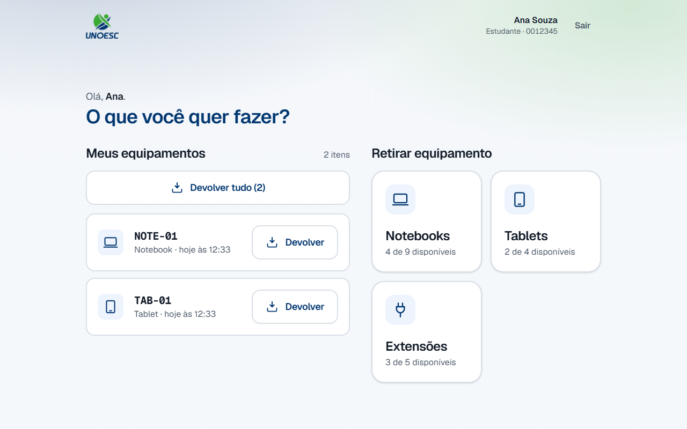
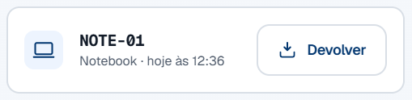
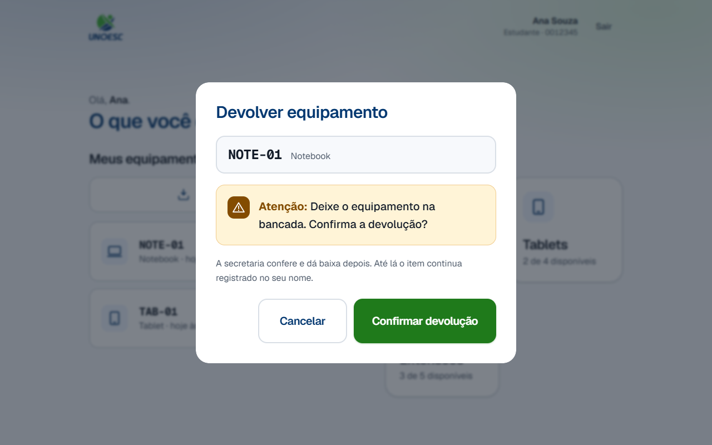
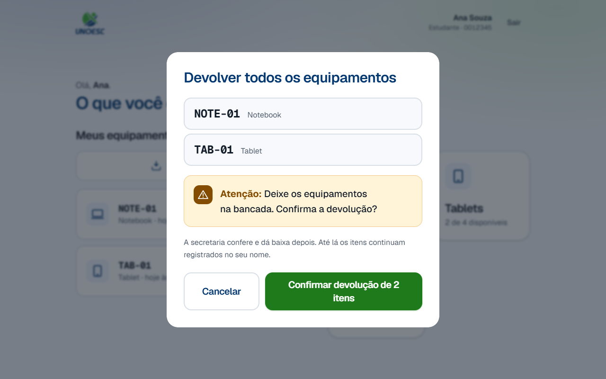
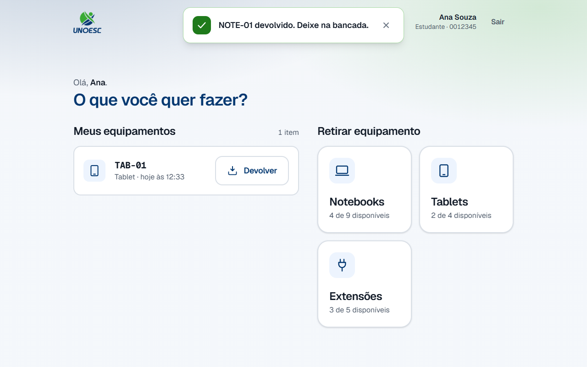
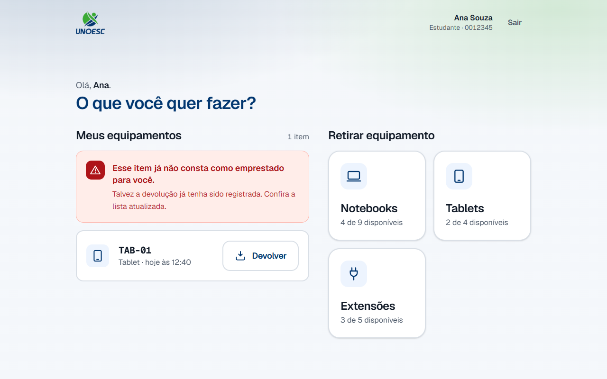
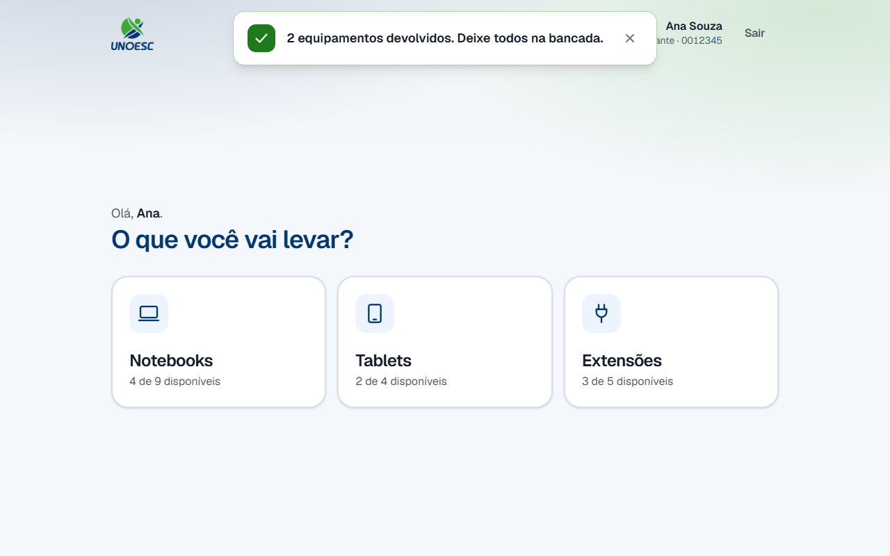
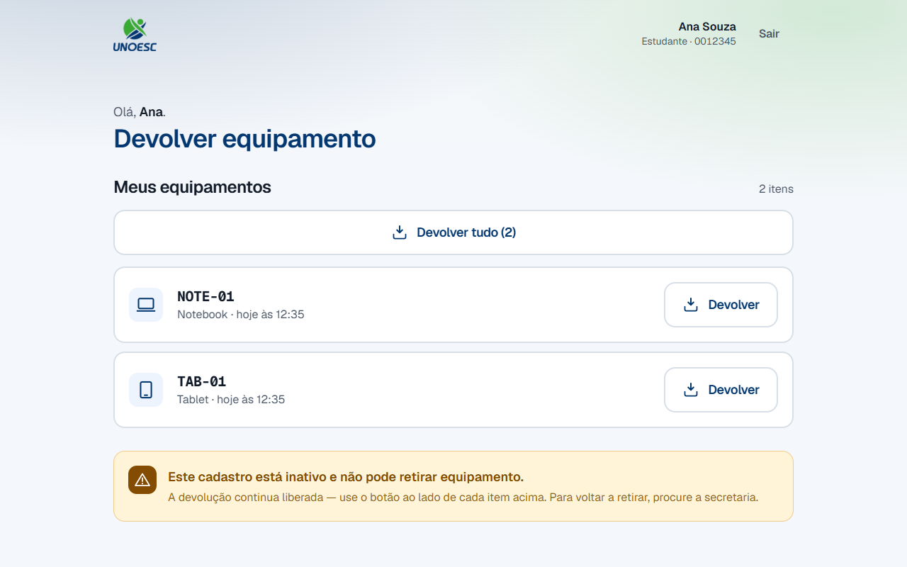

# 2. Equipment return

## 1. What this process is for

This process gives a borrowed device back to the front desk. Whoever is holding
it leaves it on the counter and **declares** the handover on the tablet, using
the same enrollment number they picked it up with.

When it ends, the item leaves the list of the person who took it and enters the
front desk checking queue. The device does **not** go back on the shelf yet: the
cycle is closed by the [physical check-in](../painel/baixa-fisica.md), in the
admin panel.

## 2. Before you start

- The tablet on the counter is on, with the portal open.
- You have at least one device recorded in your name.
- **The device is physically on the counter, or will be before you confirm.**
  This is the precondition the whole process exists to guarantee — see the
  [rule below](#7-rules-that-are-not-obvious).
- The enrollment number is registered. The record may be active **or** inactive:
  returning is allowed in both cases.

## 3. Terms used on this page

Terms that cross several processes live in the
[general glossary](../referencia/glossario.md):
[enrollment number](../referencia/glossario.md#enrollment-number),
[asset tag](../referencia/glossario.md#asset-tag),
[loan](../referencia/glossario.md#loan),
[physical check-in](../referencia/glossario.md#physical-check-in),
[shelf time](../referencia/glossario.md#shelf-time) and
[inactive record](../referencia/glossario.md#inactive-record-person).

These three belong to this page only — they are the parts of the screen that the
steps name:

| Term                                     | What it is                                                                                                                    |
| ---------------------------------------- | ------------------------------------------------------------------------------------------------------------------------------- |
| **Meus equipamentos** (My equipment)     | The section of the opening screen that lists what is in your name **right now**, one row per device.                          |
| Declaring the return                     | What tapping **Confirmar devolução** (Confirm return) does: telling the system the device was left on the counter. It is not the check. |
| **Devolver tudo** (Return all)           | The shortcut above the list, which sends every item at once. It only appears from two items upwards.                          |

## 4. Who does what

| Role               | Does                                                                                                          | Does not                                                                                                        |
| ------------------ | ----------------------------------------------------------------------------------------------------------------- | ------------------------------------------------------------------------------------------------------------------- |
| Student or teacher | Leaves the device on the counter and declares the return on the tablet, item by item or all at once.              | Does not check anything in. Declaring is not the same as the front desk confirming.                                  |
| Portal (the tablet) | Lists the open loans for the enrollment number, records the declaration and stamps the time of it.               | **Does not put the device back in the inventory.** The device stays on loan until the physical check.                |
| Front desk         | Collects what is on the counter and confirms receiving it in the admin panel — that is [process 3](../painel/baixa-fisica.md). | Takes no part in the return on the tablet. Does not need to be there for you to declare.                |

## 5. BPMN diagram

Click the diagram to open it at full size — at the width of this page it fits at
a little over a third of its size, and the labels cannot be read.

Notice how the diagram **ends**: the last event is not "device available", it is
"the device stays on loan and waits for the front desk". The arrow leaving it is
the message that [process 3](../painel/baixa-fisica.md) consumes.

**The diagram labels are in Portuguese**, because it is the same file the
Portuguese pages use.

??? note "The diagram labels, in English"

    | Label on the diagram | In English |
    | --- | --- |
    | Estudante e Professor | Student and teacher (the lane) |
    | Sistema | System (the lane) |
    | Chega na bancada com o equipamento | Arrives at the counter with the device |
    | Digita a matrícula no teclado do tablet | Types the enrollment number on the tablet keypad |
    | Lista os empréstimos ATIVO da matrícula | Lists the `ATIVO` (active) loans for that enrollment number |
    | Tem equipamento com você? | Do you have any device? |
    | Nada a devolver; a tela é só a da retirada | Nothing to return; the screen is the pickup one only |
    | Um item ou a lista inteira? | One item or the whole list? |
    | Toca em Devolver na linha do item | Taps **Devolver** (Return) on the item's row |
    | Toca em Devolver tudo, que só existe a partir de 2 itens | Taps **Devolver tudo** (Return all), which only exists from 2 items upwards |
    | Confirma no aviso: deixa o equipamento na bancada | Confirms in the dialog: leaves the device on the counter |
    | Empréstimo ainda está ATIVO? | Is the loan still `ATIVO` (active)? |
    | Esse item já não consta como emprestado para você | That item is no longer recorded as on loan to you |
    | Marca AGUARDANDO_BAIXA e grava a data da declaração | Marks it `AGUARDANDO_BAIXA` (awaiting check-in) and stamps the declaration time |
    | Devolução declarada | Return declared |
    | O equipamento segue EMPRESTADO e espera a secretaria | The device stays `EMPRESTADO` (on loan) and waits for the front desk |
    | sim / não | yes / no |
    | um item / a lista inteira | one item / the whole list |

[Download the `.bpmn` file](../../processos-fonte/02-devolucao.bpmn) — the source
of the diagram, which opens in [bpmn.io](https://bpmn.io) with nothing to
install.

## 6. Step by step

!!! warning "The screen goes back to the start on its own"

    After two minutes with no touch, the portal ends the session and returns to
    the enrollment number screen. If that happens before you confirm, start
    again from step 1 — nothing was recorded. A return that is already confirmed
    is not undone by it.

1. Type your enrollment number on the on-screen keypad.

    Type every digit, leading zeros included: `0012345` and `12345` are
    different enrollment numbers.

2. Tap **Continuar** (Continue).

3. Look at the **Meus equipamentos** (My equipment) section, on the left.

    

    Each row carries the asset tag of the device, the category and how long you
    have had it. The asset tag is the same one stuck on the device, character by
    character — that is how you tell one from another.

    Only devices still in your name appear here. Anything you have already
    returned disappears from the list, even if the front desk has not collected
    it yet.

4. Leave the device you came to return on the counter.

    This step comes **before** the confirmation on purpose, and not as a
    formality: the system has no way of knowing whether the device is there.
    What you confirm on the next screen is that this step has already happened.

5. Are you returning one item or all of them at once?

    - **If ONE item** → tap **Devolver** (Return) on the row for that device. Go
      to step 6.
    - **If ALL** → tap **Devolver tudo** (Return all), above the list. The
      button carries the number of items in parentheses and only exists from two
      items upwards. Go to step 6.

    

    

6. Check the asset tag shown at the top of the dialog against the one on the
   device you left on the counter.

    

    The notice says, in these words:

    > **Atenção:** Deixe o equipamento na bancada. Confirma a devolução?

    (**Warning:** Leave the device on the counter. Confirm the return?)

    And just below it:

    > A secretaria confere e dá baixa depois. Até lá o item continua registrado
    > no seu nome.

    (The front desk checks it and checks it in later. Until then the item stays
    recorded in your name.)

    In **Devolver tudo** (Return all) the dialog is called **Devolver todos os
    equipamentos** (Return all equipment), lists one asset tag per row and puts
    both sentences in the plural.

    

    > **Atenção:** Deixe os equipamentos na bancada. Confirma a devolução?

    (**Warning:** Leave the devices on the counter. Confirm the return?)

    Wrong item? Tap **Cancelar** (Cancel). While the dialog is open, nothing has
    been recorded.

7. Tap **Confirmar devolução** (Confirm return).

    In a batch the button reads **Confirmar devolução de N itens** (Confirm
    return of N items), with the number of devices in the list.

8. Was the item still recorded as on loan to you?

    - **If YES** → a green notice confirms it at the top of the screen —
      "NOTE-01 devolvido. Deixe na bancada." (NOTE-01 returned. Leave it on the
      counter.) — and the row disappears from the list.
    

    - **If NO** → the dialog closes and the list shows "Esse item já não consta
      como emprestado para você." (That item is no longer recorded as on loan to
      you.) This happens when the same device was declared twice. The list is
      re-read straight away: check what is left.

    

9. Look at the category grid, on the right.

    It still shows **the same counts as before** the return. This is not a
    refresh failure: it is the rule this whole process is built on, and the
    [first question in section 7](#7-rules-that-are-not-obvious) explains why.

10. Tap **Sair** (Exit), in the top right corner, or let the screen go back to
    the start on its own.

    Returned everything? The **Meus equipamentos** (My equipment) section
    disappears entirely, and the screen becomes the [pickup](retirada.md) one
    again.

    

## 7. Rules that are not obvious

!!! question "I returned it on the tablet. Why is the device not available?"

    Because returning on the tablet is a **declaration**, not a check.

    When you confirm, the loan moves to *awaiting check-in* — the device is
    physically on the counter, but nobody at the front desk has collected it
    yet. If it went back to *available* at that moment, the tablet would offer
    somebody else a device that is still sitting on the counter, and they would
    look for it on the shelf and not find it.

    That is why the count in the category grid does not change when you return
    something. It is easy to check on the screenshot in step 8: the green notice
    says `NOTE-01` was returned, and "Notebooks" still reads "4 de 9
    disponíveis" (4 of 9 available).

    The device is offered again once the front desk confirms receiving it — that
    is the [physical check-in](../painel/baixa-fisica.md), the next process.

!!! question "Why does the dialog insist on 'Deixe o equipamento na bancada'?"

    Because that is the only part of the process the system cannot verify.

    The tablet records what you declare. If you confirm and walk away with the
    device in your bag, the record says it came back and the front desk looks for
    it on the counter, where it is not. No error appears on screen to warn you —
    the mismatch only shows up at the physical check, and by then it shows up as
    a missing device, in your name.

    It is the only physical instruction in the whole system, and that is why it
    gets a box of its own instead of a line of small print.

!!! question "Which time is recorded: my tap or the check?"

    Your tap. The declaration and the check are **two** different stamps, and
    each one has a single owner.

    The distance between them is the
    [shelf time](../referencia/glossario.md#shelf-time): how long the device sat
    on the counter, already handed over by you and still invisible to anybody
    who wants to pick something up. It exists to measure that bottleneck, and
    that is why the two times cannot be the same field.

    For you this has one practical consequence: what counts as the time of your
    return is the moment you confirmed, not the moment the front desk got to the
    counter.

!!! question "My record is inactive. Can I still return things?"

    Yes. The block on an inactive record works in one direction only: it stops
    **pickups** and allows **returns**.

    

    The asymmetry is deliberate. People who are deactivated — enrollment
    suspended, graduated, left the institution — nearly always have a device in
    their bag. Blocking both directions would turn deactivation into a guarantee
    that the device never comes back to the cabinet.

    On screen, the heading becomes **Devolver equipamento** (Return equipment),
    the list stays whole and the category grid gives way to the explanation. To
    pick equipment up again, ask the front desk.

!!! question "I took three items at once. Why can I return just one?"

    Because each device picked up creates a **separate** record, even though you
    confirmed only once.

    That is what lets you return the laptop on Tuesday and keep the power strip
    until Friday. If the three were a single record, returning one would force
    you to return them all, and the front desk would have no way of knowing which
    device was already back.

    **Devolver tudo** (Return all) is a shortcut on top of that, not an
    exception: it declares the loans one by one, in the same transaction. Either
    all of them enter the queue or none does — walking away thinking you handed
    everything back when half of it was not recorded would be worse than
    returning nothing.

!!! question "I tapped Devolver on the wrong item. How do I undo it?"

    There is no way to undo it from the tablet. Once confirmed, the item leaves
    your list and enters the front desk queue.

    What fixes it is making your declaration true: **take the device to the
    counter**. If you still need it, leave it there anyway and pick it up again
    after the front desk confirms receiving it — only then is it offered on the
    portal again.

    If the device was already on the counter and the problem was returning the
    wrong item from your list, tell the front desk before the check: they are the
    ones who can correct the record, from the admin panel.

!!! info "Where this process ends"

    Not here. The return you have just declared is waiting for the front desk to
    check it — and it is the check that puts the device back in the inventory,
    closes the loan and makes the available count go up.

    That is **[Process 3 — Physical check-in](../painel/baixa-fisica.md)**, on
    the admin panel track.

## 8. Common errors and what to do

| Message on screen                                                                                                    | Cause                                                                          | What to do                                                                                                    |
| ---------------------------------------------------------------------------------------------------------------------- | -------------------------------------------------------------------------------- | ----------------------------------------------------------------------------------------------------------------- |
| "Digite a sua matrícula para continuar." (Type your enrollment number to continue.)                                    | **Continuar** (Continue) was tapped with the field empty.                       | Type the enrollment number on the on-screen keypad and tap **Continuar** (Continue) again.                     |
| "Matrícula 9999999 não encontrada." (Enrollment number 9999999 not found.)                                             | A wrong digit, a missing leading zero, or a record that was never imported.     | Check the digits and type them again. If they are right, ask the front desk.                                   |
| "Esse item já não consta como emprestado para você." (That item is no longer recorded as on loan to you.)              | The same device was declared twice, or the front desk has already checked it in. | The list re-reads itself. Check what is left in it: if the item is gone, its return is already recorded.       |
| "Nenhum equipamento seu está pendente de devolução." (None of your equipment is pending return.)                       | **Devolver tudo** (Return all) was confirmed after the list had already emptied. | Check the refreshed list. If it has disappeared from the screen, there is nothing left in your name.           |
| "Não foi possível falar com o sistema agora." (Could not reach the system right now.)                                  | The tablet could not reach the front desk computer.                             | Tap **Confirmar devolução** (Confirm return) again in a few seconds. If it persists, tell the front desk — and leave the device on the counter. |
