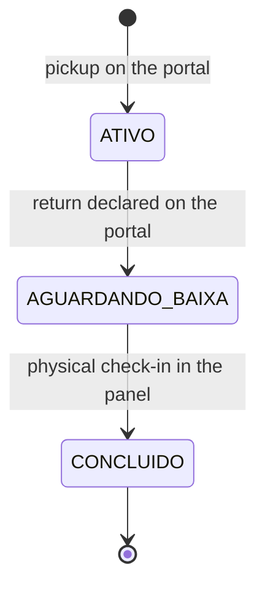
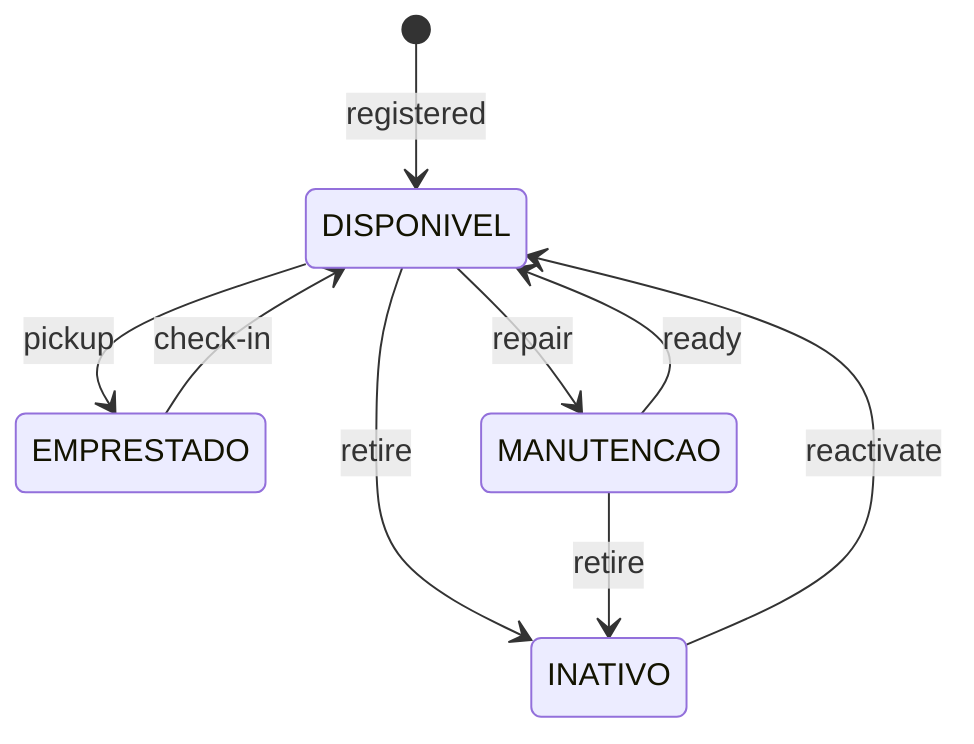

# States and transitions

The system has **two** state machines, and they run in parallel: one for the
loan (the record that somebody took a device) and one for the equipment (the
device itself). They touch at exactly two moments — the pickup and the
[physical check-in](glossario.md#physical-check-in) — and run free of each other
in between.

That "free in between" is the rule that raises the most questions at the desk,
and the [cross table](#both-at-once) at the end of this page exists to answer it
once and for all.

!!! info "How to read the names in capitals"

    `ATIVO`, `DISPONIVEL`, `AGUARDANDO_BAIXA` are the values stored in the
    database. The screen hardly ever shows them like that: the inventory writes
    "Disponível", the record list writes "Ativo". Both names appear side by side
    here on purpose — this is the page that connects the word on screen to the
    data stored.

## The loan machine

Each item picked up creates a **separate** loan (see
[loan](glossario.md#loan)). Somebody who takes a laptop and a power strip on the
same trip to the desk has two records, which travel through this machine
independently.

| Transition | Who triggers it | On which screen | Time stamp written |
| --- | --- | --- | --- |
| (born) → `ATIVO` | Student or teacher | [Portal](glossario.md#portal), **Confirmar retirada** (Confirm pickup) button | `data_retirada` |
| `ATIVO` → `AGUARDANDO_BAIXA` | Student or teacher | [Portal](glossario.md#portal), **Confirmar devolução** (Confirm return) button (or **Devolver tudo** / Return all) | `data_devolucao` |
| `AGUARDANDO_BAIXA` → `CONCLUIDO` | Front desk | [Admin panel](glossario.md#admin-panel), **Confirmar Recebimento Físico** (Confirm physical receipt) button (or **Confirmar Todas as Devoluções** / Confirm all returns) | `data_baixa` |

The three stamps are **three different fields**, and each has a single owner.
The distance between the last two is the
[shelf time](glossario.md#shelf-time): how long the device sat on the counter
after somebody said they had returned it.

### What this machine does not do

* **It does not go back.** There is no `AGUARDANDO_BAIXA` → `ATIVO`, and no
  `CONCLUIDO` → anything. A loan closed by mistake is not reopened by any
  screen — the way out is to record a new pickup.
* **It does not skip.** `ATIVO` never goes straight to `CONCLUIDO`. The front
  desk check is the only path to the end, and that is why it exists.
* **It does not delete.** A `CONCLUIDO` loan stays in the database forever. It
  is what answers "who had this device last semester".

## The equipment machine

| Transition | Who triggers it | On which screen |
| --- | --- | --- |
| (born) → `DISPONIVEL` | Front desk | Panel, **Inventário** (Inventory) tab, registration form |
| `DISPONIVEL` → `EMPRESTADO` | Student or teacher | Portal, on confirming the pickup |
| `EMPRESTADO` → `DISPONIVEL` | Front desk | Panel, at the [physical check-in](glossario.md#physical-check-in) |
| `DISPONIVEL` → `MANUTENCAO` | Front desk | Panel, **Manutenção** (Maintenance) button on the row |
| `MANUTENCAO` → `DISPONIVEL` | Front desk | Panel, **Disponível** (Available) button on the row |
| `DISPONIVEL` → `INATIVO` | Front desk | Panel, **Inativar** (Deactivate) button on the row |
| `MANUTENCAO` → `INATIVO` | Front desk | Panel, **Inativar** (Deactivate) button on the row |
| `INATIVO` → `DISPONIVEL` | Front desk | Panel, **Reativar** (Reactivate) button on the row |

### The three absences, and the reason for each

!!! warning "`EMPRESTADO` is not a button"

    The front desk moves equipment between `DISPONIVEL`, `MANUTENCAO` and
    `INATIVO`, and that is all. `EMPRESTADO` comes and goes on its own, through
    the two gestures that involve a real person carrying the device.

    If there were a button, setting it by hand would leave an open loan pointing
    at an "available" item — and the portal would offer somebody else a device
    that is in a bag. That is why the row of an item on loan shows **the name of
    whoever has it** instead of the button.

!!! warning "`INATIVO` does not go straight to `MANUTENCAO`"

    A retired device goes back to `DISPONIVEL` first; the repair is decided
    afterwards. They are two different questions — "is this item going back into
    circulation?" and "does it need repair?" — and putting them in one click
    would make the front desk answer both without being asked.

!!! warning "With an open loan, nothing changes"

    While there is an `ATIVO` **or** `AGUARDANDO_BAIXA` loan pointing at the
    device, the panel refuses any change of status. The message says who has it,
    or tells you to confirm the receipt first.

    The lock is the opposite of the rule for people, which is loose on purpose —
    see
    [deactivating a person and deactivating a device](regras-de-negocio.md#deactivating-a-person-and-deactivating-a-device-are-not-the-same-rule).

## Both at once

This is the table that answers the most frequent question about the system. It
crosses **every** combination: the three loan states plus the case "no open
loan", against the four equipment states.

| Open loan | Equipment | Does it happen? | What it means |
| --- | --- | --- | --- |
| `ATIVO` | `EMPRESTADO` | **Normal** | The device is with the person. It disappears from the portal; in the inventory it appears with their name and no button. |
| `ATIVO` | `DISPONIVEL` | Inconsistency | The portal would offer somebody else a device that is in a bag. No screen produces this. |
| `ATIVO` | `MANUTENCAO` | Does not happen | The panel refuses to change the status while there is an open loan. |
| `ATIVO` | `INATIVO` | Does not happen | The same refusal. |
| `AGUARDANDO_BAIXA` | `EMPRESTADO` | **Normal** | **The two-phase rule.** The person declared the return, the device is on the counter, and it stays out of circulation until the front desk checks it. |
| `AGUARDANDO_BAIXA` | `DISPONIVEL` | Inconsistency | It would be the portal offering a device nobody has collected yet. |
| `AGUARDANDO_BAIXA` | `MANUTENCAO` | Does not happen | The same refusal from the panel. |
| `AGUARDANDO_BAIXA` | `INATIVO` | Does not happen | The same refusal. |
| None | `DISPONIVEL` | **Normal** | The common case: the device is on the shelf, counting in the portal grid. |
| None | `MANUTENCAO` | **Normal** | Under repair. Disappears from the portal, appears in the inventory. |
| None | `INATIVO` | **Normal** | [Retired](glossario.md#retirement-inactive-item). Disappears from the portal, counts included, and sits in gray in the inventory. |
| None | `EMPRESTADO` | Inconsistency | The panel **refuses** to release it on its own and tells you to check the history: releasing an item somebody might be holding is worse than a message asking for attention. |

!!! question "And the `CONCLUIDO` loan, where is it in that table?"

    In the last four rows, in the "None" column. `CONCLUIDO` means precisely
    that the loan **is no longer open** — it does not hold the device anymore,
    and from then on the equipment can be in any of the four states, including
    `EMPRESTADO` again, through a new loan to somebody else.

    A device accumulates dozens of `CONCLUIDO` loans over its life and that says
    nothing about where it is now. What answers "where is it" is always the
    equipment status plus the **open** loan, if there is one.

### The three inconsistency rows

The three rows marked "Inconsistency" are not produced by any screen of the
system — the writes that create and close loans touch both machines inside the
same transaction, and one half does not happen without the other.

If one of them shows up, the source is external: an edit made directly in the
database, or a half-finished file restore. The last row is the only one the
panel can notice on its own, and its answer is to refuse rather than to "fix".

## Where to go next

* The *why* behind each of these rules is in
  [Business rules](regras-de-negocio.md).
* The vocabulary — what a counter is, what a shelf is, what a
  [status](glossario.md#status) is — is in the [Glossary](glossario.md).
* The processes that trigger each transition are in
  [Pickup](../portal/retirada.md), [Return](../portal/devolucao.md),
  [Physical check-in](../painel/baixa-fisica.md) and
  [Inventory management](../painel/inventario.md).
