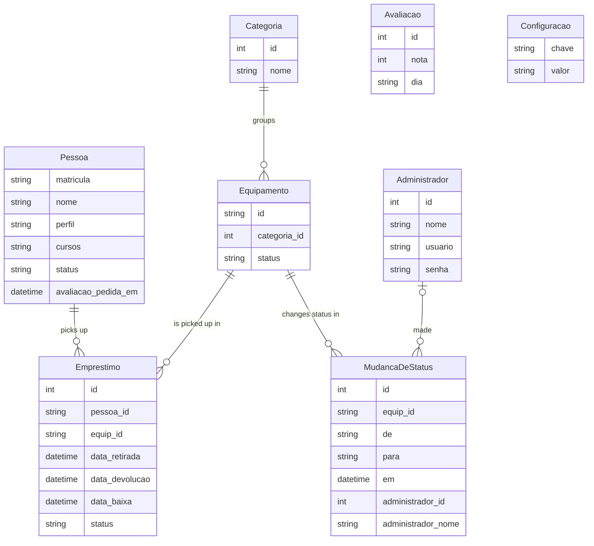

# System architecture

This page is the technical portrait of the system that the rest of the wiki
describes from the outside. It serves the reader who finished a process page and
still wonders what runs behind it.

It is short on purpose. Anyone about to **change** the code has two deeper
documents in the repository: the
[README](https://github.com/viccenzo-boff/sistema-emprestimo-equipamentos/blob/main/README.md),
with the setup recipe, the scripts and the admin panel access, and
[AGENTS.md](https://github.com/viccenzo-boff/sistema-emprestimo-equipamentos/blob/main/AGENTS.md),
which holds the decision record of every task — the discarded alternative and
the reason, task by task.

## Where the system runs

There is no cloud. The system runs **on the front desk computer**, over the
local network, and the counter tablet reaches it at that machine's address. That
comes from the
[product specification](https://github.com/viccenzo-boff/sistema-emprestimo-equipamentos/blob/main/especificacoes/spec.md),
and it explains almost everything else on this page.

Two consequences show up on screen:

- **The connection is HTTP, not HTTPS.** The admin panel session cookie has its
  `secure` flag turned off on purpose. With the flag on, the browser would
  discard the cookie and nobody could sign in.
- **No internet sits in the path.** If the institution network goes down, the
  counter keeps working.

## The two front ends

Two rather different interfaces live inside **a single application**.

| Front end | Route | Device | Who uses it | What it does |
| --- | --- | --- | --- | --- |
| Portal | `/` | Tablet at the counter | Students and teachers | [Pickup](../portal/retirada.md) and [return](../portal/devolucao.md) |
| Admin panel | `/admin` | Front desk computer | Front desk | [Physical check-in](../painel/baixa-fisica.md), [inventory](../painel/inventario.md) and [people](../painel/pessoas.md) |

The portal has **no sign-in**: the enrollment number is the identification, and
it lasts for a single visit. The admin panel has an
[account and a password](../referencia/conta-do-administrador.md).

The split is by audience, not by server. Both front ends share the database, and
that is what makes a return declared on the tablet appear in the front desk
queue at the same instant.

## The stack

| Layer | Choice | Why |
| --- | --- | --- |
| Framework | Next.js 16 (App Router) | One base for the screens and for writing to the database |
| Interface | React 19 and Tailwind CSS 4 | Large touch targets on the tablet, dense tables on the panel |
| Database access | Prisma 7, with the `better-sqlite3` adapter | Schema declared in one file and migrations under version control |
| Database | SQLite, single file | See the section below |
| Passwords | `bcryptjs` | Pure JavaScript, no C++ toolchain on the front desk machine |
| Spreadsheets | SheetJS | Reads the registrar's `.xlsx` without manual conversion, and writes the reports' `.xlsx` |
| Charts | Recharts 3, pinned version | Bars the project already drew in CSS; a line and a pie with axis, legend and tooltip by hand would be hundreds of lines to maintain. It enters only on the reports screen, loaded when the tab opens |

### Why SQLite in a single file

The whole database is **one file** on the front desk machine. There is no
database server to install, configure, update or restart.

The alternative considered was a server database, such as PostgreSQL or MySQL.
It was discarded because it adds a part that somebody has to keep alive on a
front desk computer, with no infrastructure team nearby. If the service fails to
come up after a Windows restart, the counter stops and nobody in the building
knows why. With a single file, **making a backup means copying the file**, and
restoring means putting it back.

The cost is known and fits the problem: one write at a time, and the front desk
machine is the ceiling for everything. For a counter with dozens of devices and
a handful of people per hour, that is room to spare.

## The data model

Eight tables. The arrows point from whichever table holds the reference to the
one being referenced.

`Administrador` appears in **no** loan: recording who performed each check-in
is a column that does not exist yet, and it sits on the list of
[what was left out](como-esta-wiki-foi-feita.md#what-was-left-out). Where it
does appear, since `v1.2`, is in `MudancaDeStatus`: one row per status change
made in the panel (maintenance, retirement, reactivation), with from where, to
where, when, and **who** — the link to the account and, next to it, the name it
had at the time. The link is optional on purpose: recovering a forgotten
password means deleting the account and seeding again, and neither may the
database refuse that because of the history, nor may the history go away with
it. The name stays. That table is what the maintenance rate report reads.

`Avaliacao` and `Configuracao` stand apart as well, for opposite reasons
(`v1.2`). `Avaliacao` **cannot** point at a person or at a loan: it is the
anonymous rating at the end of a pickup, and the row keeps only the rating and
the day — even the `id` is drawn at random, not sequential, so the write order
does not reveal who answered after whom. The stamp of when a person was last
asked sits on the other side, in `Pessoa.avaliacao_pedida_em`, with no link to
the row. `Configuracao` is a key-value table for what has to change without a
deploy; today it holds only the suggestion form URL that the tablet's QR code
opens.

Four points of the model that the wiki explains in full under
[business rules](../referencia/regras-de-negocio.md):

- **The key of `Pessoa` is the enrollment number, stored as text.** As a number,
  the `0012345` on the student card would become `12345`, which is a different
  enrollment number.
- **The key of `Equipamento` is the asset tag** — the `NOTE-01` stuck on the
  device. That is what makes the screen and the sticker match character by
  character.
- **Every item picked up creates a separate `Emprestimo`**, even when three
  leave in the same confirmation. That is what allows returning one and keeping
  the others.
- **`Emprestimo` carries three timestamps with distinct owners**: the pickup on
  the tablet, the **declaration** of the return on the tablet, and the
  **physical check** at the front desk. The gap between the last two is the
  [shelf time](../referencia/glossario.md#shelf-time).

### Nothing is deleted

Neither people nor equipment. Both have an `INATIVO` state, which is retirement
rather than deletion: the loan history points at them, and a deletion would take
last semester with it. The database itself refuses the operation.

The exception is the **category**, which can be deleted for real, because no
loan points at it — and even so, only while it is empty. The database refuses
that one too. Both rules are in
[inventory management](../painel/inventario.md).

## Where the rules live

Every write to the database goes through a **Server Action**, a function that
runs on the server and that the screen calls as though it were local.

The detail that matters for anyone about to change the code: **a Server Action
is a public POST endpoint**. Hiding a button on screen does not close the door.
That is why the admin panel session check runs inside every action instead of
around the pages, and why a return from the tablet filters by the enrollment
number that was typed rather than trusting the identifier the screen sent.
Without that filter, a direct request would check in someone else's loan.

The panel session is a signed cookie whose **key is the hash of that account's
password**. From that follows, at no extra cost, that changing a password drops
that person's session and only theirs, and that restarting the server signs
nobody out. The
[account page has the full path](../referencia/conta-do-administrador.md).

## What this page does not cover

Setup, database scripts, importing the registrar's spreadsheet and the password
recovery routine are in the
[README](https://github.com/viccenzo-boff/sistema-emprestimo-equipamentos/blob/main/README.md).
The decision record — every discarded alternative, with the measurement that
discarded it — is in
[AGENTS.md](https://github.com/viccenzo-boff/sistema-emprestimo-equipamentos/blob/main/AGENTS.md).
