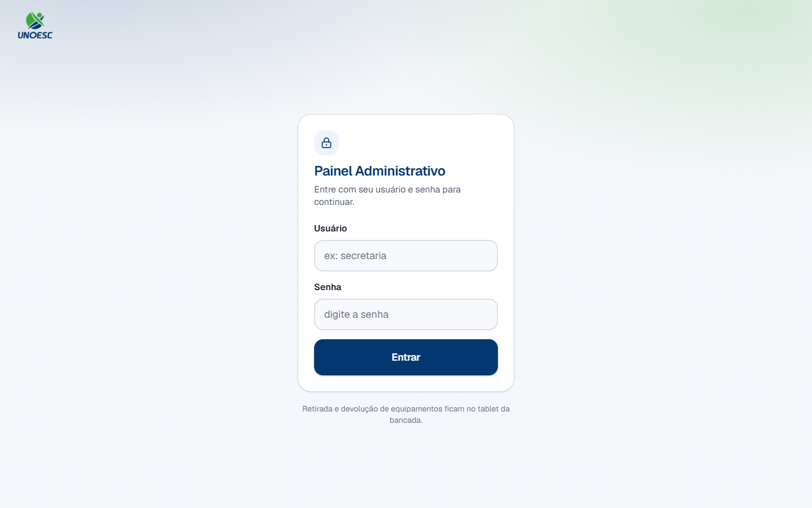
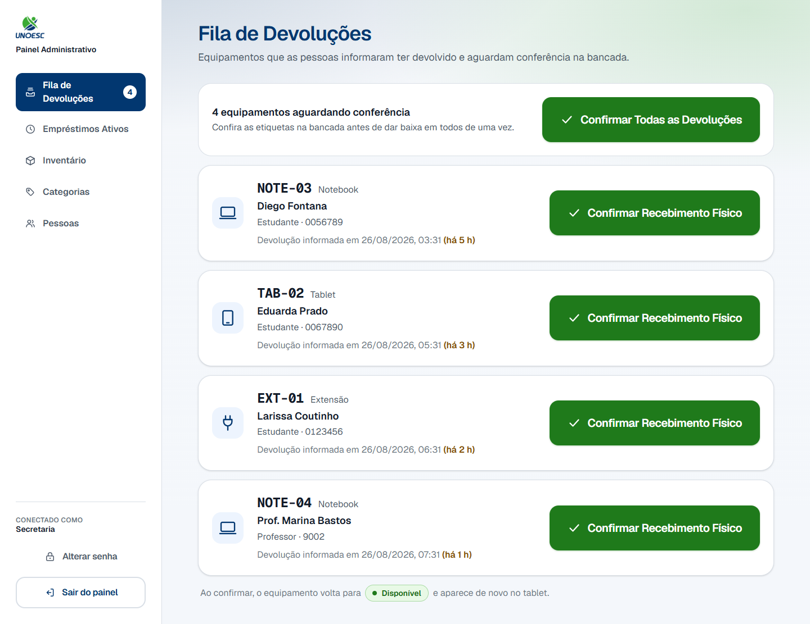
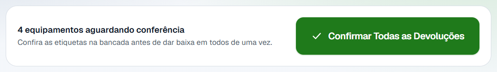
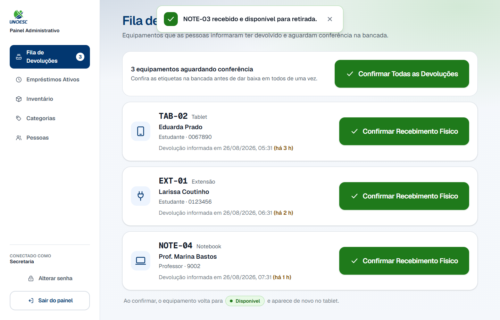
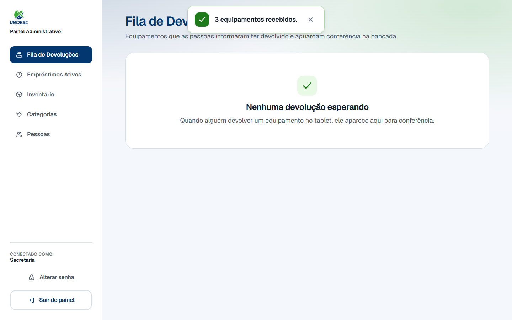
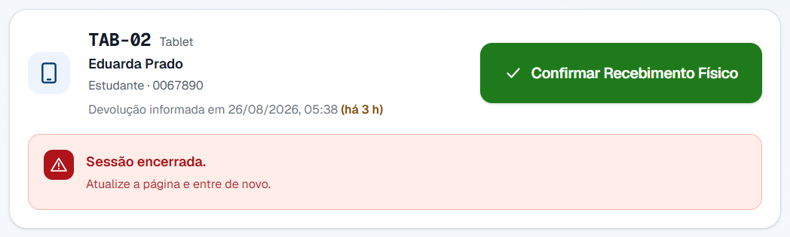

# 3. Baixa física

## 1. Objetivo do processo

Este processo fecha o ciclo que a [devolução](../portal/devolucao.md) deixou
aberto. A secretaria recolhe da bancada o aparelho que alguém declarou ter
devolvido, confere a etiqueta e confirma o recebimento no painel.

Quando termina, o empréstimo é encerrado e o equipamento volta para a
prateleira — passa a ser oferecido de novo no tablet. É a **única** etapa que
faz isso.

## 2. Pré-condições

- Você está com a sessão aberta no painel. Se não estiver, entre com seu login e
  senha — ver [Conta do administrador](../referencia/conta-do-administrador.md).
- Alguém declarou a devolução no tablet. Sem isso não há linha na fila: quem
  põe o empréstimo ali é o [processo 2](../portal/devolucao.md).
- **O aparelho está na sua mão, recolhido da bancada.** Esta é a pré-condição
  que o processo inteiro existe para garantir — ver a
  [regra abaixo](#7-regras-que-nao-sao-obvias).
- A etiqueta colada no aparelho está legível.

## 3. Glossário do processo

Os termos que atravessam vários processos moram no
[glossário geral](../referencia/glossario.md):
[baixa física](../referencia/glossario.md#baixa-fisica),
[fila de devoluções](../referencia/glossario.md#fila-de-devolucoes),
[etiqueta](../referencia/glossario.md#etiqueta),
[empréstimo](../referencia/glossario.md#emprestimo),
[tempo de prateleira](../referencia/glossario.md#tempo-de-prateleira) e
[manutenção](../referencia/glossario.md#manutencao).

Estes três são só desta página — são as partes da tela que os passos citam pelo
nome:

| Termo                          | O que é                                                                                                              |
| ------------------------------ | ---------------------------------------------------------------------------------------------------------------------- |
| Fila de Devoluções             | A primeira tela do painel: uma linha por aparelho que alguém declarou ter devolvido e que ainda não foi conferido.    |
| Confirmar Recebimento Físico   | O botão de cada linha. Encerra **aquele** empréstimo e devolve **aquele** aparelho à prateleira.                      |
| Confirmar Todas as Devoluções  | O atalho no alto da lista, que confirma a bancada inteira. Só aparece a partir de dois itens.                         |

## 4. Papéis e responsabilidades

| Papel                  | Faz                                                                                                                       | Não faz                                                                                                     |
| ---------------------- | ----------------------------------------------------------------------------------------------------------------------- | ----------------------------------------------------------------------------------------------------------- |
| Secretaria             | Recolhe o aparelho da bancada, confere a etiqueta contra a linha e confirma o recebimento no painel.                       | Não devolve pelo tablet. A declaração é de quem levou o aparelho.                                            |
| Painel (o computador)  | Lista o que está esperando conferência, encerra o empréstimo, carimba a hora da baixa e devolve o equipamento ao estoque.  | **Não confere nada sozinho.** Ele registra que você conferiu; quem olha a etiqueta é você.                    |
| Estudante ou professor | Deixou o aparelho na bancada e declarou a devolução no tablet.                                                            | Não participa deste processo. Para quem devolveu, o aparelho já saiu da lista desde a declaração.            |

## 5. Diagrama BPMN

Clique no diagrama para abri-lo em tamanho cheio — na largura da página ele
entra a pouco mais de um terço do tamanho, e os rótulos não se leem.

Repare em como o diagrama **começa**: o evento de início não é "a secretaria
abre o painel", é **Devolução declarada no tablet** — a mensagem que o
[processo 2](../portal/devolucao.md) emite quando alguém confirma a devolução.
Os dois diagramas se encaixam nesse ponto, e é por isso que a fila pode estar
cheia sem ninguém ter aberto o painel.

[Baixar o arquivo `.bpmn`](../processos-fonte/03-baixa-fisica.bpmn) — a fonte do
diagrama, que abre no [bpmn.io](https://bpmn.io) sem instalar nada.

## 6. Passo a passo

1. Abra o painel no computador da secretaria.

    

2. Digite seu login no campo **Usuário** e sua senha no campo **Senha**.

3. Clique em **Entrar**.

    O painel abre direto na **Fila de Devoluções** — ela é a primeira tela
    porque é a única com prazo.

4. Confira quantos aparelhos estão esperando.

    

    O número ao lado de **Fila de Devoluções**, no menu à esquerda, é o mesmo
    total. Ele acompanha a lista: some quando a fila zera.

5. Leia a linha do aparelho que você tem em mãos.

    

    Cada linha traz a etiqueta em letra grande, a categoria, quem devolveu, a
    matrícula, e a legenda **Devolução informada em**, com o tempo decorrido
    entre parênteses — "(há 5 h)". Esse tempo é o que faz a fila ser trabalhada
    de cima para baixo: quanto maior, mais tempo o aparelho está parado na
    bancada sem poder ser emprestado a ninguém.

6. Pegue o aparelho na bancada.

    Este passo não tem clique, e é o único do sistema inteiro que acontece fora
    da tela. Ele está numerado porque é o passo que dá sentido a todos os
    outros: o que você vai confirmar na tela é que ele já aconteceu.

7. Confira a etiqueta colada no aparelho contra a etiqueta da linha, caractere
   por caractere.

    A etiqueta está em letra monoespaçada de propósito, para bater com o adesivo
    sem dúvida entre caracteres parecidos.

8. As duas etiquetas são iguais?

    - **Se SIM** → siga para o passo 9.
    - **Se NÃO** → não confirme esta linha. Procure a linha da etiqueta que você
      tem em mãos. Se ela não estiver na fila, o aparelho ainda não foi
      devolvido no tablet — ver a
      [pergunta sobre confirmar o item errado](#7-regras-que-nao-sao-obvias).

9. Você vai confirmar um aparelho ou a bancada inteira?

    - **Se for UM** → clique em **Confirmar Recebimento Físico**, na linha
      daquele aparelho. Siga para o passo 10.
    - **Se forem TODOS** → clique em **Confirmar Todas as Devoluções**, no alto
      da lista. Confira antes que **todos** os aparelhos da lista estão na sua
      mão: o botão confirma a lista inteira de uma vez. Siga para o passo 10.

    

    

10. Confira o aviso verde no alto da tela.

    

    Ele diz a etiqueta e o que aconteceu com o aparelho — "NOTE-03 recebido e
    disponível para retirada." A linha some da lista e o contador do menu cai.

    No lote, o aviso conta o total: "3 equipamentos recebidos." Se alguma linha
    não puder ser confirmada, ele diz isso na mesma frase, em vez de esconder —
    ver a [pergunta sobre o lote](#7-regras-que-nao-sao-obvias).

11. Guarde o aparelho na prateleira.

    A partir do aviso verde ele já é oferecido no tablet. Um aparelho que consta
    como disponível e está na bancada é exatamente o problema que este processo
    existe para evitar, só que ao contrário.

12. Repita a partir do passo 5 enquanto houver linha na fila.

    

    Com a bancada limpa, a tela diz **Nenhuma devolução esperando**. O aviso da
    última confirmação continua visível por alguns segundos — ele não some junto
    com a lista.

## 7. Regras que não são óbvias

!!! question "Por que só esta confirmação devolve o equipamento à prateleira?"

    Porque devolver no tablet é uma **declaração**, e conferir na bancada é uma
    **verificação**. Só a segunda tem alguém olhando o aparelho.

    Entre uma e outra, o equipamento continua contando como fora: ele não
    aparece no tablet, não entra na contagem de disponíveis e não pode ser
    retirado por mais ninguém. É deliberado. Se ele voltasse à prateleira na
    declaração, o tablet ofereceria a outra pessoa um aparelho que continua em
    cima da bancada — e ela iria procurá-lo sem encontrar.

    Isso é fácil de medir: com quatro linhas na fila, o tablet mostrava
    "Notebooks — 4 de 9 disponíveis". Depois de confirmar o recebimento de um
    notebook, e só depois, a mesma tela passou a mostrar **5 de 9**.

    A tela diz isso no rodapé da fila, com estas palavras:

    > Ao confirmar, o equipamento volta para **Disponível** e aparece de novo no
    > tablet.

!!! question "O que exatamente fica registrado quando eu confirmo?"

    Três horários, e cada um tem um dono só:

    | Quando                                       | Quem registra          |
    | -------------------------------------------- | ---------------------- |
    | O aparelho saiu com a pessoa                 | O tablet, na retirada  |
    | A pessoa declarou que devolveu               | O tablet, na devolução |
    | Você conferiu o aparelho na bancada          | O painel, nesta baixa  |

    **Confirmar não apaga nem corrige os dois primeiros.** O horário que fica
    como o da devolução é o do toque da pessoa no tablet, não o do seu clique —
    mesmo que você confirme dois dias depois.

    A distância entre os dois últimos é o [tempo de
    prateleira](../referencia/glossario.md#tempo-de-prateleira): quanto tempo o
    aparelho ficou parado na bancada, já entregue e ainda invisível para quem
    queria retirar. É a medida do gargalo desta operação, e ela só existe porque
    os dois horários são guardados separados.

    ??? note "Os nomes dos campos, para quem for mexer no banco"

        Os três horários são `Emprestimo.data_retirada`, `Emprestimo.data_devolucao`
        e `Emprestimo.data_baixa`. O tempo de prateleira é
        `data_baixa - data_devolucao`.

        **Até a versão anterior, a baixa sobrescrevia a `data_devolucao` com o
        próprio instante.** Os dois eventos dividiam um campo só, e a conta
        acima dava zero para sempre. Quem reintroduzir esse `update` no
        `darBaixa` faz a métrica voltar a mentir **sem nenhum erro aparecer**: o
        campo existe, o valor é gravado, e o relatório traz números plausíveis.

        Os empréstimos concluídos antes dessa correção ficaram com a data da
        baixa em branco, de propósito — um zero inventado entraria em qualquer
        média futura como se tivesse sido medido.

!!! question "Cliquei duas vezes. Dei baixa duas vezes?"

    Não. A segunda confirmação do mesmo aparelho não tem efeito nenhum: o
    empréstimo já saiu da fila, e o sistema recusa em vez de registrar de novo.
    A hora que ficou gravada continua sendo a do primeiro clique.

    Então clique sem medo se ficar em dúvida se o primeiro clique registrou. O
    sinal de que registrou é o aviso verde com a etiqueta e a linha sumindo da
    lista.

    Se o aparelho já tiver saído da fila por outro caminho — a colega confirmou
    em outro computador —, a linha mostra por um instante "Esse item já saiu da
    fila." e desaparece. A lista é relida na hora: o que sobrou nela é o que
    ainda falta conferir.

!!! question "Confirmei o recebimento de um aparelho que não estava na bancada. Como desfaço?"

    Não há como desfazer pelo painel. A confirmação encerra o empréstimo e
    devolve o aparelho à prateleira, e não existe botão que reabra um empréstimo
    encerrado.

    O que resolve, na ordem:

    1. **Ache o aparelho.** Ele está com alguém, e o registro agora diz que não.
    2. **Peça para a pessoa retirar de novo no tablet**, com a matrícula dela.
       Isso recoloca o aparelho no nome de quem está com ele, e é o que faz a
       prateleira voltar a dizer a verdade.
    3. Se o aparelho estiver quebrado ou sumido, marque-o em **Manutenção** pelo
       [inventário](inventario.md) para ele parar de ser oferecido no tablet
       enquanto a situação não se resolve.

    O empréstimo encerrado por engano continua encerrado no histórico. É o
    motivo de o passo 7 existir: **conferir a etiqueta é mais barato que
    qualquer um desses três passos.**

!!! question "Posso confirmar tudo de uma vez sem conferir aparelho por aparelho?"

    Pode clicar, mas o botão não confere nada por você — ele registra que você
    conferiu. **Confirmar Todas as Devoluções** só existe a partir de dois itens,
    e a própria barra lembra disso: "Confira as etiquetas na bancada antes de dar
    baixa em todos de uma vez."

    O lote é **melhor-esforço, item a item**: se uma linha já tiver saído da fila
    no meio do caminho, as outras continuam valendo. Isso é de propósito — o
    gesto físico já aconteceu, e uma linha confirmada em outro computador não
    pode desfazer a conferência das demais. O aviso conta tudo o que aconteceu:
    quantas foram confirmadas e quantas ficaram para trás.

!!! question "Alguém devolveu e o nome não aparece na fila. Por quê?"

    A fila mostra só o que foi **declarado no tablet**. Aparelho deixado na
    bancada sem ninguém tocar no tablet não gera linha nenhuma — para o sistema,
    ele continua emprestado.

    Confira em **Empréstimos Ativos**, no menu: se o aparelho estiver lá, a
    devolução não foi declarada. Quem consegue declarar é a pessoa que retirou,
    pelo tablet, com a matrícula dela.

!!! info "Onde este processo começa"

    Aqui, não. A linha que você acabou de conferir entrou na fila quando alguém
    tocou em **Confirmar devolução** no tablet da bancada.

    Esse é o **[Processo 2 — Devolução de equipamento](../portal/devolucao.md)**,
    na trilha do portal.

## 8. Erros comuns e o que fazer

Quando uma confirmação é recusada, a mensagem aparece **dentro da linha**, logo
abaixo do botão — e a linha **continua na fila**. Isso é o sinal de que nada foi
conferido: o aparelho segue esperando.

A exceção é "Esse item já saiu da fila.": aí a mensagem aparece por um instante
e a **linha some**, porque a lista é relida na hora. Some porque aquele aparelho
já foi conferido — por você mesmo, no clique anterior, ou por outro computador.

| Mensagem na tela                                    | Causa                                                                                                       | O que fazer                                                                                                                    |
| --------------------------------------------------- | ------------------------------------------------------------------------------------------------------------- | ---------------------------------------------------------------------------------------------------------------------------------- |
| "Usuário ou senha inválidos."                       | Login ou senha errados. A mensagem é a mesma nos dois casos, de propósito.                                   | Digite de novo. A senha inicial de toda conta é trocada na primeira semana — ver [Conta do administrador](../referencia/conta-do-administrador.md). |
| "Muitas tentativas seguidas."                       | Cinco senhas erradas seguidas no mesmo login.                                                               | Aguarde o tempo que a mensagem informa. Nesse intervalo nem a senha certa passa.                                                |
| "Nenhum administrador cadastrado."                  | O sistema foi instalado e as contas do painel ainda não foram criadas.                                      | É instalação, não senha errada. Quem resolve é quem cuida do servidor, com o comando que a própria mensagem indica.             |
| "Sessão encerrada."                                 | A sessão caiu enquanto a tela estava aberta — o servidor reiniciou, ou a senha desta conta foi trocada.      | Atualize a página e entre de novo. **Nada foi conferido**: a linha continua na fila.                                            |
| "Esse item já saiu da fila."                        | Outro computador confirmou o recebimento deste aparelho antes, ou o clique foi repetido.                    | Nenhuma ação. A lista é relida sozinha; o que sobrou nela é o que ainda falta conferir.                                         |
| "Nada para confirmar."                              | O **Confirmar Todas as Devoluções** foi clicado depois de a fila já ter esvaziado em outro computador.       | Atualize a página. Se a fila aparecer vazia, a bancada já foi conferida.                                                        |
| "Nenhuma baixa foi registrada."                     | Nenhuma das linhas do lote pôde ser confirmada.                                                             | Atualize a página e confira o que sobrou na fila. Se a lista continuar cheia, avise quem cuida do servidor.                     |
| "São no máximo 50 baixas por vez."                  | A fila passou de 50 linhas.                                                                                 | Clique em **Confirmar Todas as Devoluções** de novo: a lista se atualiza entre as rodadas e encolhe a cada clique.              |
| "Não foi possível concluir a operação."             | O painel não conseguiu falar com o banco de dados.                                                          | Tente de novo. Se continuar, avise quem cuida do servidor — e **não guarde os aparelhos na prateleira** até a fila esvaziar.    |
