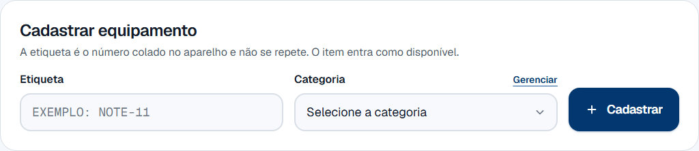
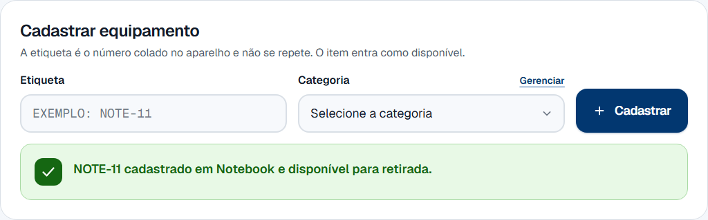
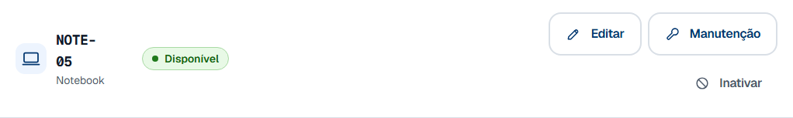
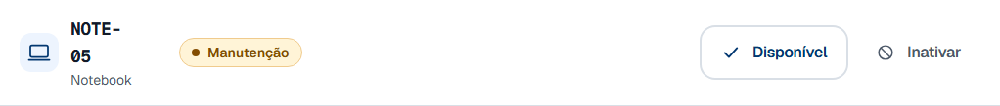
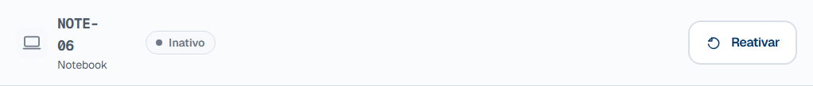
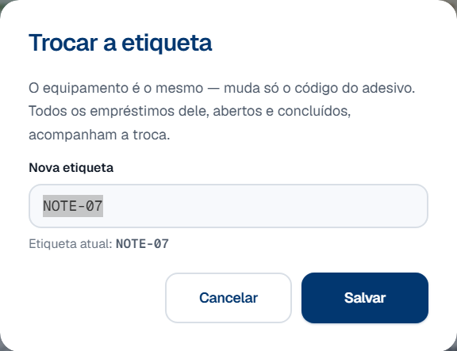
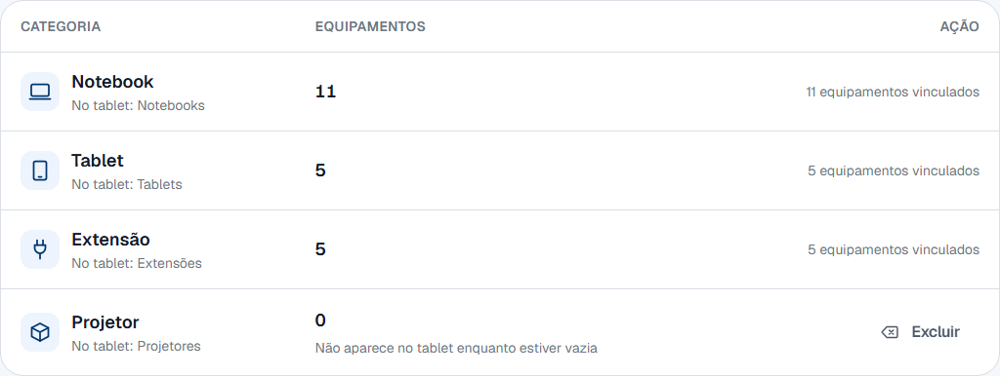
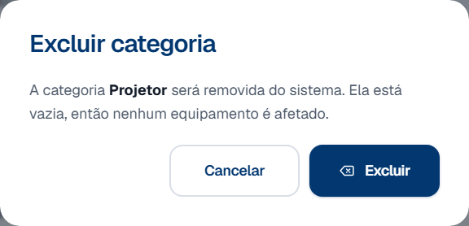
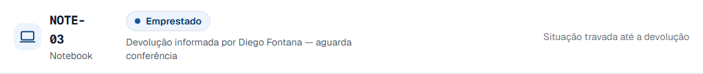
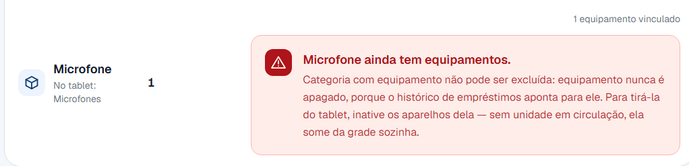

# 4. Gestão de inventário

## 1. Objetivo do processo

Este processo mantém a lista de equipamentos igual ao armário: o que chegou
entra, o que quebrou sai de circulação, o que chegou ao fim da vida útil é
aposentado, e o adesivo que descolou é corrigido.

Quando termina, o portal do tablet oferece exatamente o que existe e está em
condição de sair. Tudo o que a secretaria faz aqui muda o que a próxima pessoa
vê na grade de categorias.

## 2. Pré-condições

- Você está com a sessão aberta no painel. Se não estiver, entre com seu login e
  senha — ver [Conta do administrador](../referencia/conta-do-administrador.md).
- **O aparelho está na sua frente**, para cadastrar, para trocar o adesivo ou
  para separar para conserto. Esta tela registra decisões sobre coisas físicas.
- Existe pelo menos uma categoria cadastrada. Sem categoria não há como
  cadastrar equipamento — o formulário avisa e fica desabilitado.
- Para trocar a etiqueta ou mudar a situação, o item **não** pode estar em um
  empréstimo aberto. Ver a
  [regra sobre a situação travada](#por-que-nao-consigo-mexer-em-um-item-que-esta-emprestado).

## 3. Glossário do processo

Os termos que atravessam vários processos moram no
[glossário geral](../referencia/glossario.md):
[etiqueta](../referencia/glossario.md#etiqueta),
[categoria](../referencia/glossario.md#categoria),
[manutenção](../referencia/glossario.md#manutencao),
[aposentadoria](../referencia/glossario.md#aposentadoria-item-inativo) e
[empréstimo](../referencia/glossario.md#emprestimo).

Estes são só desta página — são as partes da tela que os passos citam pelo nome:

| Termo               | O que é                                                                                                                       |
| ------------------- | ----------------------------------------------------------------------------------------------------------------------------- |
| Inventário          | A aba do painel com todo o equipamento cadastrado, uma linha por aparelho, agrupado por categoria.                             |
| Situação            | A coluna que diz onde o aparelho está na vida dele: **Disponível**, **Emprestado**, **Manutenção** ou **Inativo**.             |
| Categorias          | A aba vizinha, onde as prateleiras do inventário são criadas e apagadas. O tablet organiza a grade por ela.                    |
| Equipamentos vinculados | A contagem que aparece na tela de Categorias no lugar do botão de excluir, quando a categoria tem algum aparelho.          |

## 4. Papéis e responsabilidades

| Papel                  | Faz                                                                                                              | Não faz                                                                                                          |
| ---------------------- | ------------------------------------------------------------------------------------------------------------------ | ------------------------------------------------------------------------------------------------------------------ |
| Secretaria             | Cadastra o aparelho que chegou, corrige a etiqueta, separa para conserto, aposenta o que não serve mais, e cria as categorias. | Não apaga equipamento — não existe essa ação, e a [regra abaixo](#por-que-nao-existe-um-botao-de-excluir-equipamento) explica por quê. |
| Painel (o computador)  | Guarda a situação de cada item, recusa as mudanças que quebrariam o histórico, e esconde do tablet o que saiu de circulação. | Não decide nada sozinho. Ele não sabe se o aparelho quebrou — quem olha o aparelho é você.                        |
| Estudante ou professor | Nada. Não participa deste processo.                                                                              | Não vê esta tela. O que ele percebe é indireto: um aparelho que some da grade de categorias no tablet.            |

## 5. Diagrama BPMN

Clique no diagrama para abri-lo em tamanho cheio — na largura da página ele
entra a pouco mais da metade do tamanho, e os rótulos ficam apertados.

O diagrama tem **três caminhos** saindo da mesma pergunta, e é assim que a tela
funciona: uma lista só, com o formulário de cadastro em cima e as ações na linha
de cada aparelho.

**A gestão de categorias não está no diagrama, de propósito.** Ela é outra tela
(**Categorias**, no menu) e não é um dos cinco processos do sistema — o que o
diagrama mostra é o cadastro **escolhendo** uma categoria que já existe. O
procedimento 5 do passo a passo cobre a criação e a exclusão.

[Baixar o arquivo `.bpmn`](../processos-fonte/04-inventario.bpmn) — a fonte do
diagrama, que abre no [bpmn.io](https://bpmn.io) sem instalar nada.

## 6. Passo a passo

São cinco procedimentos, cada um com a sua sequência. Todos começam na aba
**Inventário**, no menu à esquerda — menos o último, que é na aba
**Categorias**.

A tela abre com a contagem por situação no alto e a lista abaixo, agrupada por
categoria. É nela que você confere, de relance, se sobra aparelho para hoje.

Repare que **cada situação oferece botões diferentes**. Não é acaso: a linha só
mostra o que pode ser feito com aquele aparelho agora, e a linha de um item
emprestado não tem botão nenhum.

### Cadastrar um equipamento novo

1. Cole o adesivo no aparelho, se ele ainda não tiver um.

2. Abra a aba **Inventário**.

    

3. Digite no campo **Etiqueta** exatamente o que está escrito no adesivo.

    Pode digitar em minúscula: o sistema grava em maiúscula de qualquer jeito.
    O que ele **não** aceita é espaço e acento — ver a
    [regra sobre o formato da etiqueta](#por-que-a-etiqueta-nao-aceita-espaco-nem-acento).

4. Escolha a categoria do aparelho no campo **Categoria**.

    A lista vem da aba **Categorias**. Se a categoria certa não estiver ali,
    o link **Gerenciar**, ao lado do rótulo, leva direto ao procedimento 5.

5. Clique em **Cadastrar**.

6. Confira o aviso verde embaixo do formulário.

    

    Ele diz a etiqueta, a categoria e a situação em que o item nasceu —
    "NOTE-11 cadastrado em Notebook e disponível para retirada." A partir daí o
    aparelho já é oferecido no tablet.

7. Para cadastrar o próximo aparelho, repita a partir do passo 3.

    O formulário se limpa inteiro depois de cada cadastro, **inclusive a
    categoria** — então ela precisa ser escolhida de novo a cada item. É de
    propósito: cadastrar dez notebooks e um tablet sem perceber que o campo
    ficou em "Notebook" seria pior. O cursor já volta sozinho para a etiqueta.

### Enviar para manutenção e trazer de volta

1. Ache o aparelho na lista.

    Use a busca por etiqueta ou categoria se a lista for longa — ela aceita
    "extensao" sem acento.

2. Confira que a situação dele é **Disponível**.

    

3. Clique em **Manutenção**, na linha daquele aparelho.

4. Confira o aviso no alto da tela.

    

    Ele diz o que aconteceu com o aparelho — "NOTE-05 foi para manutenção e saiu
    da lista do tablet." O selo da linha vira âmbar e o botão **Editar** some.

5. Separe o aparelho para conserto.

    Enquanto ele estiver assim, ninguém consegue retirá-lo no tablet, e ele
    também não entra na contagem de disponíveis da categoria.

6. Quando o conserto terminar, clique em **Disponível** na mesma linha.

7. Confira o aviso: "NOTE-05 está disponível para retirada."

    O aparelho volta para a prateleira e para a grade do tablet na mesma hora.

### Aposentar um item e reativar

1. Ache o aparelho na lista.

2. Clique em **Inativar**.

    O botão está nas linhas **Disponível** e **Manutenção** — um aparelho pode
    ser aposentado direto do conserto, quando o orçamento não compensa.

3. Leia o aviso do diálogo antes de confirmar.

    

    Ele confirma a etiqueta — "este equipamento" no meio de uma tabela de vinte
    linhas não diz qual — e lembra que **o item continua na lista** e pode ser
    reativado depois.

4. Clique em **Inativar**, no diálogo.

5. Confira o aviso: "NOTE-06 foi inativado e não será mais oferecido para
   empréstimo."

    

    A linha continua na lista, mais apagada que as vizinhas, com o selo
    **Inativo** e um único botão.

6. Para trazer o aparelho de volta, clique em **Reativar**.

    Ele volta como **Disponível**, e o aviso diz isso com outras palavras —
    "NOTE-06 voltou ao inventário e está disponível para retirada." Não existe
    diálogo aqui: reativar não é gesto perigoso.

7. Se o que você quer é mandá-lo para conserto, clique em **Manutenção** depois.

    São dois cliques, e não um. Ver a
    [regra sobre o item aposentado](#por-que-o-item-aposentado-nao-tem-botao-de-manutencao).

### Trocar a etiqueta de um aparelho

1. Confira que a situação do aparelho é **Disponível**.

    A etiqueta só muda com o aparelho na bancada. Enquanto ele estiver com
    alguém, o código na tela precisa continuar batendo com o que a pessoa vai
    devolver.

2. Clique em **Editar**, na linha daquele aparelho.

    

3. Digite o código do adesivo novo no campo **Nova etiqueta**.

    O campo já vem com a etiqueta atual selecionada: pode digitar por cima. O
    diálogo diz o que vai acontecer com o histórico — "Todos os empréstimos
    dele, abertos e concluídos, acompanham a troca."

4. Clique em **Salvar**.

5. Confira o aviso: "NOTE-07 agora é NOTE-77. O histórico de empréstimos foi
   junto."

    A segunda frase é o ponto: o aparelho é o mesmo, e todo empréstimo dele —
    aberto ou concluído — passa a apontar para o código novo. Nada fica para
    trás.

### Criar e apagar uma categoria

1. Abra a aba **Categorias**, no menu.

2. Digite o nome no campo **Nome**, no singular.

    "Projetor", e não "Projetores". O plural que o tablet mostra é calculado
    pelo sistema, e a própria tela mostra qual vai ser.

3. Clique em **Cadastrar**.

4. Confira a linha nova na tabela.

    

    Embaixo do nome ela mostra o plural — "No tablet: Projetores". Se estiver
    errado, o conserto é o nome no singular, e a hora de perceber é agora.

5. Volte à aba **Inventário**.

    Enquanto a categoria não tiver nenhum aparelho, a linha dela avisa:
    "Não aparece no tablet enquanto estiver vazia". Ela só entra na grade do
    portal com o primeiro equipamento.

6. Cadastre o primeiro aparelho nela, pelo procedimento 1.

7. A categoria tem algum equipamento vinculado?

    - **Se NÃO** → a linha tem o botão **Excluir**. Siga para o passo 8.
    - **Se SIM** → no lugar do botão a linha mostra a contagem, como "11
      equipamentos vinculados". Não há como excluí-la — ver a
      [regra sobre a categoria em uso](#a-mensagem-manda-inativar-os-equipamentos-isso-libera-a-exclusao).

8. Clique em **Excluir**.

    

    O diálogo confirma que nada se perde: "Ela está vazia, então nenhum
    equipamento é afetado."

9. Clique em **Excluir**, no diálogo.

    O aviso confirma — "Categoria Projetor excluída." — e a linha some. Esta é a
    **única** exclusão de verdade do painel inteiro.

## 7. Regras que não são óbvias

!!! question "Por que não existe um botão de excluir equipamento?"

    Porque o histórico de empréstimos aponta para o aparelho, e apagá-lo levaria
    o histórico junto. O registro de quem levou aquele notebook no semestre
    passado deixaria de existir — sem aviso, e sem volta.

    Por isso a ação que tira um aparelho de circulação chama **Inativar**, e o
    ícone dela é um círculo cortado, não uma lixeira. Lixeira promete que o
    registro some, e ele não some: o item continua na lista do inventário, em
    cinza, com o botão de reativar.

    A frase está no rodapé da própria tela:

    > Inativo é a aposentadoria: some do tablet para sempre, mas continua aqui
    > para o histórico de empréstimos não ficar apontando para o vazio.

!!! question "Manutenção ou aposentadoria: qual eu uso?"

    **Manutenção é enquanto o aparelho vai voltar. Aposentadoria é quando ele
    não vai.**

    Essa é a frase inteira. O resto é consequência dela:

    | | Manutenção | Aposentadoria (**Inativar**) |
    | --- | --- | --- |
    | Para quê | Conserto, bateria, tela trocada | Fim da vida útil, roubo, perda |
    | Quanto tempo | Dias ou semanas | Para sempre |
    | Como volta | Botão **Disponível**, um clique | Botão **Reativar**, um clique |
    | Peso da linha | Selo âmbar, linha normal | Selo cinza, linha apagada |
    | Conta no resumo | Cartão **Manutenção** | Cartão **Inativo**, que só aparece se houver algum |

    As duas escondem o aparelho do tablet do mesmo jeito, e é por isso que dá
    para confundir. A diferença não é o efeito de hoje: é a resposta à pergunta
    "este aparelho volta para a prateleira?".

    Errar não é grave — as duas têm volta de um clique. Errar **de forma
    sistemática** é: um inventário em que tudo o que quebra é aposentado perde a
    conta de quantos aparelhos estão só esperando conserto.

!!! question "Por que não consigo mexer em um item que está emprestado?"

    Porque ele não está no armário. A linha de um aparelho com empréstimo aberto
    não tem botão nenhum — no lugar deles aparece o nome de quem está com ele e
    a frase **Situação travada até a devolução**.

    

    Mudar a situação à mão deixaria um empréstimo aberto apontando para um
    aparelho "disponível": o tablet ofereceria a outra pessoa um notebook que
    está na mochila de alguém.

    A trava vale também para quem **já declarou a devolução** e ainda não foi
    conferido. Aí a legenda muda e diz o caminho: confirme o recebimento na
    [Fila de Devoluções](baixa-fisica.md) primeiro. Depois disso a linha
    destrava sozinha.

    **Aqui o equipamento se comporta ao contrário da pessoa**, e é a confusão
    mais provável do painel inteiro, porque a mesma palavra — inativar — produz
    resultados diferentes nas duas telas:

    | | Equipamento (esta página) | Pessoa ([Gestão de pessoas](pessoas.md#por-que-o-equipamento-trava-e-a-pessoa-nao)) |
    | --- | --- | --- |
    | Com um empréstimo aberto | A situação **trava**: não dá para inativar | Inativar é **permitido**, com um aviso |
    | Por quê | O aparelho está fora do armário; o registro tem que dizer a verdade | Quem sai da instituição costuma estar com um aparelho na mochila |
    | Efeito da inativação | Some do tablet, nas duas pontas | **Assimétrico**: bloqueia retirar, libera devolver |

    A assimetria da pessoa existe justamente para o aparelho voltar. Travar os
    dois lados faria a inativação garantir que ele nunca voltasse.

!!! question "Por que a categoria pode ser apagada de verdade e o equipamento não?"

    Porque nenhum empréstimo aponta para a categoria. Ela é só o nome da
    prateleira: o histórico registra o aparelho, e o aparelho é que pertence a
    uma categoria.

    Apagar a prateleira vazia não perde informação nenhuma. Apagar o aparelho
    perderia.

    Por isso esta é a única exclusão de verdade do painel — e ela só é oferecida
    quando a categoria não tem nenhum equipamento vinculado.

!!! question "A mensagem manda inativar os equipamentos. Isso libera a exclusão?"

    **Não.** Inativar tira o aparelho de circulação, mas ele continua vinculado
    à categoria — e é o vínculo que trava a exclusão, não a situação.

    Isso foi medido: com o único aparelho de uma categoria marcado como
    **Inativo**, a exclusão continua sendo recusada com a mesma mensagem, e o
    banco de dados recusa igual.

    Na prática, **categoria com equipamento não é excluída pelo painel**. Não
    existe tela que mova um aparelho de uma categoria para outra, e equipamento
    nunca é apagado — então uma categoria só volta a ficar vazia se ela nunca
    tiver sido usada.

    O que resolve, quando a categoria foi criada por engano:

    1. **Se ela ainda estiver vazia**, apague agora. É o único momento em que dá.
    2. **Se já tiver aparelho**, deixe-a onde está. Uma categoria a mais no
       tablet incomoda menos que um histórico furado — e ela some da grade
       sozinha se você aposentar os aparelhos dela, porque item inativo não
       conta.

    A frase que a tela escreve na recusa está registrada na
    [tabela de erros](#8-erros-comuns-e-o-que-fazer), com esta ressalva ao lado.

!!! question "Cadastrei uma etiqueta errada. Como desfaço?"

    Depende do que saiu errado, e nenhum dos dois casos apaga a linha:

    - **O código está errado e o aparelho existe** → use o **Editar** da linha e
      troque a etiqueta. O histórico acompanha, e o aparelho continua o mesmo.
    - **O aparelho não existe** (foi cadastrado duas vezes, ou nunca chegou) →
      **Inativar**. Ele sai do tablet e da contagem de disponíveis, e fica na
      lista em cinza.

    Não há um terceiro caminho. Um equipamento cadastrado por engano vira uma
    linha aposentada no inventário, e é o preço de o histórico nunca ficar
    apontando para o vazio.

!!! question "Apaguei uma categoria e criei de novo. Por que ela mudou de lugar?"

    Porque a ordem das categorias é a ordem em que elas foram **criadas**, e não
    a ordem alfabética. Uma categoria recriada é nova para o sistema, então ela
    vai para o fim da fila — no tablet e no inventário.

    Medido: uma categoria excluída e recriada com o mesmo nome voltou depois de
    todas as outras.

    Isso não quebra nada, mas muda a grade que a pessoa vê no tablet. Se a ordem
    importa, o jeito de manter é não apagar.

!!! question "Por que o item aposentado não tem botão de Manutenção?"

    Porque são duas decisões diferentes, e juntá-las em um clique esconde uma
    delas. Um aparelho aposentado volta primeiro para a prateleira — **Reativar**
    —, e só então alguém decide que ele precisa de conserto.

    O caminho contrário existe e é direto: dá para aposentar um aparelho que
    está em **Manutenção**, sem passar por **Disponível**. É o caso comum de
    quando o orçamento do conserto chega e não compensa.

!!! question "Por que a etiqueta não aceita espaço nem acento?"

    Porque ela é lida de um adesivo e digitada de novo mais tarde, por outra
    pessoa. "NOTE 11" e "NOTE-11" seriam dois equipamentos diferentes no mesmo
    armário, e "EXTENSÃO" digitado sem o til seria um terceiro.

    O formato aceito é letra, número, ponto, hífen e sublinhado, e a própria
    recusa diz isso. Minúscula pode: o sistema grava em maiúscula.

## 8. Erros comuns e o que fazer

Quando uma ação é recusada, a mensagem aparece **dentro da linha**, logo abaixo
dos botões, e a lista é relida na hora. Isso é o sinal de que nada mudou: a
situação do aparelho continua a que estava.

Na tela de Categorias há um detalhe a mais: quando a exclusão é recusada, **o
diálogo continua aberto**, ainda dizendo que a categoria está vazia — ele é do
render anterior. Feche no **Cancelar**; o motivo está na linha, atrás dele.

| Mensagem na tela                                    | Causa                                                                                                      | O que fazer                                                                                                                                       |
| --------------------------------------------------- | ------------------------------------------------------------------------------------------------------------ | ----------------------------------------------------------------------------------------------------------------------------------------------------- |
| "Sessão encerrada."                                 | A sessão caiu com a tela aberta — o servidor reiniciou, ou a senha desta conta foi trocada.                | Atualize a página e entre de novo. **Nada foi alterado.**                                                                                          |
| "Etiqueta inválida."                                | A etiqueta tem espaço, acento ou algum caractere fora do formato.                                          | Use letra, número, ponto, hífen ou sublinhado. Minúscula pode.                                                                                     |
| "A etiqueta NOTE-05 já existe."                     | Já há um aparelho com esse adesivo no inventário.                                                          | Confira a lista. Dois adesivos iguais no mesmo armário é o problema que essa recusa evita.                                                          |
| "Escolha a categoria do equipamento."               | O formulário foi enviado com a categoria em branco.                                                        | Escolha a categoria. Ela se limpa depois de cada cadastro, de propósito.                                                                            |
| "Essa categoria não existe mais."                   | A categoria escolhida foi excluída em outro computador entre a abertura da tela e o envio.                 | Atualize a página e escolha de novo.                                                                                                                |
| "Nenhuma categoria cadastrada."                     | O inventário está começando do zero e ainda não há prateleira nenhuma.                                     | Crie a primeira em **Categorias**, no menu. O formulário de cadastro fica desabilitado até lá.                                                       |
| "NOTE-01 está em um empréstimo aberto."             | O aparelho está com alguém, ou já foi declarado devolvido e ainda não foi conferido.                       | Se estiver com alguém, espere a devolução. Se estiver esperando conferência, confirme o recebimento na [Fila de Devoluções](baixa-fisica.md).       |
| "NOTE-05 consta como emprestado."                   | O item está marcado como emprestado e não há empréstimo aberto para ele — os dados se contradizem.         | Não force. Confira o histórico daquele aparelho antes de liberá-lo: pode estar com alguém.                                                          |
| "NOTE-10 não pode ir de inativo para em manutenção." | A situação mudou em outro computador, ou a transição não é permitida.                                      | A lista já foi atualizada. Se o item estiver aposentado, clique em **Reativar** primeiro e decida o conserto depois.                                 |
| "Situação inválida para um equipamento."            | Chegou um destino que o painel não oferece — tipicamente **Emprestado**, que só o tablet põe e tira.        | Nenhuma ação. O painel move o aparelho entre **Disponível**, **Manutenção** e **Inativo**, e mais nada.                                              |
| "NOTE-09 não está disponível."                      | Tentou trocar a etiqueta de um aparelho que não está na prateleira.                                        | A etiqueta só muda com o aparelho na bancada. Traga-o de volta a **Disponível** primeiro.                                                            |
| "A categoria Notebook já existe."                   | O nome digitado é o mesmo de uma categoria existente, ignorando maiúsculas e acentos ("notebook", "extensao"). | Use a categoria que já existe. Duas grafias da mesma coisa virariam duas prateleiras no tablet.                                                     |
| "Informe o nome da categoria."                      | O campo foi enviado vazio, ou com mais de 30 caracteres.                                                   | Escreva o nome no singular, com até 30 caracteres.                                                                                                  |
| "Notebook ainda tem equipamentos."                  | A categoria tem aparelho vinculado. Quem recusa é o banco de dados, não a tela.                            | Não há como esvaziá-la pelo painel. O detalhe da mensagem manda inativar os equipamentos, e **isso não resolve** — ver a [regra acima](#a-mensagem-manda-inativar-os-equipamentos-isso-libera-a-exclusao). |
| "Essa categoria já não existe."                     | Outro computador excluiu a mesma categoria antes.                                                          | Nenhuma ação. A lista foi atualizada.                                                                                                               |
| "Não foi possível cadastrar o equipamento."         | O painel não conseguiu falar com o banco de dados.                                                         | Tente de novo. Se continuar, avise quem cuida do servidor.                                                                                          |
