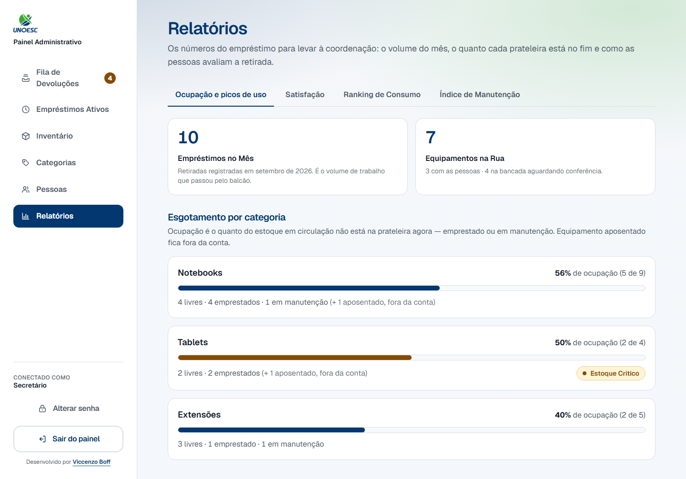
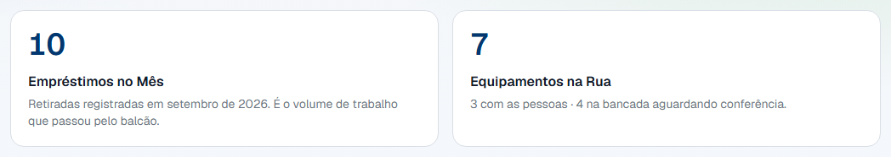
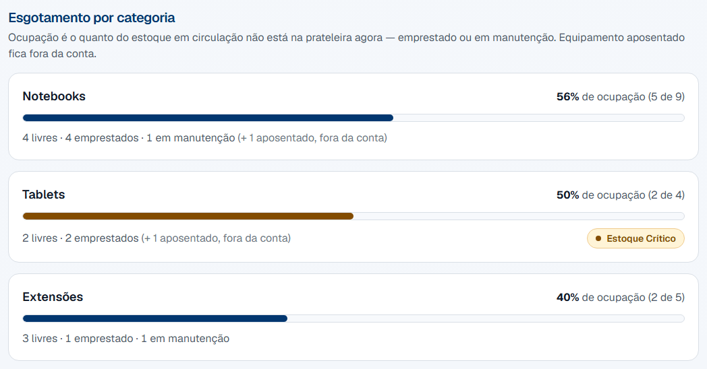
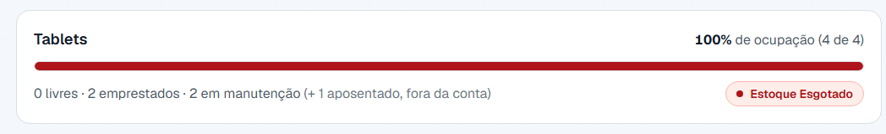
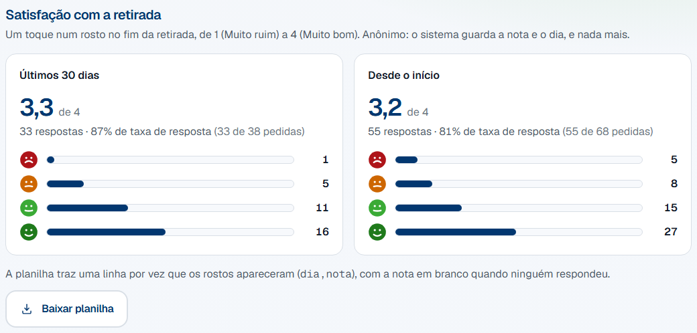
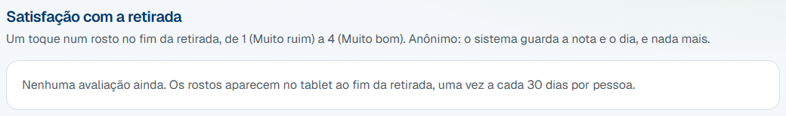
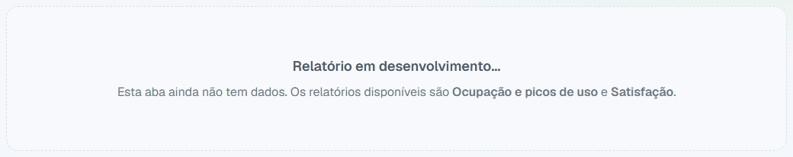

# 6. Relatórios

## 1. Objetivo do processo

Este processo transforma o que o sistema já registrou em um argumento: quantos
empréstimos passaram pelo balcão neste mês, quantos aparelhos estão fora da
prateleira agora, o quanto cada categoria chegou perto de acabar — e, desde a
`v1.2`, como as pessoas avaliam a retirada.

Quando termina, o secretário tem um número para levar à coordenação — e a
coordenação tem com que decidir se compra mais aparelho, ou se o atendimento
precisa de atenção. É a única tela do painel que quase não muda nada: ela lê,
e a única coisa que grava é o link do formulário de sugestões.

## 2. Pré-condições

- Você está com a sessão aberta no painel. Se não estiver, entre com seu login e
  senha — ver [Conta do administrador](../referencia/conta-do-administrador.md).
- Existe pelo menos uma categoria cadastrada. Sem nenhuma, a tela diz isso e
  manda para a aba **Categorias**.
- Os números são do **momento em que a página abre**. Para ver o efeito de uma
  baixa que você acabou de confirmar, recarregue a página.

## 3. Glossário do processo

Os termos que atravessam vários processos moram no
[glossário geral](../referencia/glossario.md):
[categoria](../referencia/glossario.md#categoria),
[manutenção](../referencia/glossario.md#manutencao),
[aposentadoria](../referencia/glossario.md#aposentadoria-item-inativo),
[bancada](../referencia/glossario.md#bancada) e
[empréstimo](../referencia/glossario.md#emprestimo).

Estes são só desta página:

| Termo                  | O que é                                                                                                                               |
| ---------------------- | --------------------------------------------------------------------------------------------------------------------------------------- |
| Ocupação               | A fatia do estoque em circulação que **não** está na prateleira agora — emprestada ou em manutenção. Vai de 0% a 100%.                    |
| Estoque em circulação  | Todos os aparelhos da categoria **menos os aposentados**. É o que a prateleira pode oferecer, mesmo que uma parte esteja fora no momento. |
| Estoque Esgotado       | O selo vermelho: nenhuma unidade daquela categoria está disponível. Quem chegar ao tablet agora não leva nada.                            |
| Estoque Crítico        | O selo amarelo: sobraram uma ou duas unidades disponíveis.                                                                                |
| Empréstimos no Mês     | Quantas **retiradas** foram registradas desde o dia 1º. Conta o que saiu, não o que está fora.                                            |
| Equipamentos na Rua    | Quantos aparelhos estão fora da prateleira neste instante, somando os que estão com as pessoas e os que esperam conferência na bancada.   |
| Avaliação              | O toque num dos quatro rostos no fim da retirada, no tablet: 1 (Muito ruim), 2 (Ruim), 3 (Bom) ou 4 (Muito bom). Anônima — ver a [regra abaixo](#por-que-nao-aparece-quem-votou). |
| Pedida                 | Uma vez em que os rostos apareceram, tenha alguém tocado ou não. Cada pessoa é perguntada no máximo uma vez a cada 30 dias.                |
| Taxa de resposta       | Respondidas ÷ pedidas, em %. É o número que denuncia a fadiga com a pesquisa antes de qualquer reclamação: quando ela cai, a média deixa de valer. |
| Formulário de sugestões | O formulário externo (do Google, numa conta institucional do setor) que o QR code da tela de retirada abre. O link é configurado aqui.    |

## 4. Papéis e responsabilidades

| Papel                  | Faz                                                                                                          | Não faz                                                                                                             |
| ---------------------- | -------------------------------------------------------------------------------------------------------------- | ----------------------------------------------------------------------------------------------------------------------- |
| Secretário             | Abre a aba, lê os números e leva à coordenação o que está esgotado ou crítico — e a média de satisfação. Configura o link do formulário de sugestões. | Não corrige nada aqui. O que aparece errado nesta tela se conserta nas abas **Inventário** e **Fila de Devoluções**. Não vê quem votou, porque ninguém vê. |
| Coordenação            | Decide a compra, a partir do que o secretário mostra.                                                            | Não abre o painel. Ela não tem conta — o painel é do secretário.                                                          |
| Painel (o computador)  | Soma o que está gravado, no instante em que a página abre.                                                       | Não guarda histórico do relatório, não manda aviso e não compara com o mês passado. Cada abertura é uma fotografia nova.   |
| Estudante ou professor | Toca num rosto no fim da retirada, no tablet, quando os rostos aparecem — ou não toca. É a única parte dele.      | Não vê esta tela. O que ele percebe é a consequência: a categoria que aparece esgotada aqui é a que ele acha vazia lá.     |

## 5. Passo a passo

Uma sequência só, do login ao número que sai desta tela.

1. Entre no painel com seu login e senha.
2. Clique em **Relatórios**, o último item do menu à esquerda.

    

3. A aba **Ocupação e picos de uso** já vem aberta. Leia os dois cartões do
   topo: **Empréstimos no Mês** é o volume de trabalho que passou pelo balcão, e
   **Equipamentos na Rua** é o que está fora da prateleira agora.

    

4. Repare na segunda linha do cartão **Equipamentos na Rua**: ela separa os que
   estão **com as pessoas** dos que estão **na bancada aguardando conferência**.
   Só a segunda parcela depende de você — ela some quando a
   [baixa física](baixa-fisica.md) é confirmada.
5. Desça até **Esgotamento por categoria**. Cada linha é uma prateleira, com a
   barra mostrando a ocupação e, embaixo dela, a composição em números.

    

6. Leia a linha da categoria da direita para a esquerda: **56% de ocupação
   (5 de 9)** quer dizer que, dos 9 notebooks em circulação, 5 não estão na
   prateleira. Os 5 se abrem embaixo: **4 emprestados · 1 em manutenção**.
7. Alguma categoria tem selo colorido ao lado dos números?

    - Se aparece **Estoque Esgotado** (vermelho) → não sobrou nenhuma unidade
      daquela categoria. Quem chegar ao tablet agora não leva nada. Confira a
      [Fila de Devoluções](baixa-fisica.md): se houver aparelho esperando
      conferência, confirmar o recebimento devolve unidade à prateleira na hora.
      Se a fila estiver vazia, o número é o argumento de compra.

        

    - Se aparece **Estoque Crítico** (amarelo) → sobraram uma ou duas unidades.
      Vale avisar a coordenação antes de acabar, e conferir se algum aparelho em
      manutenção já pode voltar pela aba **Inventário**.
    - Se não aparece selo nenhum → aquela categoria tem três ou mais unidades
      livres. Nada a fazer.

8. Clique na aba **Satisfação**. Os dois cartões são dois recortes fixos —
   **Últimos 30 dias** e **Desde o início** —, e cada um traz a média na escala
   de 1 a 4, quantas respostas houve e a taxa de resposta, e a distribuição em
   quatro barras, uma por rosto.

    

9. Leia o cartão de cima para baixo: **3,3 de 4** é a média das notas; **33
   respostas · 87% de taxa de resposta (33 de 38 pedidas)** diz que os rostos
   apareceram 38 vezes e 33 pessoas tocaram; e as barras dizem quantas tocaram
   em cada rosto. A barra é a fatia entre as respostas, e o número ao lado é a
   contagem.
10. Há alguma linha? Se a aba diz "Nenhuma avaliação ainda. Os rostos aparecem
    no tablet ao fim da retirada, uma vez a cada 30 dias por pessoa.", ninguém
    foi perguntado ainda — os cartões e o botão de baixar só aparecem com a
    primeira linha.

    

11. Quer cruzar os dados de outro jeito? Clique em **Baixar planilha**. O
    arquivo `avaliacoes-AAAA-MM-DD.csv` chega à pasta de downloads com uma
    linha por vez que os rostos apareceram, nas colunas `dia` e `nota` — a
    nota em branco quando ninguém respondeu. Não há hora, matrícula nem nome no
    arquivo, e não há como haver: o sistema não os guarda. A tela não recarrega.
12. Desça até **Formulário de sugestões**. É o link que o QR code da tela de
    retirada abre — cole o endereço completo do formulário, começando por
    `https://`, e clique em **Salvar**. A prévia ao lado mostra o QR exatamente
    como ele aparece no tablet. Para o QR sumir do tablet, salve com o campo em
    branco.

    

    !!! tip "Como criar o formulário"

        No Google Forms, com a **conta institucional do setor** — nunca a
        pessoal de quem está no balcão hoje, porque ela sai com a pessoa e
        o adesivo continua apontando para um formulário que ninguém abre. Em
        Configurações → Respostas, deixe **desligadas** a coleta de e-mail e a
        exigência de login: o formulário é anônimo como os rostos. Copie o link
        de Enviar, cole aqui e imprima o mesmo QR num adesivo ao lado do tablet
        — a devolução não mostra o QR, e o adesivo cobre quem só veio devolver.

13. As abas **Ranking de Consumo** e **Índice de Manutenção** ainda não têm
    relatório. Abrir uma delas mostra um aviso, e não um erro.

    

## 6. Regras que não são óbvias

!!! question "Por que a ocupação conta o aparelho em manutenção junto com o emprestado?"

    Porque a pergunta que esta tela responde é **"sobra aparelho para quem
    chegar agora?"**, e para quem chega dá no mesmo: o notebook no conserto e o
    notebook na mochila de alguém estão igualmente fora da prateleira.

    A consequência é a que interessa: **100% de ocupação quer dizer exatamente
    "nenhuma unidade disponível"**, e é por isso que a barra cheia e o selo
    vermelho sempre aparecem juntos. Se a ocupação contasse só os emprestados,
    uma categoria com três aparelhos no conserto e o resto emprestado mostraria
    uma barra pela metade ao lado de um alerta dizendo que o estoque acabou — e
    as duas coisas estariam certas ao mesmo tempo.

    A composição embaixo da barra separa as duas parcelas, para a decisão não se
    perder: manutenção é aparelho que **pode voltar**, e empréstimo é aparelho
    que **vai voltar**.

!!! question "Por que o aparelho aposentado fica fora da conta?"

    Porque ele não volta. A
    [aposentadoria](../referencia/glossario.md#aposentadoria-item-inativo) é a
    saída definitiva de circulação — o aparelho continua no banco só para o
    histórico de empréstimos não perder a referência dele.

    Contá-lo no total faria a ocupação parecer menor do que é. Uma categoria com
    dez aparelhos, quatro deles aposentados, e os seis restantes emprestados,
    mostraria 60% de ocupação com a prateleira vazia.

    É a mesma conta que o tablet já faz: lá a grade diz "Notebooks — 4 de 9
    disponíveis" com dez notebooks cadastrados, porque um está aposentado. Os
    aposentados aparecem nesta tela entre parênteses, **fora da conta**, para os
    números continuarem fechando com a aba **Inventário** — que, ao contrário,
    mostra o patrimônio inteiro.

!!! question "Por que Empréstimos no Mês não diminui quando alguém devolve?"

    Porque ele conta **retiradas**, e uma retirada que aconteceu não desacontece.
    O número responde "quanto trabalho passou pelo balcão neste mês" e sobe até o
    dia 1º do mês seguinte, quando volta a zero.

    Quem responde "quanto está fora agora" é o cartão ao lado, **Equipamentos na
    Rua**. Os dois medem coisas diferentes de propósito: um é o movimento, o
    outro é o estoque.

!!! question "Contei os aparelhos no armário e o número não bate. O que está errado?"

    Quase sempre nada. São três diferenças possíveis, e todas são deliberadas:

    - **Os aposentados não entram na conta** — eles estão no armário e não estão
      em circulação. O total entre parênteses ao lado da linha diz quantos são.
    - **Os que estão na bancada contam como fora da prateleira.** O aparelho que
      alguém acabou de devolver no tablet ainda não voltou ao estoque: ele espera
      a [baixa física](baixa-fisica.md). Enquanto espera, está fisicamente no
      balcão e contabilmente fora.
    - **Os números são do instante em que a página abriu.** Uma retirada feita no
      tablet enquanto você lia a tela não aparece até a próxima abertura.

    Se a diferença não for nenhuma das três, o lugar de conferir item a item é a
    aba [Inventário](inventario.md).

!!! question "Por que uma categoria aparece com Sem unidades em circulação, e não como esgotada?"

    Porque não há estoque para esgotar. Isso acontece em dois casos: a categoria
    acabou de ser criada e ainda não recebeu nenhum aparelho, ou todos os
    aparelhos dela foram aposentados.

    Marcá-la de vermelho seria pedir uma compra que ninguém pediu — e, pior,
    seria um vermelho permanente, que ensina o olho a ignorar os outros. A linha
    aparece sem barra, em texto cinza, e some da grade do tablet pelo mesmo
    motivo.

!!! question "Por que a aba volta para a primeira quando eu recarrego a página?"

    Porque a aba escolhida não entra no endereço. É uma escolha de projeto: o
    relatório inteiro já chega pronto quando a página abre, e trocar de aba não
    consulta o banco de novo — a troca é instantânea porque nada vai ao servidor.

    O preço é este: recarregar volta para **Ocupação e picos de uso**, e não
    existe link que abra direto numa aba específica. Para uma tela consultada de
    pé, em uma sessão, ninguém compartilha link de aba de relatório.

!!! question "Por que não dá para ver o mês passado, nem exportar a ocupação?"

    Porque o relatório de ocupação é uma fotografia do agora, e esta é a
    primeira versão dele. O sistema guarda todos os empréstimos com as datas —
    o dado para comparar meses **existe** —, mas a tela que faria essa leitura
    ainda não foi construída. A aba **Satisfação** é a única que exporta, e o
    que ela exporta é a lista crua, para o cruzamento ser feito fora.

    O mesmo vale para as abas **Ranking de Consumo** e **Índice de Manutenção**:
    os nomes estão no menu para dizer o que vem por aí, e o aviso dentro delas
    diz que ainda não vem.

!!! question "Por que não aparece quem deu cada nota?"

    Porque o sistema **não guarda**. A linha de avaliação tem só a nota e o
    dia — sem matrícula, sem perfil, sem hora. Um carimbo com a hora cruzaria
    com a hora da retirada e revelaria quem deu a nota 1; o perfil apontaria o
    professor do dia. Não é um filtro que a tela esconde: é um dado que não
    existe em lugar nenhum, nem na planilha baixada, nem para quem abre o banco.

    O limite honesto disso é o tamanho da população: num dia em que **uma
    pessoa só** foi perguntada, quem lê o banco sabe de quem é aquela nota. A
    tela nunca mostra isso, e o arquivo baixado só traz dia e nota — mas a
    regra vale ser dita, porque é a única forma de a promessa de anonimato ser
    verdadeira.

!!! question "A média é sobre as respostas ou sobre as pedidas?"

    Sobre as **respostas**. Quem não tocou em rosto nenhum não deu nota zero —
    não deu nota. Por isso o cartão mostra os dois números separados: a média
    (das respostas) e a taxa de resposta (respostas sobre pedidas).

    Leia os dois juntos. Uma média de 3,8 com 30% de taxa de resposta diz menos
    do que uma média de 3,3 com 85%: no primeiro caso quase ninguém está
    respondendo, e os que respondem são os que têm algo a dizer.

!!! question "Por que a mesma pessoa só é perguntada uma vez a cada 30 dias?"

    Para a pesquisa não irritar quem retira todo dia — e para o resultado não
    ser a opinião de quem retira todo dia. O intervalo é uma regra do sistema,
    não uma configuração: conta a partir do dia em que os rostos **apareceram**,
    tenha a pessoa tocado ou não.

    A consequência que importa aqui: "pedida" conta quem ignorou. Se a taxa de
    resposta cair, não é porque as pessoas passaram a ver menos rostos — é
    porque passaram a ignorá-los mais.

!!! question "Abri a planilha no Excel e veio tudo numa coluna só"

    Porque o arquivo separa as colunas por vírgula (é o formato padrão de CSV),
    e o Excel em português espera ponto e vírgula quando você clica duas vezes
    no arquivo. Ele não está errado — está lendo com o separador do sistema.

    O caminho é importar em vez de abrir: **Dados → De Texto/CSV**, escolha o
    arquivo, e o Excel reconhece a vírgula sozinho. O Google Planilhas e o
    LibreOffice abrem direto.

## 7. Erros comuns e o que fazer

| Mensagem na tela                        | Causa                                                                                         | O que fazer                                                                                              |
| --------------------------------------- | --------------------------------------------------------------------------------------------- | ---------------------------------------------------------------------------------------------------------- |
| "Relatório em desenvolvimento..."       | Você abriu **Ranking de Consumo** ou **Índice de Manutenção**. Esses dois ainda não existem.     | Volte para **Ocupação e picos de uso**, que é a única aba com dados. Não é erro: a tela está avisando.        |
| "Nenhuma categoria cadastrada ainda."   | Não há categoria no sistema, então não há prateleira para medir.                                | Crie a primeira na aba **Categorias**. Sem categoria, o tablet também não mostra nada.                       |
| "Sem unidades em circulação"            | A categoria existe, mas não tem aparelho em circulação — nenhum cadastrado, ou todos aposentados. | Cadastre um aparelho nela pela aba **Inventário**, ou apague a categoria se ela não serve mais.              |
| "Nenhuma avaliação ainda. Os rostos aparecem no tablet ao fim da retirada, uma vez a cada 30 dias por pessoa." | Os rostos ainda não apareceram para ninguém — o sistema acabou de ser instalado, ou ninguém retirou equipamento desde então. | Nada a fazer. O primeiro cartão aparece com a primeira retirada. Não é erro: a tela está avisando. |
| "Endereço inválido."                    | O link colado no **Formulário de sugestões** não é um endereço completo, ou não começa com `https://`. O detalhe abaixo diz qual dos dois. | Abra o formulário no navegador, copie o endereço inteiro da barra e cole. Ele tem que começar com `https://`. |
| "Formulário removido. O QR code não aparece mais no tablet." | Você salvou o campo em branco.                                                        | Não é erro: é o que "em branco" faz. Para o QR voltar, cole o endereço e salve de novo.                       |
| "Sessão encerrada."                     | A sessão caiu entre abrir a página e clicar em **Salvar**.                                       | Atualize a página, entre de novo e salve outra vez. O endereço não foi gravado.                               |
| A tela de login aparece no lugar do relatório | A sessão expirou enquanto a página estava aberta.                                          | Entre de novo. Nada se perde: esta tela só grava o link do formulário — ver [Conta do administrador](../referencia/conta-do-administrador.md). |
