# 6. Relatórios

## 1. Objetivo do processo

Este processo transforma o que o sistema já registrou em um argumento: quantas
retiradas passaram pelo balcão no período escolhido, quantos aparelhos estão
fora da prateleira agora, o quanto cada categoria chegou perto de acabar, como
as pessoas avaliam a retirada, **o que sai, quem leva e por quanto tempo**, no
Ranking de Consumo, e **quanto do estoque fica parado no conserto**, no Índice
de Manutenção.

Quando termina, o secretário tem um número para levar à coordenação — ou uma
planilha, porque as três abas com período exportam o que está na tela em `.xlsx` —
e a coordenação tem com que decidir se compra mais aparelho, ou se o
atendimento precisa de atenção. É a única tela do painel que quase não muda
nada: ela lê, e a única coisa que grava é o link do formulário de sugestões.
Desde a Tarefa 17 ela também é a tela que responde **quem** mudou a situação
de um aparelho, e **quando** — o Histórico da aba Índice de Manutenção.

## 2. Pré-condições

- Você está com a sessão aberta no painel. Se não estiver, entre com seu login e
  senha — ver [Conta do administrador](../referencia/conta-do-administrador.md).
- Existe pelo menos uma categoria cadastrada. Sem nenhuma, a tela diz isso e
  manda para a aba **Categorias**.
- Os números são do **momento em que a página abre**. Para ver o efeito de uma
  baixa que você acabou de confirmar, recarregue a página.
- Sem período escolhido, a tela mostra o **mês corrente**. O período fica no
  endereço da página, então um link guardado abre sempre o mesmo período — e
  não "o mês de agora".

## 3. Glossário do processo

Os termos que atravessam vários processos moram no
[glossário geral](../referencia/glossario.md):
[categoria](../referencia/glossario.md#categoria),
[manutenção](../referencia/glossario.md#manutencao),
[aposentadoria](../referencia/glossario.md#aposentadoria-item-inativo),
[bancada](../referencia/glossario.md#bancada),
[empréstimo](../referencia/glossario.md#emprestimo),
[tempo de prateleira](../referencia/glossario.md#tempo-de-prateleira) e
[estadia em manutenção](../referencia/glossario.md#estadia-em-manutencao).

Estes são só desta página:

| Termo                  | O que é                                                                                                                               |
| ---------------------- | --------------------------------------------------------------------------------------------------------------------------------------- |
| Período                | A janela de datas que os relatórios obedecem: um dia, um mês, um ano ou um intervalo qualquer, escolhido na linha acima das abas. O padrão é o mês corrente. |
| Retiradas no período   | Quantas **retiradas** foram registradas dentro do período. Conta o que saiu, não o que está fora. Um empréstimo pertence ao período em que foi retirado, e só a esse. |
| Retiradas por dia      | O gráfico de picos de uso: quantas retiradas houve em cada dia do período. Acima de 31 dias o gráfico agrupa por semana; acima de 182, por mês — e o título diz qual. |
| Ocupação               | A fatia do estoque em circulação que **não** está na prateleira agora — emprestada ou em manutenção. Vai de 0% a 100%.                    |
| Estoque em circulação  | Todos os aparelhos da categoria **menos os aposentados**. É o que a prateleira pode oferecer, mesmo que uma parte esteja fora no momento. |
| Estoque Esgotado       | O selo vermelho: nenhuma unidade daquela categoria está disponível. Quem chegar ao tablet agora não leva nada.                            |
| Estoque Crítico        | O selo amarelo: sobraram uma ou duas unidades disponíveis.                                                                                |
| Equipamentos na Rua    | Quantos aparelhos estão fora da prateleira neste instante, somando os que estão com as pessoas e os que esperam conferência na bancada.   |
| Tempo de uso           | Da retirada até a devolução declarada no tablet. Só conta nos empréstimos que já foram devolvidos.                                       |
| Tempo de prateleira    | Da devolução declarada até a baixa física — o tempo em que o aparelho ficou na bancada. Só conta nos empréstimos concluídos com os dois registros. |
| Mediana                | O valor do meio: metade dos empréstimos ficou abaixo dele, metade acima. Os tempos desta tela são medianas, e não médias — ver a [regra abaixo](#por-que-mediana). |
| Ranking                | Uma tabela ordenada por retiradas, com uma barra em cada linha proporcional ao maior da tabela. São três: por equipamento, por categoria e por pessoa. |
| Fatia                  | No ranking por categoria, a parte daquela categoria no total de retiradas do período, em %.                                              |
| Avaliação              | O toque num dos quatro rostos no fim da retirada, no tablet: 1 (Muito ruim), 2 (Ruim), 3 (Bom) ou 4 (Muito bom). Anônima — ver a [regra abaixo](#por-que-nao-aparece-quem-votou). |
| Pedida                 | Uma vez em que os rostos apareceram, tenha alguém tocado ou não. Cada pessoa é perguntada no máximo uma vez a cada 30 dias.                |
| Taxa de resposta       | Respondidas ÷ pedidas, em %. É o número que denuncia a fadiga com a pesquisa antes de qualquer reclamação: quando ela cai, a média deixa de valer. |
| Formulário de sugestões | O formulário externo (do Google, numa conta institucional do setor) que o QR code da tela de retirada abre. O link é configurado aqui.    |
| Entrada em manutenção  | O clique em **Manutenção** na aba Inventário: o começo de uma [estadia](../referencia/glossario.md#estadia-em-manutencao). Conta no período em que aconteceu. |
| Dias parado            | Os dias que o aparelho passou em manutenção **dentro** do período — só a parte da estadia que cai na janela, até hoje. Somados por equipamento e por categoria. |
| Índice de manutenção   | Dias parado ÷ (equipamentos em circulação hoje × dias do período até hoje), em %. É a parte do estoque que passou o período no conserto. |
| Em manutenção agora    | Quantos aparelhos estão em manutenção neste instante. Fotografia — o período não muda este número.                                      |
| "desde —"              | Um aparelho em manutenção cuja entrada o sistema não tem: ele já estava no conserto quando o histórico passou a existir. Os dias dele não contam. |
| Histórico              | A tabela de auditoria da aba: toda mudança de situação feita no painel dentro do período — manutenção, aposentadoria e reativação —, com quem fez e quando. |

## 4. Papéis e responsabilidades

| Papel                  | Faz                                                                                                          | Não faz                                                                                                             |
| ---------------------- | -------------------------------------------------------------------------------------------------------------- | ----------------------------------------------------------------------------------------------------------------------- |
| Secretário             | Escolhe o período, abre a aba, lê os números e leva à coordenação o que está esgotado ou crítico, quem mais retira, a média de satisfação e quanto do estoque fica parado — na tela ou na planilha exportada. Configura o link do formulário de sugestões. É também quem aparece, pelo nome, no Histórico de manutenção: cada mudança de situação que faz no Inventário fica registrada aqui. | Não corrige nada aqui. O que aparece errado nesta tela se conserta nas abas **Inventário** e **Fila de Devoluções**. Não vê quem votou, porque ninguém vê. |
| Coordenação            | Decide a compra e a política de uso, a partir do que o secretário mostra — ou da planilha que recebe.            | Não abre o painel. Ela não tem conta — o painel é do secretário.                                                          |
| Painel (o computador)  | Soma o que está gravado, no instante em que a página abre, dentro do período escolhido.                          | Não guarda histórico do relatório, não manda aviso e não compara com o período anterior. Cada abertura é uma fotografia nova. |
| Estudante ou professor | Toca num rosto no fim da retirada, no tablet, quando os rostos aparecem — ou não toca. É a única parte dele.      | Não vê esta tela. O que ele percebe é a consequência: a categoria que aparece esgotada aqui é a que ele acha vazia lá.     |

## 5. Passo a passo

Uma sequência só, do login à planilha que sai desta tela.

1. Entre no painel com seu login e senha.
2. Clique em **Relatórios**, o último item do menu à esquerda.

    

3. Escolha o período na linha acima das abas. Ela vale para a tela inteira, e
   nasce no **mês corrente**: o campo mostra o mês, e a frase **Mostrando
   setembro de 2026** diz por extenso a que janela os números se referem.
   São quatro unidades: **Dia**, **Mês**, **Ano** e **Período**.

    

    - **Se for Dia, Mês ou Ano** → clique na unidade e mude o campo ao lado. O
      relatório recarrega sozinho assim que a data está completa; enquanto o
      servidor responde, o quadro fica esmaecido e o número antigo continua
      legível.

        

        

    - **Se for Período** → preencha os dois campos, **De** e **até**, e clique
      em **Aplicar**. Aqui a tela espera o clique de propósito: dois campos
      aplicados um a um recarregariam o relatório com o segundo ainda por
      preencher.

        

4. A aba **Ocupação e picos de uso** já vem aberta. Leia os dois cartões do
   topo: **Retiradas no período** é o volume de trabalho que passou pelo
   balcão na janela escolhida, e **Equipamentos na Rua** é o que está fora da
   prateleira agora — este não muda com o período.

    [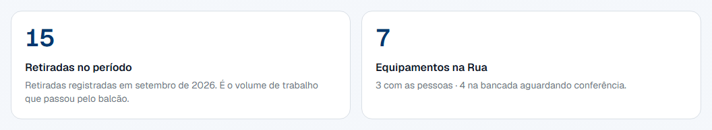](../assets/images/relatorios/06-indicadores-do-periodo.png)

5. Repare na segunda linha do cartão **Equipamentos na Rua**: ela separa os que
   estão **com as pessoas** dos que estão **na bancada aguardando conferência**.
   Só a segunda parcela depende de você — ela some quando a
   [baixa física](baixa-fisica.md) é confirmada.
6. Desça até **Picos de uso**. O gráfico **Retiradas por dia** tem uma barra
   por dia do período, inclusive os dias sem retirada, que aparecem com zero.
   O número em cima da barra mais alta é o pico; passe o mouse (ou navegue com
   as setas do teclado) para ler os outros dias.

    [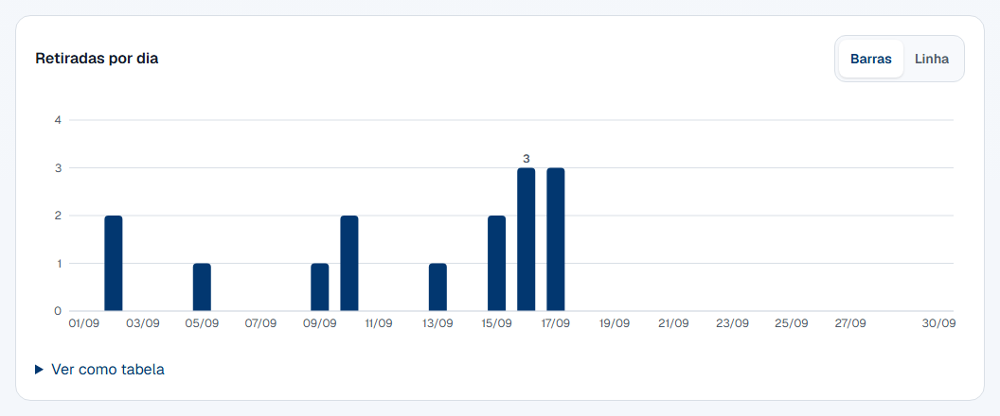](../assets/images/relatorios/07-retiradas-por-dia-barras.png)

    - **Se preferir uma linha** → clique em **Linha**, no canto do gráfico. A
      escolha fica guardada neste computador para as próximas visitas.

        [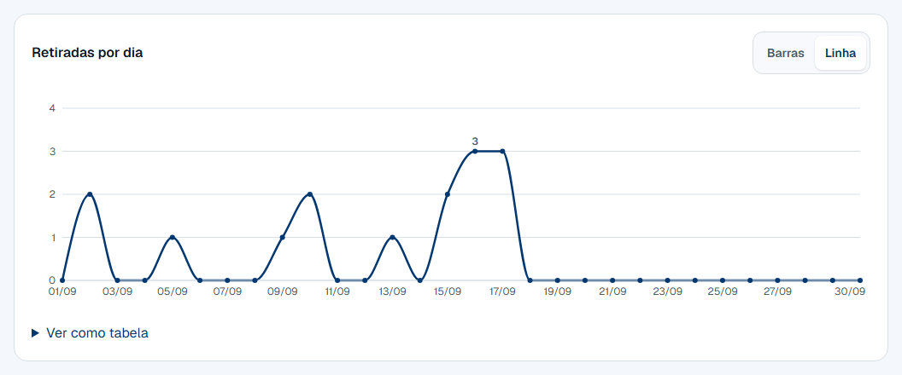](../assets/images/relatorios/08-retiradas-por-dia-linha.png)

    - **Se precisar dos números exatos** → clique em **Ver como tabela**,
      abaixo do gráfico. É a mesma série, uma linha por dia.

7. Desça até **Esgotamento por categoria**. Cada linha é uma prateleira, com a
   barra mostrando a ocupação e, embaixo dela, a composição em números. A
   frase logo acima da lista — **Situação atual do estoque; o período acima
   não muda esta lista** — não é enfeite: esta parte da aba é a fotografia do
   agora.

    [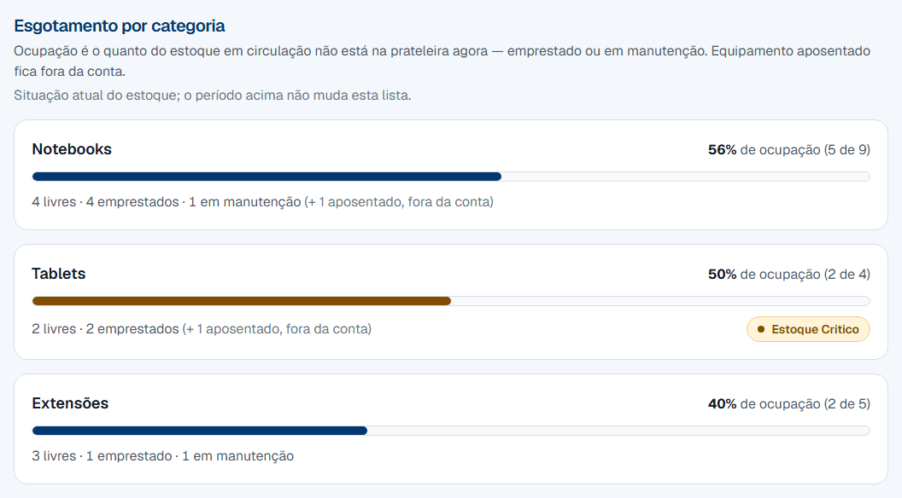](../assets/images/relatorios/09-esgotamento-por-categoria.png)

8. Leia a linha da categoria da direita para a esquerda: **56% de ocupação
   (5 de 9)** quer dizer que, dos 9 notebooks em circulação, 5 não estão na
   prateleira. Os 5 se abrem embaixo: **4 emprestados · 1 em manutenção**.
9. Alguma categoria tem selo colorido ao lado dos números?

    - Se aparece **Estoque Esgotado** (vermelho) → não sobrou nenhuma unidade
      daquela categoria. Quem chegar ao tablet agora não leva nada. Confira a
      [Fila de Devoluções](baixa-fisica.md): se houver aparelho esperando
      conferência, confirmar o recebimento devolve unidade à prateleira na hora.
      Se a fila estiver vazia, o número é o argumento de compra.

        

    - Se aparece **Estoque Crítico** (amarelo) → sobraram uma ou duas unidades.
      Vale avisar a coordenação antes de acabar, e conferir se algum aparelho em
      manutenção já pode voltar pela aba **Inventário**.
    - Se não aparece selo nenhum → aquela categoria tem três ou mais unidades
      livres. Nada a fazer.

10. Clique na aba **Satisfação**. Os dois cartões são dois recortes fixos —
    **Últimos 30 dias** e **Desde o início** —, e cada um traz a média na
    escala de 1 a 4, quantas respostas houve e a taxa de resposta, e a
    distribuição em quatro barras, uma por rosto. A linha **Esta aba não usa o
    período acima** está ali para lembrar: os dois recortes não mudam com o
    seletor.

    [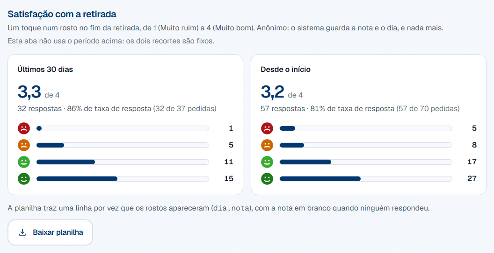](../assets/images/relatorios/11-satisfacao.png)

11. Leia o cartão de cima para baixo: **3,3 de 4** é a média das notas; **33
    respostas · 87% de taxa de resposta (33 de 38 pedidas)** diz que os rostos
    apareceram 38 vezes e 33 pessoas tocaram; e as barras dizem quantas tocaram
    em cada rosto. A barra é a fatia entre as respostas, e o número ao lado é a
    contagem.
12. Há alguma linha? Se a aba diz "Nenhuma avaliação ainda. Os rostos aparecem
    no tablet ao fim da retirada, uma vez a cada 30 dias por pessoa.", ninguém
    foi perguntado ainda — os cartões e o botão de baixar só aparecem com a
    primeira linha.

    

13. Quer cruzar as avaliações de outro jeito? Clique em **Baixar planilha**. O
    arquivo `avaliacoes-AAAA-MM-DD.csv` chega à pasta de downloads com uma
    linha por vez que os rostos apareceram, nas colunas `dia` e `nota` — a
    nota em branco quando ninguém respondeu. Não há hora, matrícula nem nome no
    arquivo, e não há como haver: o sistema não os guarda. A tela não recarrega.
14. Desça até **Formulário de sugestões**. É o link que o QR code da tela de
    retirada abre — cole o endereço completo do formulário, começando por
    `https://`, e clique em **Salvar**. A prévia ao lado mostra o QR exatamente
    como ele aparece no tablet. Para o QR sumir do tablet, salve com o campo em
    branco.

    [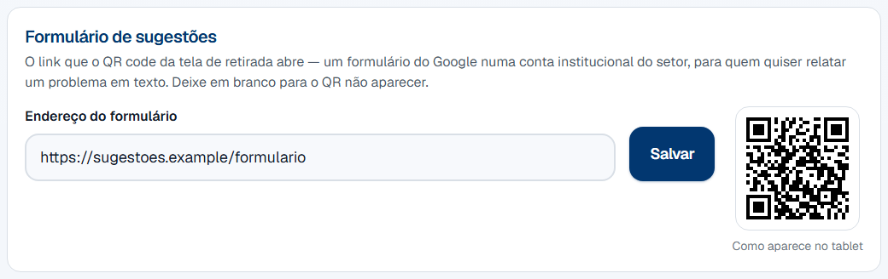](../assets/images/relatorios/12-formulario-de-sugestoes.png)

    !!! tip "Como criar o formulário"

        No Google Forms, com a **conta institucional do setor** — nunca a
        pessoal de quem está no balcão hoje, porque ela sai com a pessoa e
        o adesivo continua apontando para um formulário que ninguém abre. Em
        Configurações → Respostas, deixe **desligadas** a coleta de e-mail e a
        exigência de login: o formulário é anônimo como os rostos. Copie o link
        de Enviar, cole aqui e imprima o mesmo QR num adesivo ao lado do tablet
        — a devolução não mostra o QR, e o adesivo cobre quem só veio devolver.

15. Clique na aba **Ranking de Consumo**. Ela obedece ao mesmo período do topo.
    Os quatro cartões dizem quantas retiradas houve, quantas pessoas distintas
    retiraram, e as duas medianas: **Tempo de uso** (da retirada à devolução
    declarada) e **Tempo de prateleira** (da devolução à baixa física). Um
    cartão com "—" é uma mediana sem amostra — ninguém devolveu ainda, ou
    ninguém retirou.

    [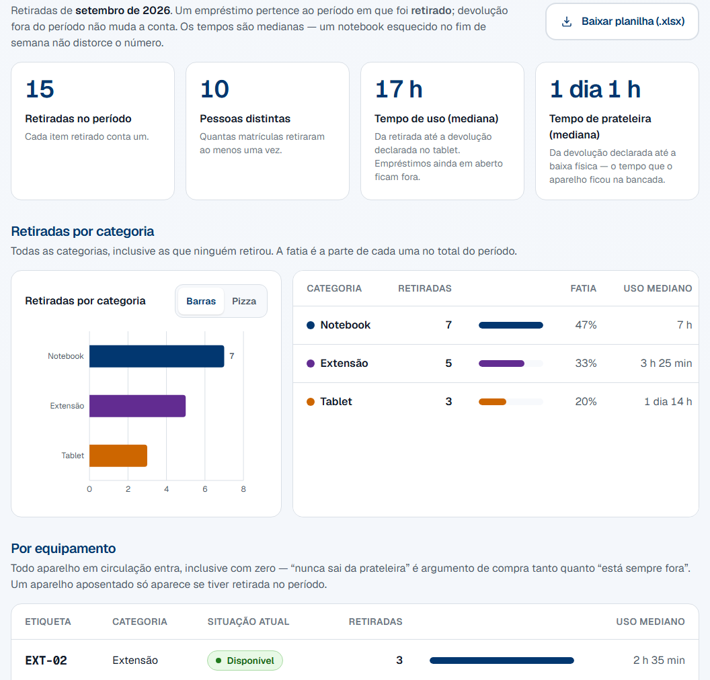](../assets/images/relatorios/14-ranking-de-consumo.png)

16. Leia **Retiradas por categoria**: o gráfico e a tabela ao lado dizem a
    mesma coisa. A tabela lista todas as categorias, inclusive as que ninguém
    retirou, com a **fatia** de cada uma no total.

    [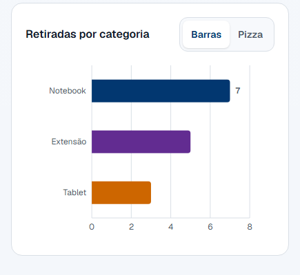](../assets/images/relatorios/15-retiradas-por-categoria-barras.png)

    - **Se preferir a pizza** → clique em **Pizza**. É a única composição da
      tela em que a pizza faz sentido; acima de seis categorias, as menores
      viram "Outras".

        [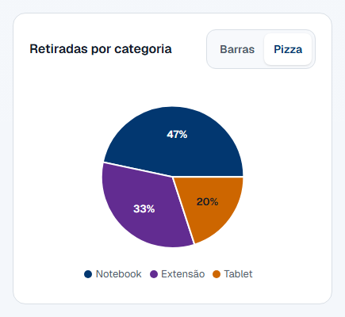](../assets/images/relatorios/16-retiradas-por-categoria-pizza.png)

17. Desça até **Por equipamento**. Todo aparelho em circulação entra, inclusive
    com zero retiradas — as linhas de zero vão para o fim, em cinza. Um
    aparelho aposentado só aparece se tiver retirada no período, com a
    situação **Inativo** na linha.

    [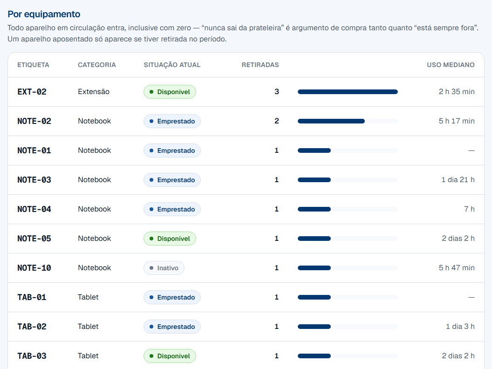](../assets/images/relatorios/17-ranking-por-equipamento.png)

18. Desça até **Por pessoa**. Só quem retirou ao menos uma vez no período
    entra; o nome é o do cadastro de hoje.

    [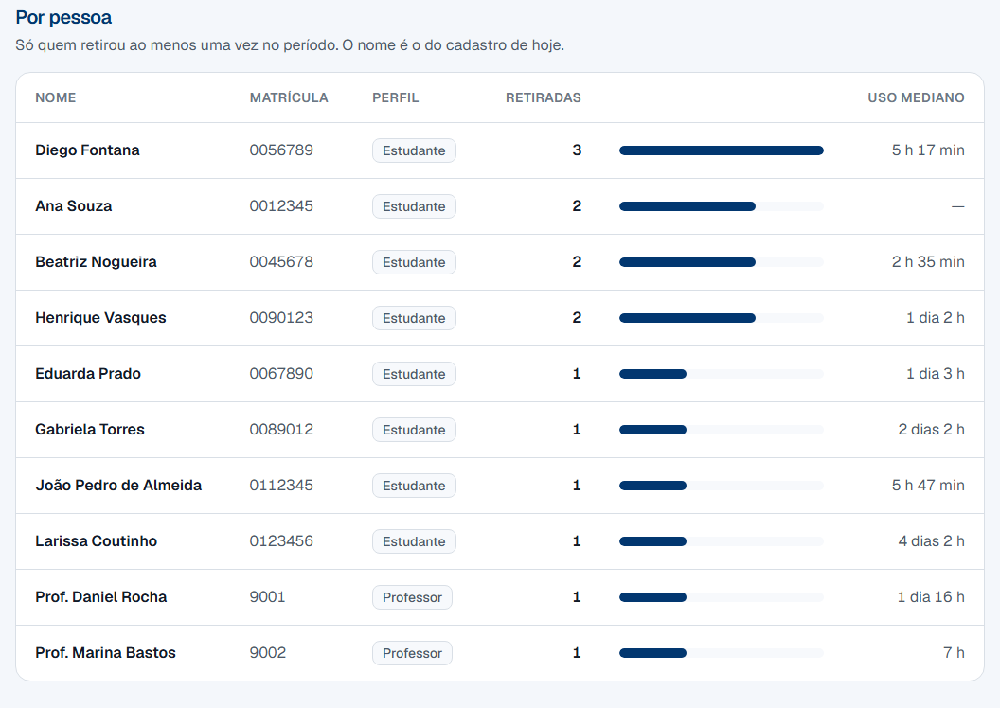](../assets/images/relatorios/18-ranking-por-pessoa.png)

19. Quer levar os números à coordenação? Clique em **Baixar planilha (.xlsx)**,
    no alto da aba. O arquivo `consumo-AAAA-MM-DD-a-AAAA-MM-DD.xlsx` chega à
    pasta de downloads com quatro abas: **Equipamentos**, **Categorias** e
    **Pessoas** são as três tabelas da tela, coluna a coluna; **Retiradas** é
    uma linha por empréstimo do período, com etiqueta, categoria, retirada,
    devolução declarada, baixa, situação e os dois tempos — **sem nome nem
    matrícula**. Contagens e tempos vão como número (os tempos em minutos), para
    o Excel somar e tirar média. A aba **Ocupação e picos de uso** tem o mesmo
    botão, e o arquivo dela (`ocupacao-…xlsx`) traz **Categorias** (a fotografia
    do estoque, com a data e hora da leitura na primeira linha) e a série
    **Retiradas por dia**. A aba **Índice de Manutenção** também — o arquivo
    dela está no passo 27. A tela não recarrega.
20. Colou um link com uma data que não existe, ou com o fim antes do início? A
    tela avisa e mostra o mês atual, em vez de dar erro.

    [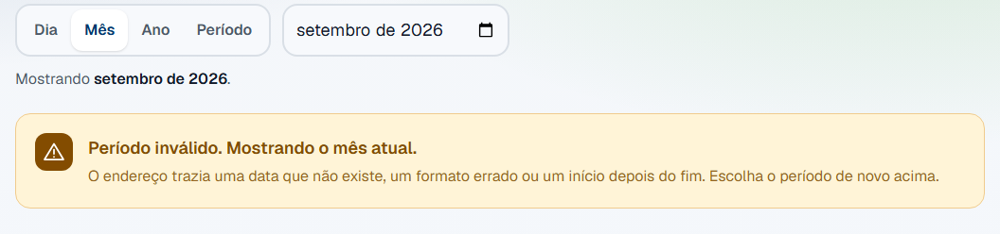](../assets/images/relatorios/19-periodo-invalido.png)

21. Clique na aba **Índice de Manutenção**. Ela obedece ao mesmo período do
    topo — nas capturas abaixo, um **Período** de 90 dias, que é a janela em
    que o cenário de demonstração tem manutenção. Os quatro cartões respondem duas perguntas diferentes da coordenação
    — **quantas vezes quebra** e **quanto do estoque fica parado**: **Em
    manutenção agora** é a fotografia deste instante (o período não muda esse
    número, e a linha de detalhe diz isso); **Entradas em manutenção** é
    quantas vezes um aparelho foi para o conserto no período; **Tempo em
    manutenção (mediana)** é o tempo de conserto mediano das estadias que
    começaram no período e já terminaram; e **Índice de manutenção** é a
    parte do estoque em circulação que passou o período parada, em %.

    [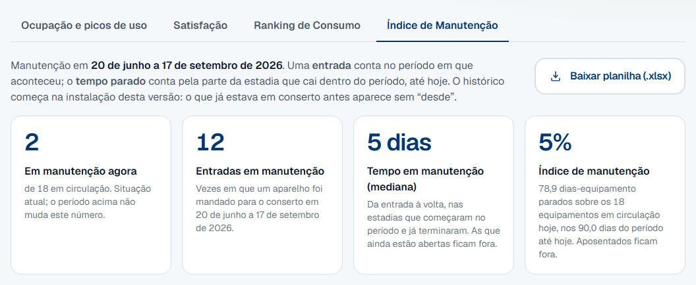](../assets/images/relatorios/20-indice-de-manutencao.png)

22. Leia a linha de detalhe do índice: **78,9 dias-equipamento parados sobre os
    18 equipamentos em circulação hoje, nos 90,0 dias do período até hoje** é a
    conta inteira. Os dias parados são a soma, sobre todos os aparelhos em
    circulação, da parte de cada estadia que cai dentro do período; o
    denominador é o estoque de hoje vezes os dias do período que já passaram.
    Um mês pela metade tem metade dos dias no denominador, e um período no
    futuro mostra "—". Aposentados ficam fora dos dois lados.
23. Desça até **Entradas em manutenção**. O gráfico **Entradas em manutenção
    por dia** tem uma barra por dia do período — por semana acima de 31 dias,
    por mês acima de 182, e o título diz qual —, com os dias sem entrada em
    zero. **Barras** e **Linha** trocam a visualização, como no gráfico de
    retiradas, e **Ver como tabela** abre a série em números.

    [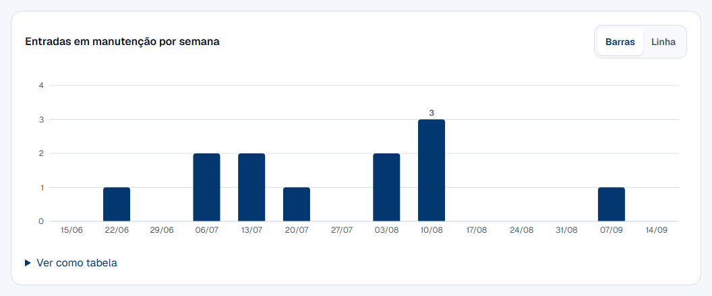](../assets/images/relatorios/21-entradas-em-manutencao-barras.png)

24. Desça até **Por equipamento**. Só entra quem foi para o conserto no
    período ou está em manutenção agora — aqui zero é a norma, e vinte linhas
    de zero esconderiam as três que importam. Os que estão em manutenção agora
    vêm primeiro, com **desde** e a data da entrada; os outros, por entradas.
    A coluna **Quem** é o nome de quem clicou em **Manutenção** da última vez.
    O rodapé diz quantos ficaram de fora: **9 equipamentos sem manutenção no
    período**.

    [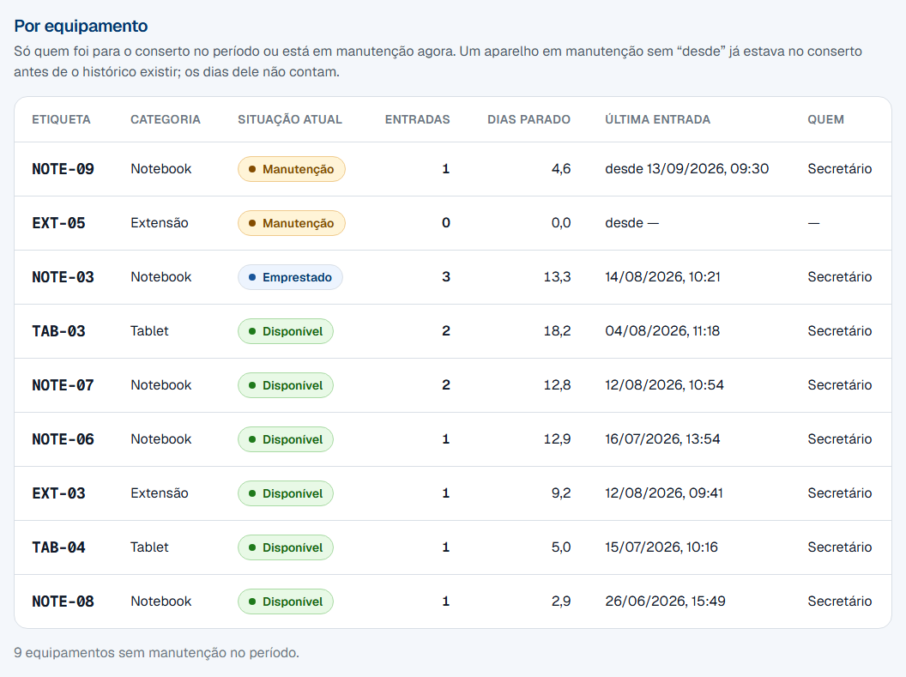](../assets/images/relatorios/22-manutencao-por-equipamento.png)

    - **Se uma linha diz "desde —"** → o aparelho está em manutenção e o
      sistema não sabe desde quando: ele já estava no conserto quando o
      histórico passou a existir. Os dias dele não contam no índice, e a coluna
      **Quem** fica em "—". Ver a [regra abaixo](#o-historico-comeca-na-instalacao).

25. Desça até **Por categoria**. Todas entram, inclusive as sem manutenção. O
    número da coluna **Índice** é a mesma conta do cartão, por categoria; a
    barra ao lado é proporcional ao maior índice da tabela, como nos rankings,
    e a tabela vem ordenada por ele: a primeira linha é a prateleira que mais
    para. **Tempo mediano** é a mediana das estadias daquela categoria que
    começaram no período e já terminaram.

    [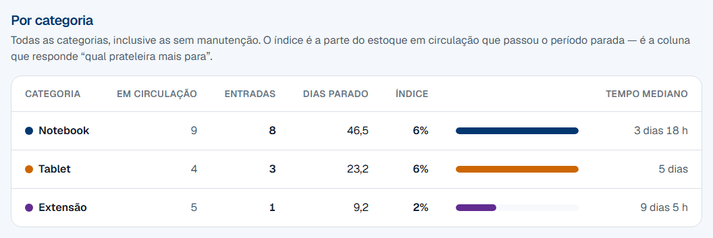](../assets/images/relatorios/23-manutencao-por-categoria.png)

26. Desça até **Histórico**. É a tabela de auditoria da aba: **toda** mudança
    de situação feita no painel dentro do período — inclusive aposentar e
    reativar, que não são manutenção —, com a data e hora, a etiqueta, a
    mudança (**Disponível → Manutenção**) e **quem** fez. Mais recente
    primeiro. É a única tabela do painel que responde "quem inativou o
    `NOTE-10`, e quando".

    [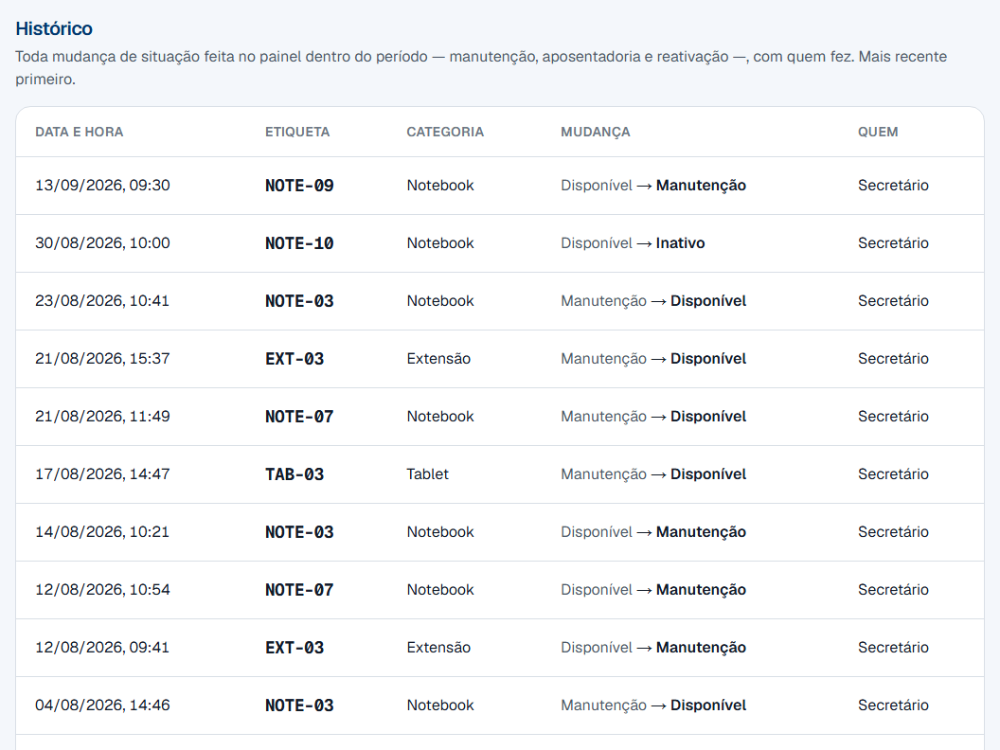](../assets/images/relatorios/24-historico-de-situacao.png)

27. Quer levar à coordenação? Clique em **Baixar planilha (.xlsx)**, no alto
    da aba. O arquivo `manutencao-AAAA-MM-DD-a-AAAA-MM-DD.xlsx` chega à pasta
    de downloads com três abas: **Equipamentos** e **Categorias** são as duas
    tabelas da tela, coluna a coluna (entradas e dias como número, o índice de
    0 a 100, o tempo mediano em minutos, e o "desde —" como célula vazia); e
    **Histórico** é o log cru do período — data e hora, etiqueta, categoria,
    de, para e quem. A tela não recarrega.
28. O período que você escolheu não tem nenhuma entrada em manutenção? A aba
    diz "Nenhuma entrada em manutenção em …" no lugar do gráfico e acima das
    duas tabelas; os cartões de entradas e de mediana mostram **0** e **—**.
    **Em manutenção agora** continua preenchido, porque é fotografia, e o
    índice pode ser maior que zero mesmo assim — um aparelho que entrou no
    conserto antes do período e continua nele conta pelos dias que passou
    parado dentro da janela.

## 6. Regras que não são óbvias

!!! question "Por que a aba e o período ficam no endereço da página?"

    Porque trocar o período é uma consulta nova ao banco, e a forma de fazer
    uma consulta nova é navegar: o endereço carrega `de` e `ate` com as datas
    resolvidas — nunca "este mês". Um link guardado hoje mostra setembro em
    novembro, e recarregar a página (F5) mantém o período **e** a aba.

    Trocar de aba, por sua vez, não vai ao servidor: os quatro painéis já
    chegaram prontos, e o endereço só é atualizado para o link ficar certo.
    Isso inverte uma escolha da primeira versão desta tela, em que a aba
    voltava para a primeira a cada recarga — o motivo daquela escolha
    (nenhum link para compartilhar) deixou de existir quando o período
    passou a morar no endereço.

!!! question "Um aparelho retirado em agosto e devolvido em setembro conta em qual mês?"

    Em **agosto**. O que entra no período é a **retirada**: um empréstimo
    pertence ao período em que foi retirado, e só a esse. A devolução fora do
    período não muda a atribuição, e o tempo de uso dele — que atravessa a
    virada do mês — entra na mediana de agosto.

    A regra é uma só para os três rankings, os cartões e o gráfico, porque
    duas regras dariam dois totais para a mesma pergunta.

!!! question "Por que os tempos são medianas, e não médias?"

    Porque um notebook esquecido no fim de semana distorce a média de uma
    semana inteira: dez empréstimos de duas horas e um de três dias dão uma
    média de oito horas que não descreve nenhum deles. A mediana é o valor
    do meio — metade ficou abaixo, metade acima — e um caso extremo não a
    arrasta.

    Os empréstimos ainda em aberto contam nas retiradas e ficam **fora** da
    mediana de uso: eles não têm devolução ainda. E o tempo de prateleira só
    conta nos concluídos que têm os dois registros; os concluídos antes de o
    sistema gravar a baixa física ficam de fora sozinhos, em vez de entrar
    como zero.

!!! question "Por que a ocupação conta o aparelho em manutenção junto com o emprestado?"

    Porque a pergunta que esta tela responde é **"sobra aparelho para quem
    chegar agora?"**, e para quem chega dá no mesmo: o notebook no conserto e o
    notebook na mochila de alguém estão igualmente fora da prateleira.

    A consequência é a que interessa: **100% de ocupação quer dizer exatamente
    "nenhuma unidade disponível"**, e é por isso que a barra cheia e o selo
    vermelho sempre aparecem juntos. Se a ocupação contasse só os emprestados,
    uma categoria com três aparelhos no conserto e o resto emprestado mostraria
    uma barra pela metade ao lado de um alerta dizendo que o estoque acabou — e
    as duas coisas estariam certas ao mesmo tempo.

    A composição embaixo da barra separa as duas parcelas, para a decisão não se
    perder: manutenção é aparelho que **pode voltar**, e empréstimo é aparelho
    que **vai voltar**.

!!! question "Escolhi agosto e a lista de categorias não mudou. Está certo?"

    Está. A ocupação por categoria é a **fotografia do agora**, e não existe
    "ocupação em 3 de agosto": o sistema não guarda a situação de cada
    aparelho em cada dia, só a de hoje. O que obedece ao período nessa aba
    são o cartão **Retiradas no período** e o gráfico **Retiradas por dia**.
    A frase acima da lista diz isso, para ninguém ler as barras como se
    fossem do mês escolhido.

!!! question "Por que o aparelho aposentado fica fora da conta?"

    Porque ele não volta. A
    [aposentadoria](../referencia/glossario.md#aposentadoria-item-inativo) é a
    saída definitiva de circulação — o aparelho continua no banco só para o
    histórico de empréstimos não perder a referência dele.

    Contá-lo no total faria a ocupação parecer menor do que é. Uma categoria com
    dez aparelhos, quatro deles aposentados, e os seis restantes emprestados,
    mostraria 60% de ocupação com a prateleira vazia.

    É a mesma conta que o tablet já faz: lá a grade diz "Notebooks — 4 de 9
    disponíveis" com dez notebooks cadastrados, porque um está aposentado. Os
    aposentados aparecem nesta tela entre parênteses, **fora da conta**, para os
    números continuarem fechando com a aba **Inventário** — que, ao contrário,
    mostra o patrimônio inteiro.

    No **Ranking de Consumo** a regra é outra, e é deliberada: o aposentado
    **entra** no ranking por equipamento se tiver retirada no período, com a
    situação **Inativo** na linha. Um relatório do ano inteiro cobre meses em
    que ele ainda circulava, e escondê-lo faria a soma das linhas não fechar
    com o cartão de retiradas. Sem retirada no período, ele não aparece.

!!! question "Por que Retiradas no período não diminui quando alguém devolve?"

    Porque ele conta **retiradas**, e uma retirada que aconteceu não desacontece.
    O número responde "quanto trabalho passou pelo balcão" na janela escolhida,
    e só muda se a janela mudar.

    Quem responde "quanto está fora agora" é o cartão ao lado, **Equipamentos na
    Rua**. Os dois medem coisas diferentes de propósito: um é o movimento, o
    outro é o estoque.

!!! question "Contei os aparelhos no armário e o número não bate. O que está errado?"

    Quase sempre nada. São três diferenças possíveis, e todas são deliberadas:

    - **Os aposentados não entram na conta** — eles estão no armário e não estão
      em circulação. O total entre parênteses ao lado da linha diz quantos são.
    - **Os que estão na bancada contam como fora da prateleira.** O aparelho que
      alguém acabou de devolver no tablet ainda não voltou ao estoque: ele espera
      a [baixa física](baixa-fisica.md). Enquanto espera, está fisicamente no
      balcão e contabilmente fora.
    - **Os números são do instante em que a página abriu.** Uma retirada feita no
      tablet enquanto você lia a tela não aparece até a próxima abertura.

    Se a diferença não for nenhuma das três, o lugar de conferir item a item é a
    aba [Inventário](inventario.md).

!!! question "Por que uma categoria aparece com Sem unidades em circulação, e não como esgotada?"

    Porque não há estoque para esgotar. Isso acontece em dois casos: a categoria
    acabou de ser criada e ainda não recebeu nenhum aparelho, ou todos os
    aparelhos dela foram aposentados.

    Marcá-la de vermelho seria pedir uma compra que ninguém pediu — e, pior,
    seria um vermelho permanente, que ensina o olho a ignorar os outros. A linha
    aparece sem barra, em texto cinza, e some da grade do tablet pelo mesmo
    motivo.

!!! question "Por que a aba Satisfação não obedece ao período?"

    Porque o dado dela é diferente: uma nota inteira por dia, sem hora, sem
    matrícula e sem perfil — é o que faz a avaliação ser anônima. Um filtro de
    um dia, num dia em que uma pessoa só foi perguntada, deixaria a nota dessa
    pessoa a um clique. Os dois recortes são fixos (**Últimos 30 dias** e
    **Desde o início**), a aba diz isso numa linha, e quem quer outro corte
    baixa o CSV.

!!! question "Dá para comparar com o mês passado?"

    Só olhando os dois: escolha um mês, anote o número, escolha o outro. A
    tela não mostra a diferença nem uma seta de tendência — cada abertura é
    uma fotografia de um período só. Para comparar vários meses de uma vez, o
    caminho é o ano inteiro no seletor (o gráfico de retiradas passa a ser por
    mês) ou a planilha exportada, onde a coordenação faz o pivô que quiser.

!!! question "Por que o índice de agosto é zero se o NOTE-09 passou agosto inteiro parado?"

    Porque o histórico de situação **começa na instalação desta versão**. Um
    aparelho que já estava em manutenção nesse dia não tem a linha de entrada
    — o sistema sabe que ele *está* no conserto, não *desde quando*. Inventar
    uma data de entrada seria inventar dias dentro de uma métrica; a tela
    prefere dizer a verdade: a linha dele mostra **desde —** e **—** na coluna
    Quem, os dias dele não contam no índice nem na mediana, e o mês em que
    ele passou parado sai como zero.

    Isso se resolve sozinho: na primeira vez que ele voltar para **Disponível**
    e for para **Manutenção** de novo, a entrada existe, e dali em diante ele
    conta como todos os outros. Os aparelhos que entraram no conserto **depois**
    da instalação nunca passam por isso.

!!! question "Quem mandou o aparelho para o conserto fica registrado?"

    Fica — com o nome de quem estava logado no painel, na hora do clique. É
    para isso que cada pessoa tem a sua conta desde a
    [conta do administrador](../referencia/conta-do-administrador.md): toda
    mudança de situação feita no Inventário (manutenção, volta, aposentadoria,
    reativação) vira uma linha no Histórico desta aba, com data, hora e o
    nome. Se um dia a conta for apagada para recuperar a senha, a linha fica —
    com o nome que a conta tinha na hora.

    O que **não** entra no Histórico: a retirada e a baixa física, que já têm
    os seus próprios registros (o empréstimo); e o que aconteceu antes da
    instalação desta versão.

!!! question "Um aparelho parado 40 dias, de 20 de agosto a 29 de setembro, conta em qual mês?"

    Nos dois — e de duas maneiras diferentes, porque a aba mede duas coisas.

    - **A entrada conta no mês em que aconteceu.** Ele é **uma** entrada, em
      agosto; setembro não ganha entrada nenhuma por ele. A mediana segue a
      mesma regra: a estadia inteira de 40 dias entra na mediana de agosto.
    - **O tempo parado conta pela parte que cai em cada mês.** Ele pesa 12
      dias em agosto e 28 em setembro, nos dias parados e no índice. Se o
      tempo contasse só no mês da entrada, setembro mostraria 0% de índice
      com o aparelho parado o mês inteiro.

    A parte de um período que ainda não chegou também não conta: um mês pela
    metade tem 17 dias no denominador, não 30 — e um período todo no futuro
    mostra "—" no índice, porque não há dias para dividir.

!!! question "Cliquei em Manutenção por engano. Dá para apagar?"

    Não — e é de propósito. O Histórico é registro de auditoria: o caminho de
    volta é clicar em **Disponível** na mesma linha do Inventário, e as duas
    mudanças ficam gravadas, com o seu nome, a um minuto de distância. Essa
    estadia de um minuto conta como uma entrada no período e entra na mediana
    (ela é curtíssima, então puxa a mediana para baixo, não para cima).

    Um clique errado por semestre não muda nenhum número que a coordenação
    lê; um Histórico que pudesse ser editado deixaria de responder "quem".

!!! question "A aba Retiradas da planilha não tem o nome de quem retirou. Por quê?"

    De propósito. O ranking por pessoa, na tela e na aba **Pessoas** do
    arquivo, já responde "quem" — com nome, matrícula e a contagem. A aba
    **Retiradas** existe para o pivô (por categoria, por dia, por tempo de
    uso), e para isso o nome não faz falta. Sem ele, o histórico nominal de
    cada pessoa não sai do painel dentro de um arquivo que vai circular por
    e-mail.

    O ranking por pessoa é uma exposição deliberada, decidida pela
    coordenação em setembro de 2026 — ver
    [Regras de negócio](../referencia/regras-de-negocio.md#o-ranking-por-pessoa-e-deliberado-e-a-avaliacao-continua-anonima).
    Ela não muda a promessa de anonimato da avaliação, que é outra tabela,
    sem matrícula.

!!! question "Por que não aparece quem deu cada nota?"

    Porque o sistema **não guarda**. A linha de avaliação tem só a nota e o
    dia — sem matrícula, sem perfil, sem hora. Um carimbo com a hora cruzaria
    com a hora da retirada e revelaria quem deu a nota 1; o perfil apontaria o
    professor do dia. Não é um filtro que a tela esconde: é um dado que não
    existe em lugar nenhum, nem na planilha baixada, nem para quem abre o banco.

    O limite honesto disso é o tamanho da população: num dia em que **uma
    pessoa só** foi perguntada, quem lê o banco sabe de quem é aquela nota. A
    tela nunca mostra isso, e o arquivo baixado só traz dia e nota — mas a
    regra vale ser dita, porque é a única forma de a promessa de anonimato ser
    verdadeira.

!!! question "A média é sobre as respostas ou sobre as pedidas?"

    Sobre as **respostas**. Quem não tocou em rosto nenhum não deu nota zero —
    não deu nota. Por isso o cartão mostra os dois números separados: a média
    (das respostas) e a taxa de resposta (respostas sobre pedidas).

    Leia os dois juntos. Uma média de 3,8 com 30% de taxa de resposta diz menos
    do que uma média de 3,3 com 85%: no primeiro caso quase ninguém está
    respondendo, e os que respondem são os que têm algo a dizer.

!!! question "Por que a mesma pessoa só é perguntada uma vez a cada 30 dias?"

    Para a pesquisa não irritar quem retira todo dia — e para o resultado não
    ser a opinião de quem retira todo dia. O intervalo é uma regra do sistema,
    não uma configuração: conta a partir do dia em que os rostos **apareceram**,
    tenha a pessoa tocado ou não.

    A consequência que importa aqui: "pedida" conta quem ignorou. Se a taxa de
    resposta cair, não é porque as pessoas passaram a ver menos rostos — é
    porque passaram a ignorá-los mais.

!!! question "Abri a planilha de avaliações no Excel e veio tudo numa coluna só"

    Porque o arquivo separa as colunas por vírgula (é o formato padrão de CSV),
    e o Excel em português espera ponto e vírgula quando você clica duas vezes
    no arquivo. Ele não está errado — está lendo com o separador do sistema.

    O caminho é importar em vez de abrir: **Dados → De Texto/CSV**, escolha o
    arquivo, e o Excel reconhece a vírgula sozinho. O Google Planilhas e o
    LibreOffice abrem direto. As planilhas de **Consumo** e de **Ocupação** não
    têm esse problema: são `.xlsx`, e abrem com duas colunas ou mais no clique.

## 7. Erros comuns e o que fazer

| Mensagem na tela                        | Causa                                                                                         | O que fazer                                                                                              |
| --------------------------------------- | --------------------------------------------------------------------------------------------- | ---------------------------------------------------------------------------------------------------------- |
| "Período inválido. Mostrando o mês atual." | O endereço trazia uma data que não existe (30 de fevereiro), um formato errado, ou um início depois do fim — quase sempre um link copiado pela metade. | Nada se perdeu: a tela mostra o mês atual. Escolha o período de novo no seletor. Não é erro do sistema: é o link. |
| "Nenhuma retirada em …"                 | O período escolhido não tem nenhuma retirada registrada. Os cartões mostram 0 e "—".            | Confira a janela no seletor. Se o período está certo, o número é esse mesmo — ninguém retirou.               |
| "Nenhuma entrada em manutenção em …"     | O período escolhido não tem nenhum aparelho indo para o conserto. Os cartões de entradas e mediana mostram 0 e "—". | Confira a janela no seletor. Se o período está certo, o número é esse mesmo. O índice ainda pode ser maior que zero: é o aparelho que já estava parado quando o período começou. |
| "Nenhuma mudança de situação em …"       | Ninguém mudou a situação de nenhum aparelho no painel dentro do período — nem manutenção, nem aposentadoria, nem reativação. | Nada a fazer. Se você espera ver uma mudança de antes da instalação desta versão, ela não existe no histórico — ver a [regra acima](#o-historico-comeca-na-instalacao). |
| "Nenhuma categoria cadastrada ainda."   | Não há categoria no sistema, então não há prateleira para medir.                                | Crie a primeira na aba **Categorias**. Sem categoria, o tablet também não mostra nada.                       |
| "Sem unidades em circulação"            | A categoria existe, mas não tem aparelho em circulação — nenhum cadastrado, ou todos aposentados. | Cadastre um aparelho nela pela aba **Inventário**, ou apague a categoria se ela não serve mais.              |
| "Nenhuma avaliação ainda. Os rostos aparecem no tablet ao fim da retirada, uma vez a cada 30 dias por pessoa." | Os rostos ainda não apareceram para ninguém — o sistema acabou de ser instalado, ou ninguém retirou equipamento desde então. | Nada a fazer. O primeiro cartão aparece com a primeira retirada. Não é erro: a tela está avisando. |
| "Não foi possível gerar a planilha. Recarregue a página e tente de novo." | O pedaço do programa que monta o arquivo não chegou ao navegador — a rede caiu no meio, ou a página ficou aberta por muito tempo. | Recarregue a página e clique de novo. Nada foi gravado nem perdido: a planilha é montada na hora, a partir do que está na tela. |
| "Endereço inválido."                    | O link colado no **Formulário de sugestões** não é um endereço completo, ou não começa com `https://`. O detalhe abaixo diz qual dos dois. | Abra o formulário no navegador, copie o endereço inteiro da barra e cole. Ele tem que começar com `https://`. |
| "Formulário removido. O QR code não aparece mais no tablet." | Você salvou o campo em branco.                                                        | Não é erro: é o que "em branco" faz. Para o QR voltar, cole o endereço e salve de novo.                       |
| "Sessão encerrada."                     | A sessão caiu entre abrir a página e clicar em **Salvar**.                                       | Atualize a página, entre de novo e salve outra vez. O endereço não foi gravado.                               |
| A tela de login aparece no lugar do relatório | A sessão expirou enquanto a página estava aberta.                                          | Entre de novo. Nada se perde: esta tela só grava o link do formulário — ver [Conta do administrador](../referencia/conta-do-administrador.md). |
