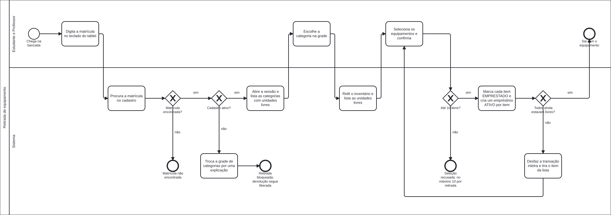
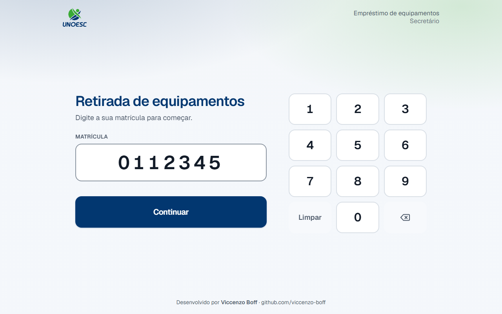
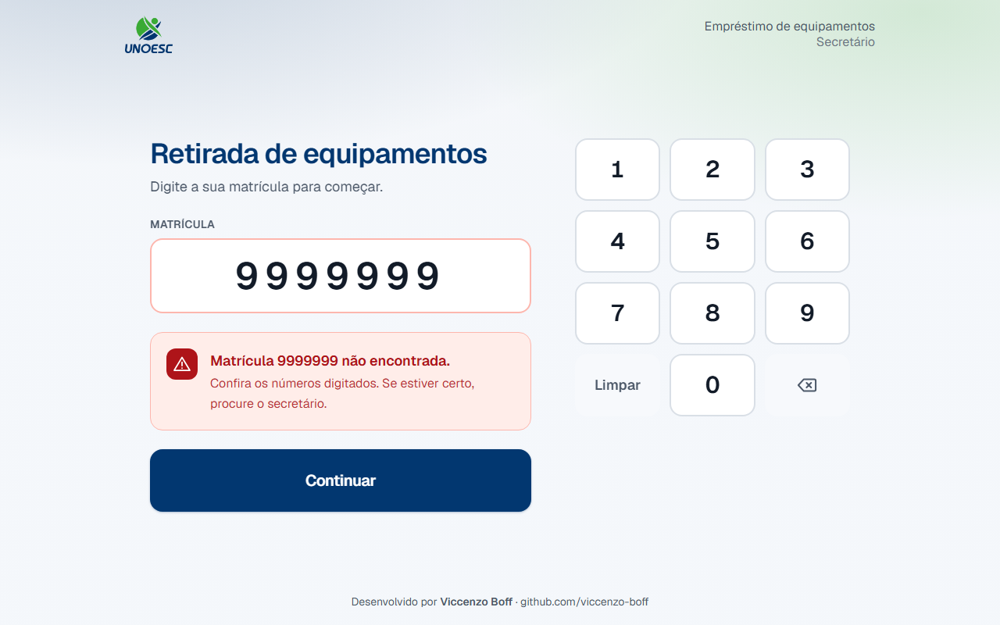
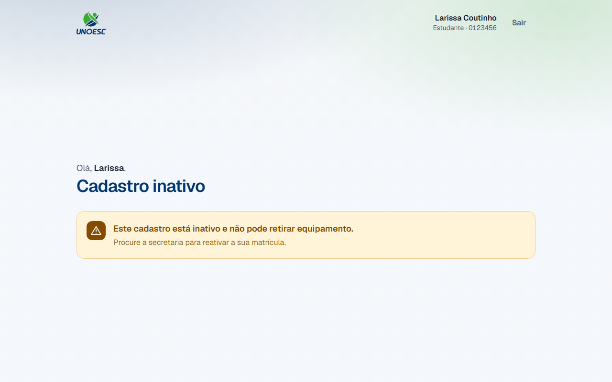
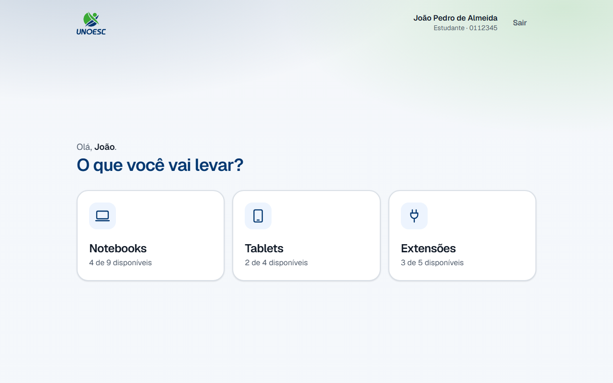
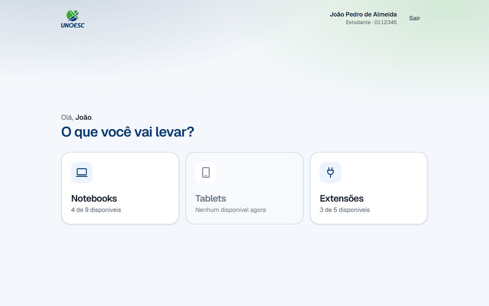
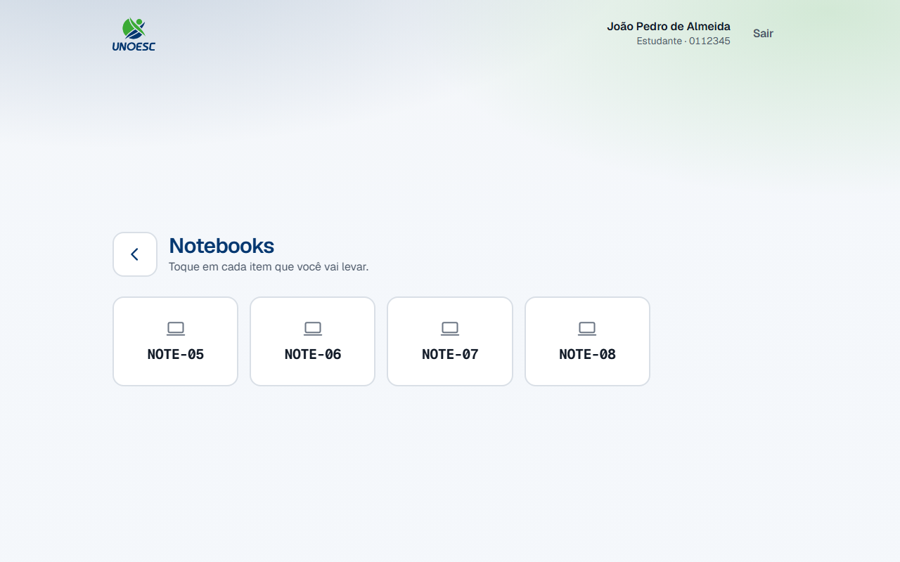
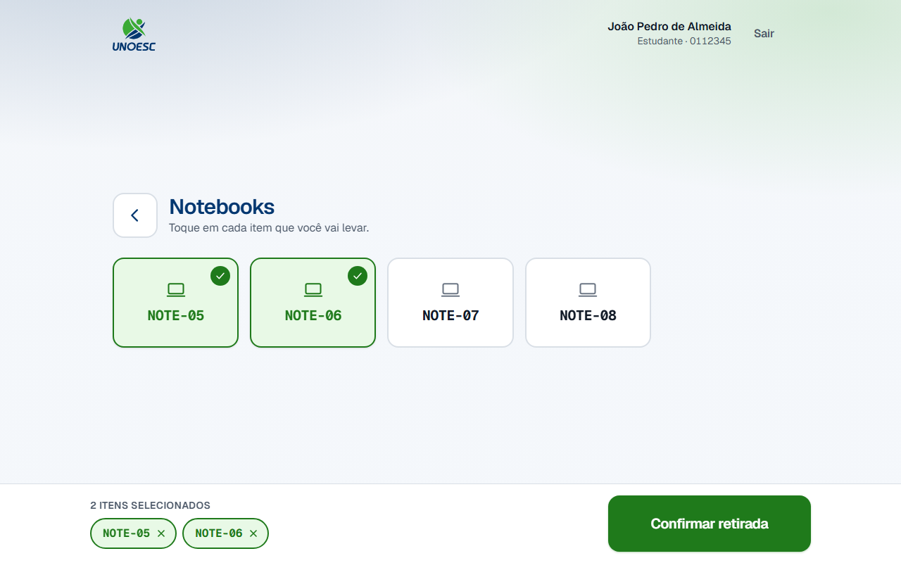
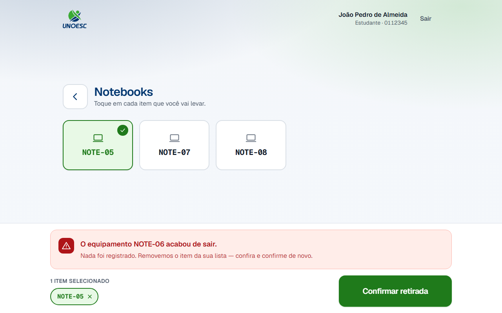
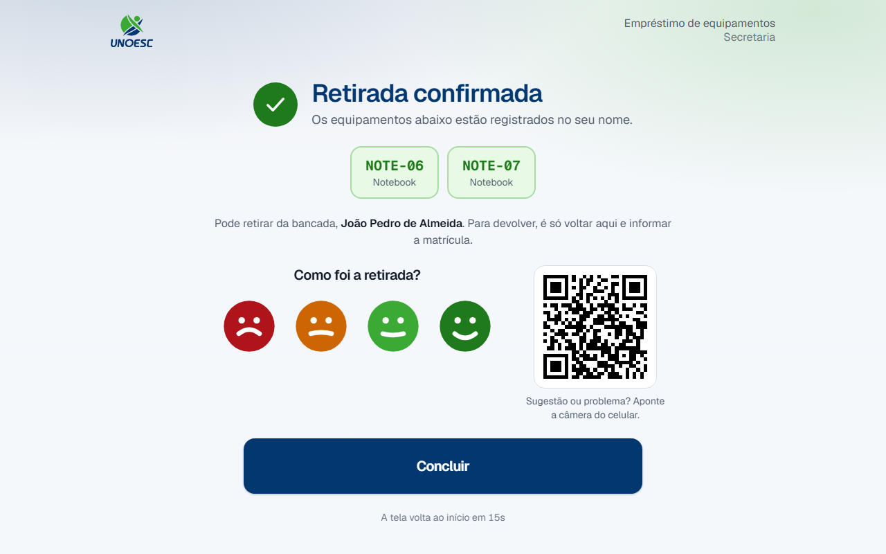

# 1. Retirada de equipamento

## 1. Objetivo do processo

Este processo entrega um equipamento da secretaria para quem vai usá-lo, sem
fila de papel e sem ninguém anotando nada à mão. Quem precisa de um notebook, de
um tablet ou de uma extensão se identifica pela matrícula no tablet da bancada,
escolhe o que vai levar e sai com o aparelho.

Quando termina, cada item escolhido está registrado no nome da pessoa e deixa de
ser oferecido às outras.

## 2. Pré-condições

- O tablet da bancada está ligado, com o portal aberto.
- A matrícula está cadastrada no sistema.
- O cadastro está ativo — cadastro inativo entra no portal, mas não retira
  (ver a [regra abaixo](#7-regras-que-nao-sao-obvias)).
- A categoria desejada tem pelo menos uma unidade livre.
- O aparelho está fisicamente na bancada.

## 3. Glossário do processo

Os termos que atravessam vários processos moram no
[glossário geral](../referencia/glossario.md): [matrícula](../referencia/glossario.md#matricula),
[etiqueta](../referencia/glossario.md#etiqueta),
[categoria](../referencia/glossario.md#categoria),
[empréstimo](../referencia/glossario.md#emprestimo) e
[cadastro inativo](../referencia/glossario.md#cadastro-inativo-pessoa).

Estes três são só desta página — são as partes da tela que os passos citam pelo
nome:

| Termo               | O que é                                                                                              |
| ------------------- | ---------------------------------------------------------------------------------------------------- |
| Grade de categorias | Os cartões grandes da tela inicial, um por categoria, com a contagem de unidades livres em cada um.  |
| Seleção             | Os itens já tocados e ainda **não** confirmados. Nada foi registrado enquanto o item está só aqui.   |
| Barra de seleção    | A faixa fixa no rodapé que lista a seleção e traz o botão **Confirmar retirada**.                    |

## 4. Papéis e responsabilidades

| Papel                  | Faz                                                                                            | Não faz                                                                                              |
| ---------------------- | ---------------------------------------------------------------------------------------------- | ------------------------------------------------------------------------------------------------------ |
| Estudante ou professor | Digita a matrícula, escolhe os itens, confirma a retirada e leva os aparelhos da bancada.       | Não escolhe qual unidade está livre — o portal só oferece as que estão.                                |
| Portal (o tablet)      | Confere o cadastro, mostra o que está livre no momento do toque e registra um empréstimo por item. | Não guarda sessão: a identificação vale para um atendimento e acaba nele.                             |
| Secretaria             | Mantém o inventário em dia e deixa os aparelhos na bancada.                                     | **Não participa da retirada.** Não confirma nada, e não precisa estar presente para a retirada acontecer. |

## 5. Diagrama BPMN

Clique no diagrama para abri-lo em tamanho cheio — na largura da página ele
entra a pouco mais de um terço do tamanho, e os rótulos não se leem.

[Baixar o arquivo `.bpmn`](../processos-fonte/01-retirada.bpmn) — a fonte do
diagrama, que abre no [bpmn.io](https://bpmn.io) sem instalar nada.

## 6. Passo a passo

!!! warning "A tela volta sozinha ao início"

    Depois de dois minutos sem nenhum toque, o portal encerra o atendimento e
    volta à tela da matrícula. O tablet fica na bancada e é de todo mundo: uma
    sessão esquecida aberta é a próxima pessoa retirando equipamento em nome de
    quem saiu. Se isso acontecer no meio do caminho, comece de novo pelo
    passo 1 — nada do que estava só na seleção foi registrado.

1. Digite a sua matrícula no teclado da tela.

    

    Digite todos os dígitos, inclusive os zeros da frente: `0012345` e `12345`
    são matrículas diferentes. Para apagar o último número, toque na tecla com o
    símbolo de apagar; para apagar tudo, toque em **Limpar**.

2. Toque em **Continuar**.

3. A matrícula está cadastrada?

    - **Se SIM** → o seu nome, o perfil e a matrícula aparecem no alto à
      direita. Confira: se o nome não for o seu, toque em **Sair** e digite a
      matrícula de novo. Siga para o passo 4.
    - **Se NÃO** → a tela continua na matrícula e mostra
      "Matrícula 9999999 não encontrada." Confira os números e digite de novo.
      Se estiverem certos, procure a secretaria.

    

4. O seu cadastro está ativo?

    - **Se SIM** → a grade de categorias aparece. Siga para o passo 5.
    - **Se NÃO** → no lugar da grade aparece
      "Este cadastro está inativo e não pode retirar equipamento." Procure a
      secretaria para reativar a matrícula. Se você está com algum aparelho, a
      [devolução](devolucao.md) continua liberada.

    

5. Você já está com algum aparelho?

    - **Se NÃO** → o título é "O que você vai levar?" e a grade de categorias
      ocupa a tela sozinha. É a tela da captura do passo 6. Siga para o passo 6.
    - **Se SIM** → o título é "O que você quer fazer?", a seção
      **Meus equipamentos** entra com o que já está no seu nome, e a grade
      divide a tela com ela — à direita no tablet deitado, abaixo dela no tablet
      em pé, sob o título **Retirar equipamento**. É a mesma grade, e a retirada
      segue igual: siga para o passo 6.

    Você não precisa devolver nada para retirar mais um aparelho. A lista à
    esquerda é a [devolução](devolucao.md), e ela não atrapalha a retirada.

6. Confira o cartão da categoria que você quer. Cada um diz quantas unidades
   estão livres agora — "4 de 9 disponíveis" quer dizer que a secretaria tem
   nove notebooks em circulação e quatro deles estão na bancada neste momento.

    

7. A categoria tem alguma unidade livre?

    - **Se SIM** → toque no cartão. Siga para o passo 8.
    - **Se NÃO** → o cartão fica cinza, diz "Nenhum disponível agora" e não
      responde ao toque. Escolha outra categoria, ou fale com a secretaria.

    

8. Toque na etiqueta de cada item que você vai levar.

    

    O item tocado fica verde, com um sinal de confirmado no canto. A etiqueta na
    tela é a mesma que está colada no aparelho, caractere por caractere.

9. Confira a barra no rodapé: ela lista tudo que está selecionado.

    

    !!! tip "Tocou no item errado?"

        Toque nele de novo para desmarcar, ou toque no **×** ao lado da etiqueta
        na barra do rodapé. Enquanto o item está só na seleção, nada foi
        registrado.

        A seleção acompanha você entre as categorias: dá para voltar pela seta
        no alto à esquerda, entrar em outra categoria e levar tudo em uma
        confirmação só.

10. Toque em **Confirmar retirada**.

11. Todos os itens selecionados ainda estavam livres?

    - **Se SIM** → a tela de retirada confirmada aparece. Siga para o passo 12.
    - **Se NÃO** → a barra mostra qual item saiu — por exemplo
      "O equipamento NOTE-06 acabou de sair." — e o portal tira esse item da sua
      lista. **Nada foi registrado**, nem os itens que continuavam livres.
      Confira o que sobrou e toque em **Confirmar retirada** de novo.

    

12. Retire da bancada os aparelhos que aparecem na tela, conferindo cada
    etiqueta.

    

13. Toque em **Concluir**.

    Se você sair sem tocar, a tela volta ao início sozinha na contagem que
    aparece no rodapé. A retirada já está registrada de qualquer forma.

## 7. Regras que não são óbvias

!!! question "Levei três itens de uma vez. Isso é um empréstimo ou três?"

    São **três**, um para cada aparelho — mesmo tendo sido uma confirmação só.

    É o que permite devolver um notebook na terça e ficar com a extensão até
    sexta. Se os três fossem um registro único, devolver um obrigaria a devolver
    todos, e a secretaria não teria como saber qual aparelho já voltou.

    Na prática você vê isso na [devolução](devolucao.md): cada item aparece em
    uma linha própria, com o seu próprio botão.

!!! question "Por que eu consigo entrar, mas não consigo retirar?"

    Porque o seu cadastro está **inativo**, e essa trava é de um lado só: ela
    bloqueia a retirada e **libera a devolução**.

    A assimetria é de propósito. Quem é inativado — trancou a matrícula, se
    formou, saiu da instituição — quase sempre está com um aparelho na mochila.
    Se o portal travasse os dois lados, a inativação viraria a garantia de que
    aquele equipamento nunca volta para o armário. Por isso a matrícula inativa
    entra normalmente, e o que muda é só a grade de categorias, que dá lugar à
    explicação.

    Para voltar a retirar, procure a secretaria.

!!! question "Por que a etiqueta aparece assim, `NOTE-01`, e nunca abreviada?"

    Porque ela precisa bater **caractere a caractere** com o adesivo colado no
    aparelho. É por isso que ela aparece inteira, em fonte monoespaçada, sem
    virar "Notebook 1" nem "Note-1" em lugar nenhum da tela.

    Quem está de pé na bancada com quatro notebooks iguais na frente só tem a
    etiqueta para distinguir um do outro. Qualquer "melhoria" na forma de
    escrevê-la vira, na bancada, uma comparação que não fecha.

!!! question "Confirmei e peguei o aparelho errado. Como desfaço?"

    Não há como desfazer a retirada pelo tablet — depois da confirmação, os
    itens estão no seu nome.

    O caminho é o processo seguinte: volte ao portal, informe a matrícula e
    [devolva](devolucao.md) o item que você não vai usar, deixando-o na bancada.
    Ele só volta a ser oferecido a outra pessoa depois que a secretaria o
    recolher.

## 8. Erros comuns e o que fazer

| Mensagem na tela                                          | Causa                                                                                              | O que fazer                                                                                                       |
| --------------------------------------------------------- | -------------------------------------------------------------------------------------------------- | ------------------------------------------------------------------------------------------------------------------ |
| "Matrícula 9999999 não encontrada."                       | Dígito trocado, zero da frente esquecido, ou cadastro que nunca foi importado.                     | Confira os números e digite de novo. Se estiverem certos, procure a secretaria.                                    |
| "Este cadastro está inativo e não pode retirar equipamento." | O cadastro saiu de circulação.                                                                     | Procure a secretaria para reativar. A devolução do que já está com você continua liberada.                         |
| "Nenhuma unidade de Tablet está livre agora."              | A última unidade da categoria saiu entre a sua entrada no portal e o toque no cartão.              | Volte pela seta no alto à esquerda e escolha outra categoria.                                                       |
| "O equipamento NOTE-06 acabou de sair."                    | Outra pessoa confirmou a retirada desse mesmo aparelho antes de você.                              | Nada foi registrado. O item já saiu da sua lista: confira o que sobrou e confirme de novo.                          |
| "São no máximo 10 itens por retirada."                     | A seleção passou do teto de dez itens.                                                             | Tire itens da seleção até sobrarem dez. Para levar mais de uma vez só, fale com a secretaria.                       |
