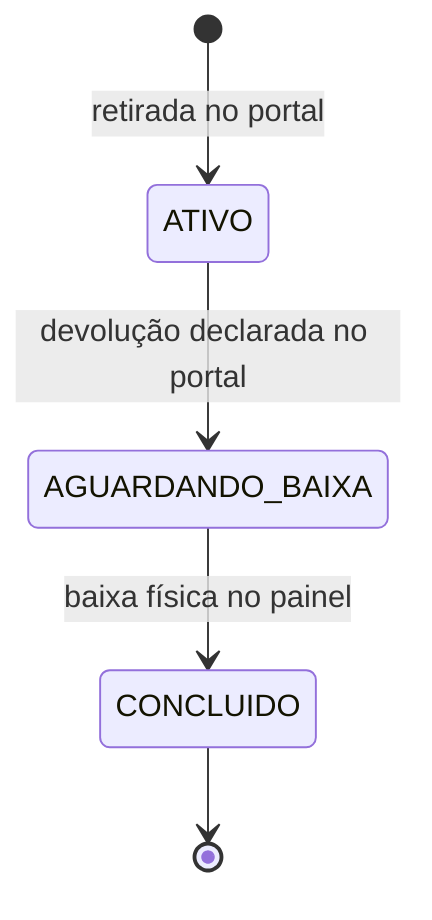
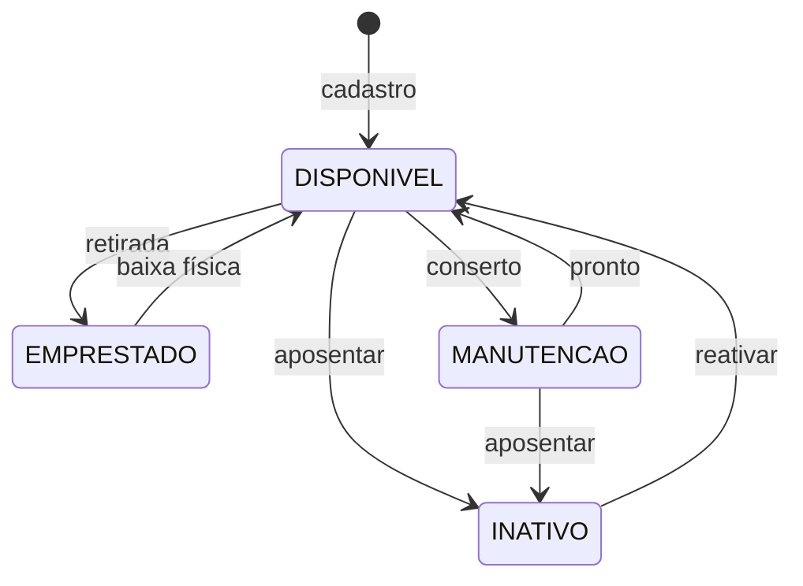

# Estados e transições

O sistema tem **duas** máquinas de estado, e elas correm em paralelo: uma para o
empréstimo (o registro de que alguém levou um aparelho) e outra para o
equipamento (o aparelho em si). Elas se encostam em exatamente dois momentos — a
retirada e a [baixa física](glossario.md#baixa-fisica) — e ficam soltas uma da
outra no meio.

Esse "soltas no meio" é a regra que mais gera dúvida no balcão, e a
[tabela cruzada](#as-duas-ao-mesmo-tempo) no fim desta página existe para
respondê-la de uma vez.

!!! info "Como ler os nomes em caixa alta"

    `ATIVO`, `DISPONIVEL`, `AGUARDANDO_BAIXA` são os valores gravados no banco.
    A tela quase nunca os mostra assim: o inventário escreve "Disponível", a
    lista de cadastros escreve "Ativo". Os dois nomes aparecem lado a lado aqui
    de propósito — esta é a página que liga a palavra da tela ao dado gravado.

## A máquina do empréstimo

Cada item retirado gera um empréstimo **separado** (ver
[empréstimo](glossario.md#emprestimo)). Quem leva um notebook e uma extensão na
mesma ida ao balcão tem dois registros, que andam por esta máquina de forma
independente.

| Transição | Quem dispara | Em que tela | Marcador de tempo gravado |
| --- | --- | --- | --- |
| (nasce) → `ATIVO` | Estudante ou professor | [Portal](glossario.md#portal), botão **Confirmar retirada** | `data_retirada` |
| `ATIVO` → `AGUARDANDO_BAIXA` | Estudante ou professor | [Portal](glossario.md#portal), botão **Confirmar devolução** (ou **Devolver tudo**) | `data_devolucao` |
| `AGUARDANDO_BAIXA` → `CONCLUIDO` | Secretaria | [Painel](glossario.md#painel), botão **Confirmar Recebimento Físico** (ou **Confirmar Todas as Devoluções**) | `data_baixa` |

Os três marcadores são **três campos diferentes**, e cada um tem um dono só. A
distância entre os dois últimos é o
[tempo de prateleira](glossario.md#tempo-de-prateleira): quanto tempo o aparelho
ficou parado na bancada depois de alguém dizer que o devolveu.

### O que esta máquina não faz

* **Não volta.** Não existe `AGUARDANDO_BAIXA` → `ATIVO` nem `CONCLUIDO` →
  qualquer coisa. Um empréstimo encerrado por engano não reabre por nenhuma
  tela — o caminho é registrar uma retirada nova.
* **Não pula.** `ATIVO` nunca vai direto para `CONCLUIDO`. A conferência da
  secretaria é o único caminho até o fim, e é por isso que ela existe.
* **Não apaga.** Empréstimo `CONCLUIDO` fica no banco para sempre. É ele que
  responde "quem estava com este aparelho no semestre passado".

## A máquina do equipamento

| Transição | Quem dispara | Em que tela |
| --- | --- | --- |
| (nasce) → `DISPONIVEL` | Secretaria | Painel, aba **Inventário**, formulário de cadastro |
| `DISPONIVEL` → `EMPRESTADO` | Estudante ou professor | Portal, na confirmação da retirada |
| `EMPRESTADO` → `DISPONIVEL` | Secretaria | Painel, na [baixa física](glossario.md#baixa-fisica) |
| `DISPONIVEL` → `MANUTENCAO` | Secretaria | Painel, botão **Manutenção** na linha |
| `MANUTENCAO` → `DISPONIVEL` | Secretaria | Painel, botão **Disponível** na linha |
| `DISPONIVEL` → `INATIVO` | Secretaria | Painel, botão **Inativar** na linha |
| `MANUTENCAO` → `INATIVO` | Secretaria | Painel, botão **Inativar** na linha |
| `INATIVO` → `DISPONIVEL` | Secretaria | Painel, botão **Reativar** na linha |

### As três ausências, e o motivo de cada uma

!!! warning "`EMPRESTADO` não é um botão"

    A secretaria move o equipamento entre `DISPONIVEL`, `MANUTENCAO` e
    `INATIVO`, e só. `EMPRESTADO` entra e sai sozinho, pelos dois gestos que
    envolvem uma pessoa de verdade levando o aparelho.

    Se houvesse um botão, marcá-lo à mão deixaria um empréstimo aberto
    apontando para um item "disponível" — e o portal ofereceria a outra pessoa
    um aparelho que está numa mochila. Por isso a linha de um item emprestado
    mostra **o nome de quem está com ele** no lugar do botão.

!!! warning "`INATIVO` não vai direto para `MANUTENCAO`"

    Aparelho aposentado volta para `DISPONIVEL` primeiro; o conserto se decide
    depois. São duas perguntas diferentes — "este item volta a circular?" e
    "ele precisa de conserto?" —, e juntá-las num clique só faria a secretaria
    responder as duas sem ser perguntada.

!!! warning "Com empréstimo aberto, nada muda"

    Enquanto existe um empréstimo `ATIVO` **ou** `AGUARDANDO_BAIXA` apontando
    para o aparelho, o painel recusa qualquer mudança de situação. A mensagem
    diz com quem ele está, ou manda confirmar o recebimento primeiro.

    A trava é o oposto da regra da pessoa, que é frouxa de propósito — ver
    [inativar pessoa e inativar equipamento](regras-de-negocio.md#inativar-pessoa-e-inativar-equipamento-nao-sao-a-mesma-regra).

## As duas ao mesmo tempo

Esta é a tabela que responde a pergunta mais frequente do sistema. Ela cruza
**todas** as combinações: as três situações do empréstimo mais o caso "nenhum
empréstimo aberto", contra as quatro situações do equipamento.

| Empréstimo aberto | Equipamento | Acontece? | O que significa |
| --- | --- | --- | --- |
| `ATIVO` | `EMPRESTADO` | **Normal** | O aparelho está com a pessoa. Some do portal; no inventário aparece com o nome dela e sem botão. |
| `ATIVO` | `DISPONIVEL` | Inconsistência | O portal ofereceria a outra pessoa um aparelho que está numa mochila. Nenhuma tela produz isso. |
| `ATIVO` | `MANUTENCAO` | Não acontece | O painel recusa mudar a situação enquanto há empréstimo aberto. |
| `ATIVO` | `INATIVO` | Não acontece | Mesma recusa. |
| `AGUARDANDO_BAIXA` | `EMPRESTADO` | **Normal** | **A regra das duas fases.** A pessoa declarou a devolução, o aparelho está na bancada, e ele continua fora de circulação até a secretaria conferir. |
| `AGUARDANDO_BAIXA` | `DISPONIVEL` | Inconsistência | Seria o portal oferecendo um aparelho que ninguém recolheu ainda. |
| `AGUARDANDO_BAIXA` | `MANUTENCAO` | Não acontece | Mesma recusa do painel. |
| `AGUARDANDO_BAIXA` | `INATIVO` | Não acontece | Mesma recusa. |
| Nenhum | `DISPONIVEL` | **Normal** | O caso comum: o aparelho está na prateleira, contando na grade do portal. |
| Nenhum | `MANUTENCAO` | **Normal** | Em conserto. Some do portal, aparece no inventário. |
| Nenhum | `INATIVO` | **Normal** | [Aposentado](glossario.md#aposentadoria-item-inativo). Some do portal, inclusive das contagens, e fica em cinza no inventário. |
| Nenhum | `EMPRESTADO` | Inconsistência | O painel **recusa** liberar por conta própria e manda conferir o histórico: liberar um item que talvez esteja com alguém é pior que uma mensagem pedindo atenção. |

!!! question "E o empréstimo `CONCLUIDO`, onde está nessa tabela?"

    Nas quatro últimas linhas, na coluna "Nenhum". `CONCLUIDO` quer dizer
    justamente que aquele empréstimo **não está mais aberto** — ele não segura
    mais o aparelho, e a partir dali o equipamento pode estar em qualquer uma
    das quatro situações, inclusive `EMPRESTADO` outra vez, por um empréstimo
    novo de outra pessoa.

    Um aparelho acumula dezenas de empréstimos `CONCLUIDO` ao longo da vida e
    isso não diz nada sobre onde ele está agora. Quem responde "onde está" é
    sempre a situação do equipamento mais o empréstimo **aberto**, se houver.

### As três linhas de inconsistência

As três linhas marcadas como "Inconsistência" não são produzidas por nenhuma
tela do sistema — as escritas que criam e encerram empréstimo mexem nas duas
máquinas dentro da mesma transação, e uma metade não acontece sem a outra.

Se alguma delas aparecer, a origem é externa: uma edição feita direto no banco,
ou uma restauração de arquivo pela metade. A última linha é a única que o painel
consegue perceber sozinho, e a resposta dele é recusar em vez de "consertar".

## Onde continuar

* O *porquê* de cada uma dessas regras está em
  [Regras de negócio](regras-de-negocio.md).
* O vocabulário — o que é bancada, prateleira,
  [situação](glossario.md#situacao) — está no [Glossário](glossario.md).
* Os processos que disparam cada transição estão em
  [Retirada](../portal/retirada.md), [Devolução](../portal/devolucao.md),
  [Baixa física](../painel/baixa-fisica.md) e
  [Gestão de inventário](../painel/inventario.md).
