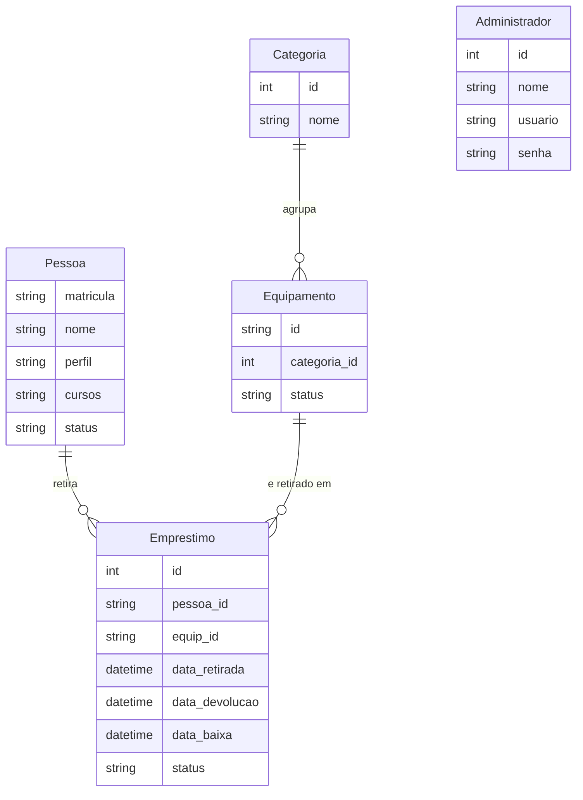

# Arquitetura do sistema

Esta página é o retrato técnico do sistema que o resto da wiki descreve por
fora. Ela serve a quem leu um processo e ficou com a pergunta "mas o que está
rodando ali atrás?".

É curta de propósito. Quem for **mexer** no código tem dois documentos mais
fundos, no repositório: o
[README](https://github.com/viccenzo-boff/sistema-emprestimo-equipamentos/blob/main/README.md),
que traz a receita de instalação, os scripts e o acesso ao painel, e o
[AGENTS.md](https://github.com/viccenzo-boff/sistema-emprestimo-equipamentos/blob/main/AGENTS.md),
que guarda o registro de decisões de cada tarefa — a alternativa descartada e o
motivo, tarefa por tarefa.

## Onde o sistema roda

Não há nuvem. O sistema roda **no computador da secretaria**, em rede local, e o
tablet da bancada o alcança pelo endereço dessa máquina. É uma decisão do
[escopo do produto](https://github.com/viccenzo-boff/sistema-emprestimo-equipamentos/blob/main/especificacoes/spec.md),
e ela explica quase todo o resto desta página.

Duas consequências que aparecem na tela:

- **A conexão é HTTP, não HTTPS.** O cookie de sessão do painel tem a marca
  `secure` desligada de propósito: com ela ligada, o navegador descartaria o
  cookie e ninguém conseguiria entrar.
- **Não há internet no caminho.** Se a rede da instituição cair, a bancada
  continua funcionando.

## As duas frentes

São duas interfaces bem diferentes dentro de **uma aplicação só**.

| Frente | Rota | Aparelho | Quem usa | O que faz |
| --- | --- | --- | --- | --- |
| Portal | `/` | Tablet na bancada | Estudante e professor | [Retirada](../portal/retirada.md) e [devolução](../portal/devolucao.md) |
| Painel | `/admin` | Computador da secretaria | Secretaria | [Baixa física](../painel/baixa-fisica.md), [inventário](../painel/inventario.md) e [pessoas](../painel/pessoas.md) |

O portal **não tem login**: a matrícula é a identificação, e ela vale para um
atendimento só. O painel tem [conta e senha](../referencia/conta-do-administrador.md).

A separação é de audiência, não de servidor: as duas frentes compartilham o
banco, e é isso que faz a devolução declarada no tablet aparecer na fila da
secretaria no mesmo instante.

## A stack

| Camada | Escolha | Por quê |
| --- | --- | --- |
| Framework | Next.js 16 (App Router) | Uma base só para as telas e para a escrita no banco |
| Interface | React 19 e Tailwind CSS 4 | Alvo de toque grande no tablet, tabela densa no painel |
| Acesso ao banco | Prisma 7, com adaptador `better-sqlite3` | Esquema declarado em um arquivo e migrações versionadas |
| Banco | SQLite, arquivo único | Ver a seção abaixo |
| Senha | `bcryptjs` | JavaScript puro, sem compilador de C++ na máquina da secretaria |
| Planilha | SheetJS | Lê o `.xlsx` da coordenação sem conversão manual |

### Por que SQLite em arquivo único

O banco inteiro é **um arquivo** na máquina da secretaria. Não há servidor de
banco para instalar, configurar, atualizar nem reiniciar.

A alternativa considerada era um banco de servidor — PostgreSQL ou MySQL. Ela
foi descartada porque acrescenta uma peça que alguém precisa manter viva em um
computador de secretaria, sem equipe de infraestrutura por perto: se o serviço
não sobe depois de um reinício do Windows, a bancada para e ninguém no prédio
sabe por quê. Com arquivo único, **fazer cópia de segurança é copiar o arquivo**,
e restaurar é colocá-lo de volta.

O preço é conhecido e cabe no problema: uma escrita por vez, e a máquina da
secretaria é o limite de tudo. Para uma bancada com dezenas de aparelhos e um
punhado de pessoas por hora, é folga.

## O modelo de dados

Cinco tabelas. As setas apontam de quem guarda a referência para quem é
referenciado.

O `Administrador` fica solto de propósito: ele é a conta de quem opera o painel,
e **não** aparece em nenhum empréstimo. Registrar quem deu a baixa em cada item é
uma coluna que ainda não existe — está na lista de [o que ficou de
fora](como-esta-wiki-foi-feita.md#o-que-ficou-de-fora).

Quatro pontos do modelo que a wiki explica por inteiro nas
[regras de negócio](../referencia/regras-de-negocio.md):

- **A chave da `Pessoa` é a matrícula, guardada como texto.** Como número, o
  `0012345` da carteirinha viraria `12345`, que é outra matrícula.
- **A chave do `Equipamento` é a etiqueta** — o `NOTE-01` colado no aparelho. É
  o que faz a tela e o adesivo baterem caractere a caractere.
- **Cada item retirado gera um `Emprestimo` separado**, mesmo quando três saem
  na mesma confirmação. É o que permite devolver um e ficar com os outros.
- **O `Emprestimo` tem três marcadores de tempo, com donos distintos**: a
  retirada no tablet, a **declaração** da devolução no tablet, e a
  **conferência física** na secretaria. A diferença entre os dois últimos é o
  [tempo de prateleira](../referencia/glossario.md#tempo-de-prateleira).

### Nada é apagado

Nem pessoa, nem equipamento. Os dois têm o estado `INATIVO`, que é aposentadoria
e não exclusão — o histórico de empréstimos aponta para eles, e uma exclusão
levaria junto o semestre passado. O próprio banco recusa a operação.

A exceção é a **categoria**, que pode ser apagada de verdade, porque nenhum
empréstimo aponta para ela — e mesmo assim só quando está vazia. Quem recusa
também é o banco. As duas regras estão em
[gestão de inventário](../painel/inventario.md).

## Onde as regras moram

Toda escrita no banco passa por uma **Server Action**: uma função que roda no
servidor e que a tela chama como se fosse local.

O detalhe que importa para quem for mexer: **Server Action é um endpoint POST
público**. Esconder um botão na tela não fecha a porta. Por isso a verificação
de sessão do painel é refeita dentro de cada ação, e não no contorno das
páginas; e por isso a devolução pelo tablet filtra pela matrícula digitada, em
vez de aceitar o identificador que a tela mandou — sem esse filtro, uma
requisição direta daria baixa no empréstimo de outra pessoa.

A sessão do painel é um cookie assinado cuja **chave é o hash da senha daquela
conta**. Daí sai, de graça, que trocar a senha derruba a sessão daquela pessoa e
só dela, e que reiniciar o servidor não desloga ninguém. O
[caminho completo está na página da conta](../referencia/conta-do-administrador.md).

## O que esta página não cobre

Instalação, scripts de banco, importação da planilha da coordenação e o roteiro
de recuperação de senha estão no
[README](https://github.com/viccenzo-boff/sistema-emprestimo-equipamentos/blob/main/README.md).
O registro de decisões — cada alternativa descartada, com a medição que a
descartou — está no
[AGENTS.md](https://github.com/viccenzo-boff/sistema-emprestimo-equipamentos/blob/main/AGENTS.md).
